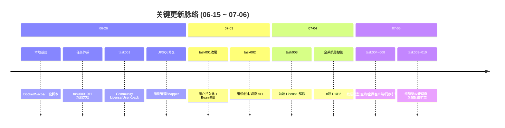
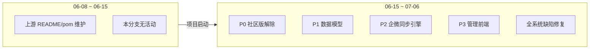

# 项目周报 · 2026-06-15 ~ 2026-07-06

> **项目**：MeterSphere V3 自研（`chenqifen` 分支）  
> **统计区间**：2026-06-15 ~ 2026-07-06  
> **对比基线**：2026-06-08 ~ 2026-06-15  
> **远程仓库**：`github.com:chenqifen-miduo/metersphere.git`

> **已提交：3 次提交 | 64 文件 | +5193 / -64 行 | 0 个 PR 合并**  
> **工作区（未提交）：53 已跟踪修改 + 73 新增文件 | +1107 / -201 行（已跟踪部分）**  
> **贡献者**：chenqifen-miduo (3 commits)

**区间趋势**：6 月 15 日后，项目从「零起步」进入**全栈交付期**——P0 社区版解除与组织 API 已合入 git，P1~P3 组织架构模块（task004~010）主体代码已完成但**大量待提交**。同期完成一轮全系统缺陷修复（8 项 P1/P2）。下一阶段重心为：**工作区合入 git、端到端联调验证、task011 Excel 导入**。

---

## 关键更新脉络

---

## 一、本区间完成（06-15 ~ 07-06）

### 1. P0 — 社区版解除与组织基础 ✅ 已提交

> **价值**：源码部署可脱离企业版 Xpack JAR；支持多组织创建与切换；前端 License 门禁解除。

| 任务 | 状态 | 要点 |
|------|------|------|
| task001 | ✅ 已提交 | `CommunityLicenseServiceImpl`、`CommunityUserXpackServiceImpl`、`CommunityXpackConfiguration`；用户 CRUD 落库 |
| task002 | ✅ 工作区 | `POST /system/organization/add`、`/switch`、`/switch-option`；`OrganizationInitService` |
| task003 | ✅ 工作区 | `licenseStore.hasLicense()`、`VITE_MS_UNLIMITED`、创建/进入组织入口 |

### 2. P1 — 数据模型与查询 API ✅ 工作区

> **价值**：为组织架构同步提供持久化层与只读查询能力。

| 任务 | 状态 | 要点 |
|------|------|------|
| task004 | ✅ 工作区 | Flyway `V3.7.0_1/2`：`department`、`org_wecom_sync_config`、`org_sync_log`；`user` 扩展字段 |
| task005 | ✅ 工作区 | 部门树、成员分页、成员详情（脱敏）API |

### 3. P2 — 企微同步全链路 ✅ 工作区

> **价值**：实现从企微通讯录拉取到 MS 组织镜像的完整后端能力。

| 任务 | 状态 | 要点 |
|------|------|------|
| task006 | ✅ 工作区 | `WecomContactClient`：Token 缓存、部门/用户 API、重试 |
| task007 | ✅ 工作区 | `WecomOrgSyncService`、部门/用户 Handler、Redis 锁、`org_sync_log` |
| task008 | ✅ 工作区 | 手动同步/状态/日志/配置 API；`WecomOrgSyncJob` Quartz 定时任务 |

### 4. P3 — 管理前端与配置扩展 ✅ 工作区

> **价值**：管理员可在 UI 完成组织镜像查看、手动同步与企微配置，无需改库。

| 任务 | 状态 | 要点 |
|------|------|------|
| task009 | ✅ 工作区 | 左树右表管理页、成员详情抽屉、同步面板与日志抽屉 |
| task010 | ✅ 工作区 | 同步配置抽屉；`GET /config/get`、`POST /config/test`；Secret 掩码 |
| task011 | ⏳ 待开始 | Excel 组织架构导入 |

### 5. 本地开发与文档体系 ✅ 已提交 + 持续更新

- **一键启停**：`start.ps1` / `stop.ps1`、`dev/docker-compose.yml`、`deploy/nacos/`
- **任务文档**：`docs/task/task000` ~ `task011`（10/11 已完成）
- **开发日志**：27 份 `develop_logs`（含 8 份 buglist、3 份 details）

### 6. 全系统缺陷修复（2026-07-04）✅ 工作区

> **价值**：保障 P0/P1 功能在真实联调场景下可用。

| 编号 | 模块 | 摘要 |
|------|------|------|
| BUG-PLAN-001/002 | 测试计划 | 执行历史 Tab / 报告列表为空 |
| BUG-DASH-001 | 工作台 | orgId 为空不加载卡片 |
| BUG-SYS-001/002 | 系统/安全 | 单测 IDGenerator NPE；未认证 API 返回 500 |
| BUG-API-001 | 接口测试 | JDK 21 XStream 解析失败 |
| BUG-CASE-001 | 用例管理 | caseReview 路由 404 |
| BUG-PRJ-001 | 项目管理 | 项目所属组织更新不生效 |

### 7. UI / SQL 修复（06-26 已提交）

- 用例管理左树横向溢出、侧边菜单滚动
- `ExtProjectMemberMapper.xml`、`ExtTestPlanBugMapper.xml` SQL 兼容
- `BaseDisplayService` 静态资源 fallback

---

## 二、区间数据

### 已提交 commit 明细

| 日期 | Commit | 类型 | 说明 | 规模 |
|------|--------|------|------|------|
| 06-26 | `65938d1d94` | feat | 本地基建 + task 文档 + UI/SQL 修复 | 51 files, +3841/-64 |
| 06-26 | `4c2d2b78c0` | feat | task001 Community License/UserXpack | 6 files, +159/-10 |
| 07-03 | `0b4c9593ec` | fix | task001 用户持久化 + Xpack Bean 注册 | 12 files, +1217/-14 |

### 每日提交分布

| 日期 | 提交数 | 重点方向 |
|------|--------|----------|
| 06-15 ~ 06-25 | 0 | 无 git 提交（规划酝酿期） |
| 06-26 | 2 | 本地基建 + task001 后端 + 文档 |
| 06-27 ~ 07-02 | 0 | task002/003 开发（工作区） |
| 07-03 | 1 | task001 收尾修复 |
| 07-04 ~ 07-06 | 0 | task004~010 + 缺陷修复（工作区） |

### 提交类型分布（已提交）

| 类型 | 数量 | 占比 |
|------|------|------|
| feat | 2 | 67% |
| fix | 1 | 33% |

### 任务完成度（task000 跟踪）

| 阶段 | 已完成 | 待完成 |
|------|--------|--------|
| P0 (task001~003) | 3/3 | — |
| P1 (task004~005) | 2/2 | — |
| P2 (task006~008) | 3/3 | — |
| P3 (task009~011) | 2/3 | task011 |
| **合计** | **10/11** | **91%** |

---

## 三、对比分析：06-15~07-06 vs 06-08~06-15

### 3.1 总体差异一览

| 维度 | 06-08 ~ 06-15（基线） | 06-15 ~ 07-06（本区间） | 变化 |
|------|----------------------|------------------------|------|
| **本分支提交** | 0 | 3 | +3 |
| **上游提交** | 3（zhao：README revert、pom 依赖） | 0 | 无上游合入 |
| **PR 合并** | 0 | 0 | — |
| **自研 task 完成** | 0 | 10/11 | 从 0 → 91% |
| **新增后端模块** | 0 | 组织架构全栈（~50+ 新文件） | 质变 |
| **新增前端页面** | 0 | 组织架构管理页 + 配置抽屉 | 质变 |
| **缺陷修复** | 0 | 8 项 P1/P2 + BUG001 | +9 |
| **文档产出** | 0 | task 文档 12 份 + develop_logs 27 份 | 体系化 |

### 3.2 工作重心迁移

**基线区间（06-08~06-15）**：
- 本分支 `chenqifen` **无任何开发活动**
- 仅存在上游 `zhao` 的 README 回滚与 `pom.xml` JSON 依赖更新（2026-05-18 提交，06-11 出现在 log 范围）
- 无任务文档、无本地基建、无社区版改造

**本区间（06-15~07-06）**：
- 从「空白」到「组织架构模块 91% 完工」的完整跃迁
- 关键路径 task001 → task002 → task004 → task006 → task007 → task008 → task009 全部打通
- 开发模式：**集中爆发于 06-26 和 07-03~07-06**，中间存在大量工作区开发未提交

### 3.3 里程碑对比

| 里程碑 | 06-15 时 | 07-06 时 |
|--------|----------|----------|
| M0 P0（组织/用户/License） | 未开始 | ✅ 完成 |
| M1 P1（Flyway + 查询 API） | 未开始 | ✅ 代码完成，待联调 |
| M2 P2（企微同步） | 未开始 | ✅ 代码完成，待联调 |
| M3 P3（管理页 + 配置） | 未开始 | ⚠️ 90%（缺 task011） |

### 3.4 相对上一份周报（06-14~06-29）的新增进展

上一份周报（`doc/report.2026-近半月.md`）截止时状态：

| 项目 | 上一份（~06-29） | 本份（~07-06） |
|------|-----------------|----------------|
| 已提交 task | task001 | task001 + task001 修复 |
| 进行中 | BUG001 待提交 | BUG001 已合入（07-03 commit） |
| 待启动 | task002~005 | task002~010 已完成（工作区） |
| 缺陷修复 | 仅 BUG001 | +8 项全系统缺陷 |
| 前端页面 | 无 | 组织架构管理页 |

---

## 四、上周方向落地情况

> 对照 `doc/report.2026-近半月.md`（06-14~06-29）的「下阶段优先级建议」。

| 优先级 | 建议方向 | 实际进展 | 状态 |
|--------|----------|----------|------|
| **P0** | BUG001 合入 | `0b4c9593ec` 已提交用户持久化 + Bean 注册 | ✅ 完成 |
| **P0** | task002 组织 API | 三接口 + InitService + 单测已编写 | ✅ 工作区完成 |
| **P1** | task003 前端 License 解除 | `licenseStore`、`VITE_MS_UNLIMITED`、组织入口 | ✅ 工作区完成 |
| **P1** | 文档同步 task001 | `details/task001` 已更新 | ✅ 完成 |
| **P2** | task004~005 | Flyway + 查询 API 全套 | ✅ 工作区完成 |
| **P2** | 本地环境修复 | `stop.ps1` 等仍待验证 | ⚠️ 部分 |

**超预期完成**：task006~010（企微客户端 → 同步引擎 → API → 管理前端 → 配置扩展）在原建议中未列入 P0/P1，但已在 07-06 前全部完工。

---

## 五、下阶段优先级建议

| 优先级 | 方向 | 建议动作 |
|--------|------|----------|
| **P0** | 工作区合入 | 将 task002~010 + 缺陷修复分批 commit 并 push |
| **P0** | 端到端联调 | 配置企微 Secret → 手动同步 → 验证树/表/日志 |
| **P1** | task011 | Excel 组织架构导入 |
| **P1** | M2/M3 验收 | 补齐 task000 里程碑中「待联调验证」勾选 |
| **P2** | 集成测试 | 解决 ENV-001 Testcontainers Docker 依赖 |
| **P2** | 安全复查 | Secret 掩码、权限边界、审计日志全覆盖验证 |

---

## 六、风险与备注

1. **大量代码未提交**：73 个新文件 + 53 个修改文件在工作区，存在丢失风险，建议尽快分批合入。  
2. **集成测试环境**：`SystemOrganizationControllerTests` 等 SpringBootTest 需 Docker（ENV-001 仍开放）。  
3. **企微联调依赖真实 CorpID/Secret**：task006~010 单元测试通过，但端到端需真实企微环境。  
4. **MeterSphere V3 用户 CRUD 依赖 Xpack 扩展点**：Community 实现已补全落库职责（07-03 修复）。  
5. **Maven 构建依赖 `frontend/dist`**：纯后端编译需 `-DskipAntRunForJenkins=true`。

---

## 附录 A：分支状态（截至 2026-07-06）

| 分支 | HEAD | 说明 |
|------|------|------|
| `chenqifen` | `0b4c9593ec` | 含 task001 完整修复 |
| 工作区 | 53M + 73?? | task002~010 + 缺陷修复待提交 |

## 附录 B：相关文档

| 文档 | 路径 |
|------|------|
| 实施总览 | `docs/task/task000-实施总览与依赖关系.md` |
| 上一份周报 | `doc/report.2026-近半月.md` |
| 全系统缺陷修复 | `docs/develop_logs/2026-07-04-全系统缺陷修复-开发摘要.md` |
| task009 前端 | `docs/develop_logs/2026-07-06-task009-组织架构管理前端.md` |
| task010 配置 | `docs/develop_logs/2026-07-06-task010-企微配置扩展.md` |

---

*生成方式：基于 git 历史（2026-06-15 ~ 2026-07-06）、`docs/develop_logs` 工作记录与 `docs/task/task000` 任务跟踪自动汇总。*
