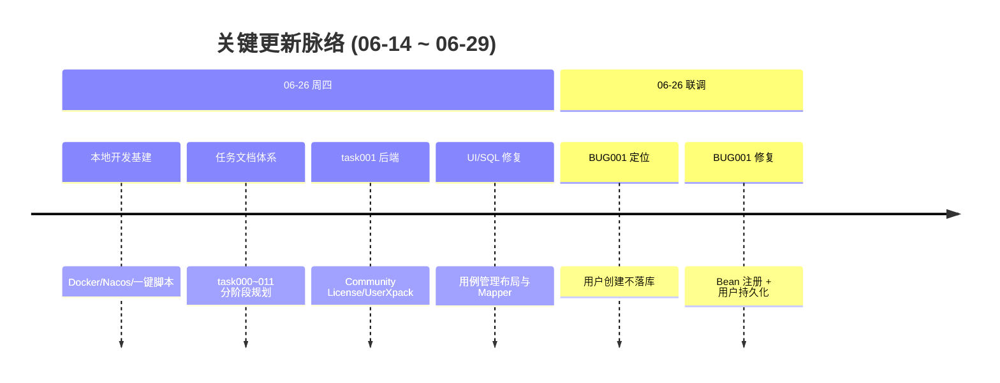

# 项目周报 · 近半月 (2026-06-14 ~ 2026-06-29)

> **项目**：MeterSphere V3 自研（`chenqifen` 分支）  
> **统计区间**：2026-06-14 ~ 2026-06-29（近 15 日）  
> **远程仓库**：`github.com:chenqifen-miduo/metersphere.git`

> **总计 2 次提交 | 55 个文件变更 | +3990 行 / -64 行 | 0 个 PR 合并**  
> **贡献者**：chenqifen-miduo (2 commits)

**区间趋势**：近半月开发集中在 6 月 26 日两个里程碑提交，主线为「本地开发基建 + 任务体系梳理」与「task001 社区版 Xpack/License 后端实现」。提交合并后，在本地联调中发现用户管理链路缺陷，已定位根因并完成代码修复（**尚未提交**）。下一阶段重心应转向 task002 组织 API 与 BUG001 修复合入。

---

## 关键更新脉络

---

## 一、本周（近半月）完成

### 1. 本地开发与 Windows 体验 — 一键启停与中间件栈

> **价值**：降低 MeterSphere V3 源码在 Windows 上的启动门槛，使后续 task 开发可本地闭环验证。

- `dev/docker-compose.yml`：MySQL / Redis / Kafka / MinIO / Nacos
- `start.ps1` / `stop.ps1` / `scripts/*.ps1`：环境检查、依赖启动、前后端启停
- `deploy/nacos/dev|prod/metersphere.properties`：配置模板
- `backend/app`：`application-local.properties`、`application.properties`、本地路径默认值
- `frontend/.env.development`：指向 `localhost:8081`

### 2. 社区版解除 + 组织架构 — 任务规划与方案文档

> **价值**：将「解除社区版限制 + 企微/Excel 组织架构同步」拆解为可执行的 12 份 task，明确依赖与优先级。

- `docs/task/task000` ~ `task011`：P0~P3 分阶段实施清单
- `docs/summary/community-unlock-and-org-structure.md`：社区版解除与组织架构方案摘要
- `docs/summary/组织架构模块设计摘要.md`：myTapd 方案导读
- `docs/develop_logs/`：开发摘要、task001 代码详细说明、BUG 修复记录

### 3. task001 — 社区版 License / UserXpack 后端实现 ✅ 已提交

> **价值**：源码部署不再因缺少企业版 Xpack JAR 而 NPE；License 校验始终 valid，解除用户数/资源池配额限制。

- 新增 `CommunityLicenseServiceImpl`：`validate()` 始终返回 `status=valid`
- 新增 `CommunityUserXpackServiceImpl`（初版）：配额网关均返回 `0`
- 单元测试 8 用例通过（`Community*Test`）
- 已合并至 `chenqifen`、`v3.x`（HEAD `4c2d2b78c0`）

### 4. UI / SQL / 静态资源 — 缺陷修复 ✅ 已提交

> **价值**：改善用例管理页面可用性，修复若干 SQL 与静态资源加载问题。

- 用例管理左树横向溢出（`ms-split-box`、`ms-tree`、`caseManagementFeature`）
- 侧边菜单滚动（`ms-menu`、`default-layout`）
- `ExtProjectMemberMapper.xml`：DISTINCT + ORDER BY 兼容
- `ExtTestPlanBugMapper.xml`：关联缺陷去重聚合
- `BaseDisplayService`：静态资源 fallback；`theme.ts` / favicon URL 修复

### 5. BUG001 — 创建用户成功但列表不显示 ⚠️ 已修复，待提交

> **价值**：恢复系统设置 → 用户管理的核心能力（创建、导入、邀请注册、启用/禁用、删除）。

| 阶段 | 现象 | 根因 |
|------|------|------|
| 一 | 创建用户 500 / NPE | `@Service` + `@ConditionalOnMissingBean` 未可靠注册 Bean |
| 二 | 提示成功但列表无数据 | Community 实现只 `return 0`，未 `insert user` / 写角色关系 |

**修复要点（工作区未提交）**：

- 新增 `CommunityXpackConfiguration`：`@Configuration` + `@Bean` 注册 License / UserXpack
- `CommunityUserXpackServiceImpl` 补全用户落库、`cftToken`、角色关系、启用/禁用、软删除
- 文档：`docs/develop_logs/buglist/2026-06-26-BUG001-创建用户成功但列表不显示.md`

---

## 二、区间数据

### 每日提交分布

| 日期 | 提交数 | 重点方向 |
|------|--------|----------|
| 06-14 ~ 06-25 | 0 | 无 git 提交记录 |
| 06-26 | 2 | 本地基建 + task001 + 文档 |

### 提交类型分布

| 类型 | 数量 | 占比 |
|------|------|------|
| feat (新功能) | 2 | 100% |
| fix / refactor / docs / chore | 0 | 0% |

### 两次提交明细

| Commit | 说明 | 规模 |
|--------|------|------|
| `65938d1d94` | 本地开发工具链、task 文档、UI/SQL 修复 | 51 files, +3841 / -64 |
| `4c2d2b78c0` | task001 Community License/UserXpack + 单测 | 6 files, +159 / -10 |

---

## 三、与历史对比

> 本仓库 `doc/` 下无更早周报，跳过周环比表格。

| 维度 | 近半月情况 |
|------|-----------|
| 已合并 PR | 0（均为本地直接提交） |
| 已提交 task | task001 ✅ |
| 进行中修复 | BUG001（用户持久化） |
| 待启动 task | task002（组织创建与切换 API） |

---

## 四、下周 / 下阶段优先级建议

| 优先级 | 方向 | 建议动作 |
|--------|------|----------|
| **P0** | BUG001 合入 | 提交 `CommunityXpackConfiguration` + 用户持久化实现；重启后端验证创建/列表/登录 |
| **P0** | task002 | 实现 `POST /system/organization/add` 与组织切换 API |
| **P1** | task003 | 前端 `licenseStore.hasLicense()` / `VITE_MS_UNLIMITED` 解除 License 门禁 |
| **P1** | 文档同步 | 更新 task001 详细说明：Community 须负责用户落库，非仅返回 0 |
| **P2** | task004~005 | Flyway 数据模型 + 组织架构查询 API |
| **P2** | 本地环境 | 修复 `stop.ps1` 误停 Docker 中间件问题；`frontend/dist` 缺失导致 Maven antrun 失败需文档化 |

---

## 五、风险与备注

1. **MeterSphere V3 用户 CRUD 依赖 Xpack 扩展点**：Community 实现必须承担企业版落库职责，否则接口成功但无数据。  
2. **Spring Boot 3.5.7 与 Spring Cloud Alibaba 版本冲突**：已通过 `spring.cloud.compatibility-verifier.enabled=false` 规避。  
3. **Maven 构建依赖 `frontend/dist`**：纯后端编译需加 `-DskipAntRunForJenkins=true`。  
4. **`deploy/nacos/dev` 含开发默认密码**：仅用于本地 Docker，生产需独立配置。

---

## 附录 A：分支状态（截至统计日）

| 分支 | HEAD | 说明 |
|------|------|------|
| `chenqifen` | `4c2d2b78c0` | 含 task001；BUG001 修复在工作区 |
| `v3.x` | `4c2d2b78c0` | 已同步 |
| `feature/v3.x-task001-community-xpack-license` | `4c2d2b78c0` | task001 功能分支 |

## 附录 B：相关文档

| 文档 | 路径 |
|------|------|
| 开发摘要 | `docs/develop_logs/2026-06-26-组织架构与社区版改造开发摘要.md` |
| task001 代码说明 | `docs/develop_logs/details/task001-社区版Xpack与License-代码详细说明.md` |
| BUG001 修复记录 | `docs/develop_logs/buglist/2026-06-26-BUG001-创建用户成功但列表不显示.md` |
| 实施总览 | `docs/task/task000-实施总览与依赖关系.md` |

---

*生成方式：基于 git 历史（2026-06-14 ~ 2026-06-29）与 `docs/develop_logs` 工作记录自动汇总。*
