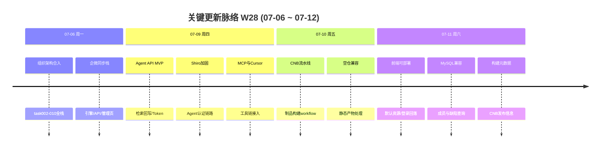

# 周报 2026-W28 (2026-07-06 ~ 2026-07-12)

> **项目**：MeterSphere V3 自研  
> **统计区间**：2026-07-06 ~ 2026-07-12  
> **对比基线**：上一份区间周报 `doc/report.2026-06-15至07-06.md`  
> **远程仓库**：`github.com:chenqifen-miduo/metersphere.git`

> **总计 15 次提交 | 357 个文件变更 | +30251 行 / -374 行 | 0 个 PR 合并**
>
> **贡献者**：zhangsj (12 commits), chenqifen-miduo (3 commits)

**本周趋势**：工作重心从「组织架构主体开发（大量工作区未合入）」转向**交付合入与平台能力扩展**。周一将 task002–010 组织/企微同步全栈一次合入；周四交付 MeterSphere Agent API MVP+P2（含 MCP/Cursor 接入）；周末由并行线推进 CNB 制品构建与生产前端可部署性修补。相对上一区间「代码已齐、等待合入」，本周完成**合入突破 + Agent 新主线落地**。

---

## 关键更新脉络

---

## 一、本周完成

### 1. 组织架构全栈合入（task002–010）— 社区版组织镜像与企微同步能力落库合入

> **价值**：管理员可管理组织与成员镜像，并通过企微同步保持通讯录一致；此前滞留工作区的能力进入可协作、可回滚的版本历史。

- **组织基础 API**：创建/切换组织、组织初始化服务
- **数据模型**：Flyway `V3.7.0_1/2`（部门、企微同步配置、同步日志、用户扩展字段）
- **查询能力**：部门树、成员分页/详情
- **企微同步**：通讯录客户端、同步引擎、手动同步/状态/日志/配置 API、Quartz 定时任务
- **管理前端**：组织架构管理页、同步面板、企微配置（含测试连通与 Secret 掩码）
- **配套**：前端 License 解除与组织入口；随交付合入的一批系统缺陷修复
- 关键提交：`7dadb7f222`

### 2. MeterSphere Agent 协作平台 MVP+P2 — 外部 Agent 可检索用例并回写结果

> **价值**：测试人员与 AI Agent 可通过标准 API/MCP 拉取用例、回写执行结果，缩短手工登记与协作成本。

- **后端模块** `agent-integration`：Token 认证、用例检索/导出、计划内回写、批量回写、执行附件、模块别名、审计日志
- **数据层**：Flyway `V3.7.1`（`agent_token` / `agent_exec_log` 等）
- **前端**：系统设置侧 Token 管理页与路由/文案
- **工具链**：`metersphere-mcp`（search/submit/batch/upload 等 tools）、Cursor 规则与 SOP
- 关键提交：`cbb70406bf`

### 3. Agent 安全接入加固 — Shiro 链路扩展，保障 Agent API 可认证访问

> **价值**：避免 Agent 接口游离于统一鉴权之外，降低未授权访问与集成联调踩坑风险。

- 抽取/接入 `ShiroFilterChainExtender`，扩展 Agent 过滤链
- 补充 Filter/检索/回写相关测试与 `scripts/verify-agent-api.ps1`
- 关键提交：`eb66723f96`

### 4. CNB 制品构建与发布流水线 — 可重复的前后端制品构建

> **价值**：团队可在 CNB 上稳定产出可部署制品，减少手工打包与环境漂移。

- 新增 `.github/workflows/cnb-build.yml`、`Dockerfile.backend`、`.deploy/*`
- 处理空静态仓库、仅保留最新制品、发布构建元数据
- 相关提交：`e36c5ad0ca`、`e2b519a384`、`4fc1244245` 等

### 5. 生产前端可部署性修补 — 默认资源、登录回落与构建配置

> **价值**：灰度/生产部署时登录页与页面展示资源可用，可选鉴权配置异常时仍能进入本地登录。

- 页面展示默认图/资源、生产后端 URL、Vite/前端构建配置
- 可选鉴权配置失败时回落本地登录
- 相关提交：`4faa6a66db`、`df5c56eb1b`、`11ec19bc31`、`5d6a7e9da5`、`6ac8e7f99f` 等

### 6. MySQL 兼容 SQL 修复 — 项目成员与测试计划缺陷查询

> **价值**：在 MySQL 环境下成员列表与测试计划缺陷查询不再因 `DISTINCT`/`GROUP BY` 规则失败。

- `ExtProjectMemberMapper.xml`：distinct 排序兼容
- `ExtTestPlanBugMapper.xml`：group by 兼容
- 相关提交：`6f20996fbb`、`1bc35495e8`

### 7. 文档与任务体系扩展 — Agent/组织日志归档与后续优化规划

> **价值**：交付可追溯，后续前端工程治理有清晰任务拆分。

- develop_logs 按 `community_rebuild` / `metersphere_agent` 归档
- 新增 Agent/产品经理 SOP；规划 `metersphere_optimize` task000–010
- 随组织架构与 Agent 大提交一并落地

---

## 二、本周数据

### 每日提交分布

| 日期 | 提交数 | 重点方向 |
|------|--------|----------|
| 07-06 (周一) | 1 | 组织架构 task002–010 全栈合入 |
| 07-07 ~ 07-08 | 0 | — |
| 07-09 (周四) | 2 | Agent MVP+P2 交付；Shiro 加固 |
| 07-10 (周五) | 2 | CNB 制品构建流水线与空仓兼容 |
| 07-11 (周六) | 10 | 前端可部署修补、MySQL 兼容、CNB 元数据 |
| 07-12 (周日) | 0 | — |

### 提交类型分布

| 类型 | 数量 | 占比 |
|------|------|------|
| feat (新功能) | 2 | 13% |
| fix (Bug 修复) | 5 | 33% |
| chore/ci/CD（含 Add/Publish/Keep/Handle/CD） | 5 | 33% |
| 中文 commit / 无前缀（Use/Fallback 等） | 3 | 20% |

---

## 三、与上周对比

> 对照上一份区间周报（2026-06-15 ~ 2026-07-06，非完整 ISO 自然周；下表「上周」指该份报告的已提交统计）。

| 指标 | 上区间 | W28 | 变化 |
|------|--------|-----|------|
| 提交数 | 3 | 15 | +400% |
| 合并 PR 数 | 0 | 0 | — |
| 文件变更 | 64 | 357 | +458% |
| 净增行数 | +5193 / -64 | +30251 / -374 | 交付量显著上升 |

### 上周方向落地情况

| 上区间建议方向 | W28 实际进展 |
|----------------|--------------|
| P0 工作区合入（task002–010 + 缺陷修复） | ✅ `7dadb7f222` 已合入组织架构全栈与配套修复 |
| P0 企微端到端联调 | ⚠️ 能力已合入，真实 CorpID/Secret 联调与验收勾选未见本周提交证据 |
| P1 task011 Excel 组织架构导入 | ❌ 未见对应提交 |
| P1 M2/M3 验收勾选 | ⚠️ 代码合入完成，里程碑验收仍待闭环 |
| P2 集成测试（Testcontainers/ENV-001） | ⚠️ Agent 侧补充了集成/单测，组织侧 Docker 依赖问题未见专门解决提交 |
| P2 安全复查（Secret 掩码/权限边界） | ⚠️ 配置掩码等随合入，系统级安全复查未见单独收口 |

**超预期完成**：MeterSphere Agent API MVP+P2、MCP/Cursor 接入、CNB 制品流水线与生产前端可部署修补——均不在上区间 P0/P1 清单内。

---

## 四、下周优先级建议

| 优先级 | 方向 | 建议动作 |
|--------|------|----------|
| P0 | Agent 端到端验收 | 本地 Flyway 建表 → 发放 Token → search/submit 联调；Cursor MCP 实测；关闭 task010 验收项 |
| P0 | 企微同步联调 | 配置真实 Secret → 手动同步 → 验证部门树/成员表/同步日志 |
| P1 | 双线历史合并收口 | 确认自研线与 CNB 线已稳定合入主开发分支，补齐部署文档与发布检查单 |
| P1 | task011 Excel 导入 | 启动组织架构 Excel 导入（补齐 P3 剩余缺口） |
| P2 | 生产构建冒烟 | 跑通 CNB 构建产物在目标环境的登录/组织页/Agent API 冒烟 |
| P2 | 安全与权限复查 | Agent Token scope、企微 Secret 掩码、组织访问边界做一次人工检查 |

---

## 附录：本周主要提交（无 GitHub PR 合并）

| Commit | 标题 | 分类 |
|--------|------|------|
| `7dadb7f222` | 组织架构全栈合入（task002–010） | ✨ 新功能 |
| `cbb70406bf` | Agent API MVP、P2 扩展与集成测试 | ✨ 新功能 / 🧠 AI |
| `eb66723f96` | 扩展 Shiro Filter Chain 支持 Agent API | 🔐 权限 |
| `e36c5ad0ca` | 新增 CNB 制品构建 workflow | 🔧 DevOps |
| `e2b519a384` ~ `4fc1244245` | CNB 空仓/制品保留/元数据与前端可部署修补 | 🔧 DevOps / 🐛 修复 |
| `6f20996fbb` / `1bc35495e8` | MySQL 成员排序与测试计划缺陷查询兼容 | 🐛 Bug 修复 |

---

## 附录 B：相关文档

| 文档 | 路径 |
|------|------|
| 上一份区间周报 | `doc/report.2026-06-15至07-06.md` |
| Agent 实施总览摘要 | `docs/develop_logs/metersphere_agent/2026-07-07-task000-实施总览-开发摘要.md` |
| 组织架构 task010 | `docs/develop_logs/community_rebuild/2026-07-06-task010-企微配置扩展.md` |
| Agent 协作 SOP | `docs/SOP/SOP-MeterSphere-Agent协作平台操作规范.md` |

---

*生成方式：基于 git 历史（2026-07-06 ~ 2026-07-12）与 confirmed 重大脉络自动汇总。【AI生成】*
