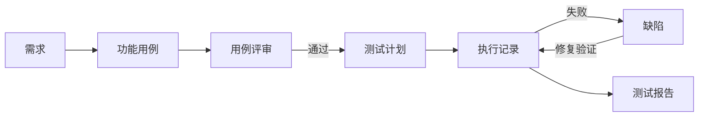

# MeterSphere 产品经理标准操作规范（SOP）

> **文档版本**：v1.0  
> **编写日期**：2026-07-08  
> **适用范围**：MeterSphere V3 自研版全体产品经理、测试负责人、项目 Owner  
> **文档性质**：产品标准操作规范  
> **当前平台版本**：V3.x（社区版解除限制 + 组织架构扩展 + Agent 集成 MVP）  
> **【AI生成】已人工审核确认**：待产品负责人审核后生效

---

## 目录

1. [产品概述](#1-产品概述)
2. [适用角色与职责边界](#2-适用角色与职责边界)
3. [平台架构与数据模型](#3-平台架构与数据模型)
4. [平台初始化 SOP](#4-平台初始化-sop)
5. [组织与权限管理 SOP](#5-组织与权限管理-sop)
6. [测试管理全生命周期 SOP](#6-测试管理全生命周期-sop)
7. [接口测试模块 SOP](#7-接口测试模块-sop)
8. [自研扩展能力 SOP](#8-自研扩展能力-sop)
9. [迭代与发版管理 SOP](#9-迭代与发版管理-sop)
10. [验收与质量门禁](#10-验收与质量门禁)
11. [异常处理与升级机制](#11-异常处理与升级机制)
12. [术语表](#12-术语表)
13. [附录](#13-附录)

---

## 1. 产品概述

### 1.1 产品定位

MeterSphere 是新一代开源持续测试平台，覆盖**测试管理、接口测试、缺陷管理、测试报告**等核心能力，并内置 AI 助手提升测试效率。

本仓库为**米多内部自研版**，在开源社区版基础上扩展了：

| 扩展能力 | 说明 | 状态 |
|---------|------|:--:|
| 社区版限制解除 | 多组织、多用户、多资源池，不受 License 配额限制 | ✅ 已上线 |
| 组织架构管理 | 企微通讯录同步、部门树展示、成员查询 | ✅ 已上线 |
| Excel 组织架构导入 | 批量导入部门与用户 | 🔄 规划中 |
| AI Agent 协作 | Cursor/MCP 接入，用例检索与结果回写 | ✅ MVP 已上线 |

### 1.2 核心价值（PM 视角）

| 场景 | 传统方式 | MeterSphere 方式 |
|------|---------|-----------------|
| 用例管理 | Excel / 单机工具，版本混乱 | 模块树 + 标签 + 评审，团队协作 |
| 测试执行 | 人工逐条执行，结果分散 | 测试计划统一调度，执行历史可追溯 |
| 接口测试 | Postman + JMeter 分离 | 调试、定义、场景、Mock 一体化 |
| 缺陷跟踪 | 与测试用例脱节 | 用例 ↔ 缺陷双向关联 |
| AI 辅助 | 无 | AI 生成用例 + Agent 自动执行回写 |
| 组织管理 | 手工维护账号 | 企微同步，组织-项目-成员自动对齐 |

### 1.3 产品分层架构

```
系统（System）
  └── 组织（Organization）  ← 业务隔离单元，对应一个业务线/事业部
        └── 项目（Project）  ← 测试工作单元，对应一个产品/系统
              ├── 功能用例
              ├── 接口测试
              ├── 测试计划
              ├── 缺陷管理
              └── 测试报告
```

**PM 关键认知**：
- **组织**决定权限边界和数据隔离；一个企微主体建议对应一个 MS 组织
- **项目**是日常测试工作的入口；PM 主要在项目维度推进测试活动
- **系统管理员**管全局；**组织管理员**管本组织；**项目管理员**管本项目

---

## 2. 适用角色与职责边界

### 2.1 角色矩阵

| 角色 | 核心职责 | 典型操作 | 平台入口 |
|------|---------|---------|---------|
| **产品经理（PM）** | 需求拆解、用例评审、测试计划制定、验收签字 | 创建评审、关联需求、审阅报告 | 用例评审、测试计划、报告 |
| **测试负责人** | 测试策略、资源协调、质量门禁 | 创建计划、分配任务、审核 Agent Token | 测试计划、系统设置 |
| **测试工程师** | 用例编写、执行、缺陷提交 | CRUD 用例、执行计划、提 Bug | 用例管理、测试计划 |
| **开发工程师** | 自测、缺陷修复 | 查看关联用例、修复 Bug | 缺陷管理、工作台 |
| **系统管理员** | 平台运维、组织/用户/权限 | 创建组织、同步企微、管理 Token | 系统设置 |
| **自动化工程师** | Agent/MCP 配置、脚本维护 | 配置 Cursor MCP、维护 Playwright | Agent Token、MCP |

### 2.2 PM 职责边界（Do / Don't）

| ✅ PM 应该做 | ❌ PM 不应该做 |
|-------------|---------------|
| 定义测试范围和验收标准 | 直接修改系统配置（组织/权限） |
| 发起/参与用例评审 | 编写接口自动化脚本 |
| 确认测试计划覆盖需求 | 管理 Agent Token（交给测试负责人） |
| 审阅测试报告并签字 | 操作企微同步（交给系统管理员） |
| 推动缺陷闭环 | 绕过评审直接上线 |

---

## 3. 平台架构与数据模型

### 3.1 功能模块地图

| 序号 | 模块 | 前端路径 | 核心对象 | PM 关注度 |
|:--:|------|---------|---------|:--:|
| 0 | 工作台 | `/workstation/*` | 待办、关注、创建 | ⭐ |
| 1 | 项目管理 | `/project-management/*` | 环境、模板、成员 | ⭐⭐ |
| 2 | 测试计划 | `/test-plan/*` | 计划、执行、报告 | ⭐⭐⭐ |
| 3 | 用例管理 | `/case-management/*` | 功能用例、评审 | ⭐⭐⭐ |
| 4 | 接口测试 | `/api-test/*` | 接口定义、场景 | ⭐⭐ |
| 5 | 缺陷管理 | `/bug-management/*` | 缺陷 | ⭐⭐⭐ |
| 6 | 系统设置 | `/setting/system/*` | 组织、用户、架构 | ⭐ |
| 7 | 组织设置 | `/setting/organization/*` | 组织成员、模板 | ⭐⭐ |

### 3.2 核心对象关系



### 3.3 权限模型速查

| 层级 | 权限前缀 | 示例 |
|------|---------|------|
| 系统级 | `SYSTEM_*` | `SYSTEM_USER:READ` |
| 组织级 | `ORGANIZATION_*` | `ORGANIZATION_MEMBER:READ` |
| 项目级 | `PROJECT_*` | `PROJECT_TEST_PLAN:READ` |

PM 日常所需项目级权限：
- `FUNCTIONAL_CASE:READ` — 查看用例
- `CASE_REVIEW:READ` — 参与评审
- `PROJECT_TEST_PLAN:READ` — 查看计划与报告
- `PROJECT_BUG:READ` — 查看缺陷

---

## 4. 平台初始化 SOP

> **执行角色**：系统管理员（PM 配合确认业务需求）  
> **触发时机**：新环境部署 / 新业务线接入

### 4.1 初始化检查清单

```
□ Step 1：确认环境可用
    ├─ 前端 http://localhost:5173（或生产域名）
    ├─ 后端 http://localhost:8081
    └─ 管理员账号可登录

□ Step 2：创建组织
    ├─ 路径：系统设置 → 组织与项目 → 创建组织
    ├─ 填写：组织名称、组织管理员
    └─ 验收：组织列表出现新组织，模板/字段/状态流自动初始化

□ Step 3：同步组织架构（可选）
    ├─ 路径：系统设置 → 组织架构
    ├─ 配置企微通讯录 Secret + Cron
    └─ 手动触发同步，确认部门树与成员数据

□ Step 4：创建项目
    ├─ 路径：进入组织 → 组织设置 → 组织项目 → 创建项目
    ├─ 填写：项目名称、项目管理员
    └─ 验收：项目成员可正常进入项目

□ Step 5：配置项目基础
    ├─ 项目成员与角色分配
    ├─ 用例/缺陷/接口模板确认
    ├─ 测试环境配置
    └─ 消息通知（可选）

□ Step 6：PM 确认接入
    ├─ PM 账号可进入项目
    ├─ 菜单权限符合预期
    └─ 通知 PM 可以开始用例工作
```

### 4.2 组织命名规范

| 类型 | 规范 | 示例 |
|------|------|------|
| 组织名 | `{公司/事业部名}` | `米多科技` |
| 项目名 | `{产品名}-{版本/线}` | `工单系统-V2` |
| 测试计划 | `{迭代}-{类型}-{日期}` | `Sprint12-功能测试-20260708` |
| Agent 专用计划 | `Agent-{类型}-{年份}` | `Agent-功能测试-2026` |

---

## 5. 组织与权限管理 SOP

### 5.1 新成员接入流程

```
HR/行政提供名单
  → 系统管理员在企微同步或手动创建用户
    → 组织管理员添加为组织成员
      → 项目管理员添加为项目成员并分配角色
        → PM 确认成员可访问所需模块
```

### 5.2 角色分配建议

| 项目角色 | 建议权限 | 适用人员 |
|---------|---------|---------|
| 项目管理员 | 全部项目权限 | 测试负责人 |
| 测试成员 | 用例读写 + 计划执行 + 缺陷读写 | 测试工程师 |
| 开发成员 | 用例只读 + 缺陷读写 | 开发工程师 |
| 产品成员 | 用例只读 + 评审参与 + 报告只读 | 产品经理 |
| 只读成员 | 各模块 READ | 管理层/干系人 |

### 5.3 组织架构运维（系统管理员）

| 操作 | 路径 | 频率 |
|------|------|------|
| 手动同步企微 | 系统设置 → 组织架构 → 同步 | 组织变更时 |
| 查看同步日志 | 同上 → 同步面板 | 每次同步后 |
| 配置定时同步 | 同上 → 同步配置 | 一次性 |
| Excel 导入（规划中） | 系统设置 → 组织架构 → 导入 | 初始化时 |

**PM 需知**：组织架构为**只读镜像**（数据源自企微），不支持前端手工增删部门。人员变动走企微 → 同步 → 平台自动更新。

---

## 6. 测试管理全生命周期 SOP

> 本章为 PM 核心工作流，按迭代节奏执行。

### 6.1 迭代测试全流程

```
需求评审（PM）
  ↓
用例设计（测试工程师）
  ↓
用例评审（PM + 测试 + 开发）  ← PM 关键节点
  ↓
用例入库（测试工程师）
  ↓
纳入测试计划（测试负责人）
  ↓
测试执行（测试工程师 / Agent）
  ↓
缺陷跟踪（测试 + 开发）
  ↓
测试报告（测试负责人）
  ↓
PM 验收签字  ← PM 关键节点
```

### 6.2 用例管理 SOP

#### 6.2.1 模块规划（PM 参与）

| 规范 | 说明 | 示例 |
|------|------|------|
| 按业务域划分顶层模块 | 与产品功能模块对齐 | `登录/` `订单/` `支付/` |
| 不超过 3 层 | 便于检索和 Agent 命中 | `订单/创建/正常流程` |
| 命名简洁明确 | 避免歧义 | ✅ `用户管理` ❌ `一些用户相关的` |

#### 6.2.2 用例编写规范（PM 审核要点）

| 检查项 | 要求 |
|--------|------|
| 前置条件 | 明确数据/环境/权限要求 |
| 步骤可执行 | 每步操作 + 预期结果一一对应 |
| 优先级 | 使用 `functional_priority` 字段：P0/P1/P2/P3 |
| 标签 | 统一规范：`smoke`、`regression`、`P0` 等 |
| 关联需求 | 每条用例关联对应需求/Story |
| 必须挂模块 | 未挂模块的用例无法被模块检索和 Agent 命中 |

#### 6.2.3 用例评审 SOP（PM 主导）

**触发时机**：每个迭代需求冻结后、开发提测前

**评审流程**：

```
Step 1：测试负责人创建评审
  ├─ 路径：用例管理 → 用例评审 → 创建评审
  ├─ 填写：评审名称、关联用例范围
  └─ 指定：PM、开发代表为评审人

Step 2：评审人逐条审阅
  ├─ 检查：覆盖度（需求 ↔ 用例）
  ├─ 检查：步骤完整性、预期结果明确性
  ├─ 检查：优先级分配合理性
  └─ 操作：通过 / 驳回 / 提修改意见

Step 3：测试工程师修改被驳回用例

Step 4：PM 确认评审结论
  ├─ 全部通过 → 用例定稿，可纳入测试计划
  └─ 存在驳回 → 返回 Step 2
```

**PM 评审检查清单**：

- [ ] 所有 P0 需求均有对应用例
- [ ] 正向 + 异常 + 边界场景覆盖
- [ ] 用例步骤可被测试人员（或 Agent）逐步执行
- [ ] 优先级与业务风险匹配
- [ ] 无重复/冗余用例

### 6.3 测试计划 SOP

#### 6.3.1 计划创建（测试负责人执行，PM 确认范围）

| 步骤 | 操作 | 负责人 |
|:--:|------|:--:|
| 1 | 创建测试计划，命名规范 `{迭代}-{类型}-{日期}` | 测试负责人 |
| 2 | 关联本迭代需执行的用例（按模块/标签批量关联） | 测试负责人 |
| 3 | PM 确认用例范围与需求覆盖一致 | PM |
| 4 | 分配执行人（可按模块/优先级） | 测试负责人 |
| 5 | 设置计划起止时间 | 测试负责人 |

#### 6.3.2 Agent 专用测试计划（测试负责人创建）

| 规范 | 说明 |
|------|------|
| 独立计划 | 名称如 `Agent-功能测试-2026`，与人工计划分开 |
| 预先关联 | 所有 Agent 可执行用例预先关联到该计划 |
| 不重复关联 | 同一计划内一条用例只关联一次 |
| 固定 planId | Agent 检索时自动匹配，无需每次传参 |

### 6.4 测试执行 SOP

#### 6.4.1 人工执行

```
进入测试计划详情
  → 选择待执行用例
    → 逐步执行并标记每步结果（通过/失败/阻塞）
      → 失败时关联缺陷或新建缺陷
        → 全部执行完毕，查看计划进度
```

#### 6.4.2 Agent 辅助执行（PM 了解即可）

```
测试工程师/开发在 Cursor 中说：
  「提取登录模块 P0 用例，执行后回写 MeterSphere」
    → Agent 检索用例 → 外部执行 → 回写结果
      → PM 在测试计划中查看 Agent 执行记录
        → PM 抽查 Agent 结果质量（关键用例需人工复核）
```

> Agent 详细操作见：[SOP-MeterSphere-Agent协作平台操作规范.md](SOP-MeterSphere-Agent协作平台操作规范.md)

### 6.5 缺陷管理 SOP

#### 6.5.1 缺陷生命周期

```
新建（测试）→ 确认（开发）→ 修复中（开发）→ 已修复（开发）→ 验证（测试）→ 关闭
                                    ↓
                               拒绝/延期（开发 + PM 确认）
```

#### 6.5.2 PM 在缺陷流程中的职责

| 节点 | PM 动作 |
|------|---------|
| 缺陷创建 | 确认严重级别与优先级合理 |
| 缺陷拒绝 | 仲裁测试与开发的分歧 |
| P0/P1 缺陷 | 推动开发优先修复，跟踪进度 |
| 回归验证 | 确认缺陷关闭后不影响其他功能 |
| 上线前 | 确认无未关闭 P0/P1 缺陷 |

#### 6.5.3 缺陷严重级别参考

| 级别 | 定义 | PM 处理 |
|------|------|---------|
| P0-致命 | 系统崩溃、数据丢失、核心流程不可用 | 立即升级，阻塞发版 |
| P1-严重 | 主要功能异常，无绕行方案 | 必须在当前迭代修复 |
| P2-一般 | 次要功能异常，有绕行方案 | 可排入下一迭代 |
| P3-轻微 | UI/文案/体验问题 | 记录待优化 |

### 6.6 测试报告 SOP

#### 6.6.1 报告生成（测试负责人）

```
测试计划执行完毕
  → 测试计划 → 报告 → 生成报告
    → 选择关联计划、配置报告内容
      → 生成并分享链接
```

#### 6.6.2 PM 验收审阅（PM 主导）

**审阅检查清单**：

- [ ] 需求覆盖率：所有 P0 需求已测试
- [ ] 用例通过率：P0 用例 100% 通过
- [ ] 缺陷状态：无未关闭 P0/P1 缺陷
- [ ] 遗留风险：P2/P3 缺陷已评估并记录
- [ ] Agent 执行质量：关键用例已人工复核（如使用 Agent）
- [ ] 签字确认：PM 在报告中标记验收结论

**验收结论模板**：

| 结论 | 条件 |
|------|------|
| ✅ 通过，可上线 | P0 用例全通过 + 无 P0/P1 未关闭缺陷 |
| ⚠️ 有条件通过 | P0 通过 + P1 有修复计划 + PM 确认风险可接受 |
| ❌ 不通过 | 存在 P0 未通过用例或 P0 未关闭缺陷 |

---

## 7. 接口测试模块 SOP

> PM 通常不直接操作接口测试，但需了解能力边界以便规划。

### 7.1 模块能力概览

| 子模块 | 路径 | 说明 | PM 参与场景 |
|--------|------|------|-----------|
| 接口调试 | `/api-test/debug` | 单次请求调试 | 一般不参与 |
| 接口定义 | `/api-test/management` | 接口文档化管理 | 需求评审时确认接口清单 |
| 接口场景 | `/api-test/scenario` | 多接口编排自动化 | 确认核心链路覆盖 |
| Mock 服务 | `/api-test/management` | 接口 Mock | 前后端分离联调 |
| 测试报告 | `/api-test/report` | 接口执行报告 | 审阅接口测试报告 |

### 7.2 PM 在接口测试中的职责

| 阶段 | PM 动作 |
|------|---------|
| 需求评审 | 确认接口清单、核心链路 |
| 测试计划 | 确认接口场景已纳入计划 |
| 报告审阅 | 关注核心接口通过率 |
| 上线决策 | 接口 P0 场景必须全通过 |

---

## 8. 自研扩展能力 SOP

### 8.1 社区版限制解除

**背景**：开源社区版限制 1 组织、5 用户、1 资源池。自研版已解除。

**PM 需知**：
- 可自由创建多个组织、 unlimited 用户
- 前端需配置 `VITE_MS_UNLIMITED=true`
- 不影响 PM 日常工作流，但多组织场景需注意切换组织后项目上下文变化

### 8.2 组织架构管理

**入口**：系统设置 → 组织架构

**PM 使用场景**：
- 查看部门结构与成员分布
- 确认测试/项目成员是否已同步到平台
- 不直接操作同步（由系统管理员执行）

### 8.3 AI Agent 协作

**PM 职责**：
- 确认 Agent 专用测试计划已创建
- 确认用例模块/标签规范，便于 Agent 检索
- 验收时关注 Agent 执行结果，关键用例需人工复核
- 审批 Agent Token 申请（或委托测试负责人）

**PM 不需操作**：
- MCP 配置、Token 创建、Playwright 脚本维护

> 详细 Agent SOP 见：[SOP-MeterSphere-Agent协作平台操作规范.md](SOP-MeterSphere-Agent协作平台操作规范.md)

---

## 9. 迭代与发版管理 SOP

### 9.1 迭代节奏（建议）

| 阶段 | 时间占比 | 关键产出 | 负责人 |
|------|---------|---------|:--:|
| 需求评审 | 10% | 需求清单、验收标准 | PM |
| 用例设计与评审 | 20% | 评审通过的用例集 | 测试 + PM |
| 开发 | 40% | 可测版本 | 开发 |
| 测试执行 | 20% | 执行记录、缺陷清单 | 测试 |
| 验收与发版 | 10% | 测试报告、PM 签字 | PM + 测试负责人 |

### 9.2 发版前质量门禁

```
Gate 1：用例评审通过
  ↓
Gate 2：P0 用例执行通过率 100%
  ↓
Gate 3：无 P0/P1 未关闭缺陷
  ↓
Gate 4：PM 验收签字
  ↓
Gate 5：测试负责人确认报告
  ↓
✅ 可发版
```

**任一 Gate 不通过 → 不发版，回到对应阶段修复。**

### 9.3 发版 Checklist（PM 执行）

- [ ] 本迭代所有 P0 需求已关联用例
- [ ] 用例评审已全部通过
- [ ] 测试计划执行完毕
- [ ] 测试报告已生成并审阅
- [ ] P0 用例通过率 100%
- [ ] 无 P0/P1 未关闭缺陷
- [ ] 遗留 P2/P3 缺陷已记录并评估风险
- [ ] PM 验收结论已填写
- [ ] 相关干系人已通知

### 9.4 需求变更管理

| 变更类型 | PM 动作 | 影响 |
|---------|---------|------|
| 新增需求 | 补充用例 → 追加评审 → 纳入计划 | 可能延期 |
| 需求变更 | 更新用例 → 重新评审受影响部分 | 可能延期 |
| 需求移除 | 标记用例废弃 → 从计划移除 | 无影响 |
| 紧急 Hotfix | 最小用例集 → 快速执行 → 加速验收 | 简化流程 |

---

## 10. 验收与质量门禁

### 10.1 里程碑验收标准

| 里程碑 | 验收标准 | 验收人 |
|--------|---------|:--:|
| M0：平台初始化 | 组织/项目/成员/权限可用 | 系统管理员 + PM |
| M1：用例就绪 | 本迭代用例评审通过 | PM |
| M2：测试完成 | 计划执行完毕，报告生成 | 测试负责人 |
| M3：PM 验收 | PM 签字确认可上线 | PM |

### 10.2 缺陷分级与处理 SLA

| 级别 | 响应时间 | 修复时间 | 是否阻塞发版 |
|------|---------|---------|:----------:|
| P0 | 2 小时 | 24 小时 | ✅ 是 |
| P1 | 4 小时 | 48 小时 | ✅ 是 |
| P2 | 1 工作日 | 下一迭代 | ❌ 否 |
| P3 | 3 工作日 | 排期优化 | ❌ 否 |

### 10.3 已知限制（PM 需了解）

| 限制 | 影响 | 规避方式 |
|------|------|---------|
| 功能用例不支持平台内 UI 自动化 | Agent 需在外部执行 | 使用 Cursor + Playwright |
| 计划外回写（P2 待建设） | Agent 回写必须关联测试计划 | 预先创建 Agent 专用计划 |
| 组织架构只读 | 不能前端手工改部门 | 走企微变更 → 同步 |
| 社区版 AI 能力 | 部分 AI 功能可能受限 | 确认自研版配置 |

---

## 11. 异常处理与升级机制

### 11.1 常见问题处理

| 现象 | 可能原因 | PM 处理方式 |
|------|---------|-----------|
| 看不到「创建组织」按钮 | 前端 License 限制未解除 | 联系系统管理员检查 `VITE_MS_UNLIMITED` |
| 切换组织后项目列表为空 | 未进入正确组织上下文 | 重新进入组织 → 选择项目 |
| 用例评审页面 404 | 路由兼容问题（已修复） | 使用「用例评审」而非旧路径 `caseReview` |
| 测试计划执行历史为空 | 数据关联问题（已修复） | 联系测试负责人排查 |
| 工作台数据为空 | orgId 上下文缺失 | 确认已选择组织和项目 |
| Agent 回写后平台看不到结果 | 未关联测试计划 | 确认用例已关联 Agent 专用计划 |

### 11.2 升级路径

```
PM 发现问题
  → 判断级别（P0-P3）
    → P0/P1：立即通知测试负责人 + 开发负责人
      → 测试负责人创建缺陷并跟踪
        → 修复后 PM 确认回归
    → P2/P3：记录缺陷，排入下一迭代
```

### 11.3 跨团队协作文档

| 场景 | 参考文档 |
|------|---------|
| 提 Bug / 查 Bug | [MeterSphere-全系统-缺陷清单-2026-07-04.md](./MeterSphere-全系统-缺陷清单-2026-07-04.md) |
| 测试范围与策略 | [MeterSphere-全系统-测试策略-2026-07-04.md](../task/destination/MeterSphere-全系统-测试策略-2026-07-04.md) |
| Agent 协作 | [SOP-MeterSphere-Agent协作平台操作规范.md](SOP-MeterSphere-Agent协作平台操作规范.md) |
| 组织架构方案 | [community-unlock-and-org-structure.md](../summary/community-unlock-and-org-structure.md) |

---

## 12. 术语表

| 术语 | 说明 |
|------|------|
| **系统** | MeterSphere 平台全局层，管理所有组织 |
| **组织** | 业务隔离单元，通常对应一个事业部/企微主体 |
| **项目** | 测试工作单元，PM 日常操作的主要上下文 |
| **功能用例** | 手工测试用例，含步骤和预期结果 |
| **用例评审** | 对用例进行同行评审的流程 |
| **测试计划** | 一次测试活动的用例集合与执行调度 |
| **testPlanCaseId** | 用例在测试计划中的关联 ID |
| **Agent** | 外部 AI 助手，通过 API/MCP 与平台交互 |
| **MCP** | Model Context Protocol，AI 助手接入协议 |
| **functional_priority** | 用例优先级自定义字段（P0/P1/P2/P3） |
| **smoke** | 冒烟测试标签，最高优先级快速验证 |
| **regression** | 回归测试标签，全量或增量回归 |

---

## 13. 附录

### 附录 A：PM 日常工作 Checklist

**每日**：
- [ ] 查看工作台待办（待评审用例、待确认缺陷）
- [ ] 跟踪 P0/P1 缺陷修复进度

**每迭代**：
- [ ] 参与/主导用例评审
- [ ] 确认测试计划范围
- [ ] 审阅测试报告并签字
- [ ] 确认发版门禁全部通过

**每季度**：
- [ ] 回顾用例模块结构是否需要调整
- [ ] 评估 Agent 协作效果与覆盖率
- [ ] 确认组织架构同步正常

### 附录 B：页面路径速查

| 功能 | 路径 |
|------|------|
| 工作台首页 | `/workstation/home` |
| 功能用例 | `/case-management/featureCase` |
| 用例评审 | `/case-management/caseManagementReview` |
| 测试计划 | `/test-plan/testPlanIndex` |
| 测试报告 | `/test-plan/testPlanReport` |
| 缺陷管理 | `/bug-management/index` |
| 组织与项目 | `/setting/system/organization-and-project` |
| 组织架构 | `/setting/system/org-structure` |
| 项目设置 | `/project-management/permission` |

### 附录 C：相关文档索引

| 文档 | 路径 | 用途 |
|------|------|------|
| Agent 协作 SOP | `docs/SOP-MeterSphere-Agent协作平台操作规范.md` | Agent 接入与日常使用 |
| 全系统测试策略 | `docs/task/destination/MeterSphere-全系统-测试策略-2026-07-04.md` | 测试范围与验收标准 |
| 缺陷清单 | `docs/MeterSphere-全系统-缺陷清单-2026-07-04.md` | 已知问题跟踪 |
| 社区版改造方案 | `docs/summary/community-unlock-and-org-structure.md` | 自研扩展背景 |
| Agent 改造方案 | `docs/task/destination/MeterSphere-Agent集成-改造方案-2026-07-07.md` | Agent 技术方案 |
| Cursor 接入指南 | `metersphere-mcp/docs/cursor-onboarding.md` | MCP 配置 |

### 附录 D：版本记录

| 版本 | 日期 | 变更说明 | 作者 |
|------|------|---------|------|
| v1.0 | 2026-07-08 | 初版：覆盖平台初始化、测试全生命周期、自研扩展、发版门禁 | AI 辅助生成 |

---

*本文档由产品经理维护，随平台版本迭代更新。如有疑问或改进建议，请联系测试负责人或系统管理员。*
