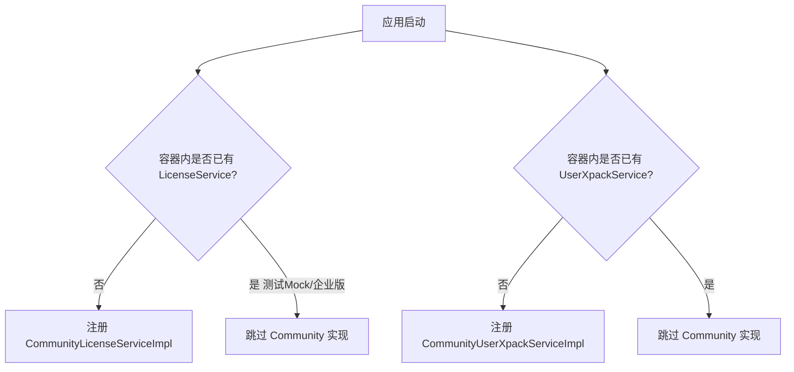

# task001 代码详细说明 — 社区版 Xpack 与 License 实现

> **任务文档**：[../../task/task001-P0-社区版Xpack与License实现.md](../../../task/task001-P0-社区版Xpack与License实现.md)  
> **提交**：`4c2d2b78c0`（分支 `feature/v3.x-task001-community-xpack-license`）  
> **范围**：本文**仅**说明 task001 新建/修改的 4 个 Java 文件及其在系统中的职责

---

## 1. 任务要解决什么问题

MeterSphere 开源版中，`LicenseService` 与 `UserXpackService` 只有接口定义，**生产环境没有默认实现**：

- 企业版通过外部 Xpack JAR 注入实现类  
- 社区版运行时若调用方通过 `CommonBeanFactory.getBean(...)` 取 Bean，可能无实现或校验失败  

task001 在 `system-setting` 模块新增两个 **Community 实现类**，使社区版部署时：

1. License 校验始终通过（`status = valid`）  
2. 用户增删改配额网关始终返回成功（`0`）  

---

## 2. 涉及文件一览

| 文件 | 类型 | 职责 |
|------|------|------|
| `CommunityLicenseServiceImpl.java` | 生产代码 | License 永远有效 |
| `CommunityUserXpackServiceImpl.java` | 生产代码 | 用户配额永远放行 |
| `CommunityLicenseServiceImplTest.java` | 单元测试 | 验证 License 实现契约 |
| `CommunityUserXpackServiceImplTest.java` | 单元测试 | 验证 UserXpack 实现契约 |

路径前缀：`backend/services/system-setting/src/main/java/io/metersphere/system/service/impl/`  
测试路径：`backend/services/system-setting/src/test/java/io/metersphere/system/service/impl/`

---

## 3. `CommunityLicenseServiceImpl`

### 3.1 类级设计

```java
@Service
@ConditionalOnMissingBean(LicenseService.class)
public class CommunityLicenseServiceImpl implements LicenseService
```

| 元素 | 作用 |
|------|------|
| `@Service` | 注册为 Spring Bean，供 `CommonBeanFactory.getBean(LicenseService.class)` 获取 |
| `@ConditionalOnMissingBean(LicenseService.class)` | 容器中已有其他 `LicenseService`（如测试 Mock、企业版 Xpack）时**不注册**本类，避免 Bean 冲突 |
| `implements LicenseService` | 实现 MeterSphere 统一的 License 扩展点 |

### 3.2 私有方法

#### `validLicense()`（private static）

| 项 | 说明 |
|----|------|
| **作用** | 构造统一的「有效 License」响应对象 |
| **目的** | 避免在多个 public 方法中重复 `new LicenseDTO()` + `setStatus("valid")` |
| **返回值** | `LicenseDTO`，且 `status` 固定为 `"valid"` |

### 3.3 接口方法

#### `validate()`

| 项 | 说明 |
|----|------|
| **作用** | 校验当前 License 是否有效 |
| **目的** | 社区版直接返回 valid，让下游认为已授权 |
| **实现** | 调用 `validLicense()` |
| **主要调用方** | `LicenseController.validate()` → `GET /license/validate`；`NodeResourcePoolService.licenseValidate()`；`TestResourcePoolService.licenseValidate()`；`ApiExecuteService` |

**解除的限制示例**：

- 资源池节点并发数校验：`NodeResourcePoolService` 中 `if (!licenseValidate())` 不再拦截  
- 资源池单任务并发：`TestResourcePoolService` 中 `!licenseValidate()` 时强制默认并发  

#### `refreshLicense()`

| 项 | 说明 |
|----|------|
| **作用** | 刷新 License 状态 |
| **目的** | 与企业版接口对齐；社区版无真实 License 文件，刷新结果仍为 valid |
| **实现** | 调用 `validLicense()` |

#### `addLicense(String licenseCode, String userId)`

| 项 | 说明 |
|----|------|
| **作用** | 添加/导入 License 码 |
| **目的** | 满足 `LicenseController.addLicense()` 接口契约；社区版不解析 licenseCode，直接视为成功 |
| **实现** | 调用 `validLicense()`，忽略 `licenseCode`、`userId` 参数 |
| **调用方** | `POST /license/add` |

#### `getCode(String encrypt)`

| 项 | 说明 |
|----|------|
| **作用** | License 相关编解码辅助 |
| **目的** | 保持接口完整实现，避免调用方 NPE |
| **实现** | 原样返回 `encrypt` 入参（与测试 Mock 行为一致） |

---

## 4. `CommunityUserXpackServiceImpl`

### 4.1 类级设计

```java
@Service
@ConditionalOnMissingBean(UserXpackService.class)
public class CommunityUserXpackServiceImpl implements UserXpackService
```

| 元素 | 作用 |
|------|------|
| `@Service` | 注册 Spring Bean |
| `@ConditionalOnMissingBean(UserXpackService.class)` | 企业版 Xpack 已提供实现时不注册 |
| `implements UserXpackService` | 实现用户配额扩展点 |

### 4.2 常量

#### `SUCCESS = 0`（private static final int）

| 项 | 说明 |
|----|------|
| **作用** | 表示「配额检查通过，允许继续操作」 |
| **目的** | 与 `SimpleUserService` 中 `if (responseCode == 0)` 分支约定一致 |
| **对照** | 企业版非 0 时：` -1` → 用户总数超限；其他正值 → 部门用户数限制 |

### 4.3 接口方法

#### `GWHowToAddUser(UserBatchCreateRequest, String source, String operator)`

| 项 | 说明 |
|----|------|
| **作用** | 批量添加用户前的配额校验网关 |
| **目的** | 社区版不限制用户数，直接放行 |
| **实现** | `return SUCCESS`（0） |
| **调用方** | `SimpleUserService.saveUserAndRole()` ← 添加用户、批量导入等 |

**调用链**：

```
POST /system/user/addUser（及同类接口）
  → SimpleUserService.saveUserAndRole()
    → GWHowToAddUser() 返回 0
      → 继续 insert user、写 user_role_relation、记录操作日志
```

**若返回非 0**（企业版/community 未实现时可能发生）：

- `-1` → 抛 `USER_TOO_MANY`（开源版约 5 人上限提示）  
- 其他 → 抛 `DEPT_USER_TOO_MANY`  

#### `GWHowToAddUser(UserRegisterRequest, UserInvite)`

| 项 | 说明 |
|----|------|
| **作用** | 用户注册 / 邀请注册前的配额校验 |
| **目的** | 同上，覆盖邀请链接注册场景 |
| **实现** | `return SUCCESS` |
| **调用方** | `SimpleUserService` 邀请注册流程 |

#### `GWHowToChangeUser(List<String> userIds, boolean enable, String operator)`

| 项 | 说明 |
|----|------|
| **作用** | 批量启用/禁用用户前的配额校验 |
| **目的** | 企业版可能在启用时校验 License 用户数；社区版放行 |
| **实现** | `return SUCCESS` |
| **调用方** | `SimpleUserService` 批量更新用户状态 |

#### `GWHowToDeleteUser(List<String> userIdList, String operator)`

| 项 | 说明 |
|----|------|
| **作用** | 批量删除用户前的配额/授权校验 |
| **目的** | 与企业版删除策略对齐；社区版不做额外限制 |
| **实现** | `return SUCCESS` |
| **调用方** | `SimpleUserService` 删除用户 |

---

## 5. 单元测试类

### 5.1 `CommunityLicenseServiceImplTest`

**测试策略**：不启动 Spring 容器，`new CommunityLicenseServiceImpl()` 直接测方法返回值。

| 测试方法 | 验证目的 |
|----------|----------|
| `validateReturnsValid()` | `validate()` 非空且 `status == "valid"` |
| `refreshLicenseReturnsValid()` | `refreshLicense()` 返回 valid |
| `addLicenseReturnsValid()` | 传入任意 licenseCode 仍返回 valid |
| `getCodeReturnsInput()` | `getCode` 透传输入，不修改内容 |

### 5.2 `CommunityUserXpackServiceImplTest`

| 测试方法 | 验证目的 |
|----------|----------|
| `gwHowToAddUserBatchReturnsSuccess()` | 批量添加网关返回 0 |
| `gwHowToAddUserRegisterReturnsSuccess()` | 注册网关返回 0 |
| `gwHowToChangeUserReturnsSuccess()` | 启用/禁用网关返回 0 |
| `gwHowToDeleteUserReturnsSuccess()` | 删除网关返回 0 |

---

## 6. 运行时 Bean 注册逻辑



**测试环境**：`LicenseServiceMockImpl`（test 包）已注册为 `LicenseService` → Community License 实现**不会**注册。  
**生产社区版**：无其他实现 → 两个 Community 类**均注册**。

---

## 7. 本 task 代码生效后的系统行为

| 场景 | task001 前 | task001 后 |
|------|-----------|-----------|
| `GET /license/validate` | 可能无 Bean 或无效 | 返回 `{ status: "valid" }` |
| 创建第 6 个系统用户 | 可能抛 USER_TOO_MANY | 正常创建 |
| 资源池设置高并发 | 可能被 licenseValidate 拒绝 | 允许配置 |
| 企业版 Xpack JAR 存在 | — | Community 实现不注册，企业版优先 |

---

## 8. 本 task 未包含的内容

以下属于其他 task，**不在 task001 代码范围内**：

- 前端 `licenseStore.hasLicense()` / `VITE_MS_UNLIMITED` → **task003**  
- `POST /system/organization/add` → **task002**  
- 本地开发脚本、Docker Compose → 其他提交，非 task001  

---

## 9. 相关接口定义（只读参考）

task001 **未修改**以下文件，但实现类必须与其契约一致：

| 接口 | 路径 |
|------|------|
| `LicenseService` | `backend/services/system-setting/.../LicenseService.java` |
| `UserXpackService` | `backend/services/system-setting/.../UserXpackService.java` |
| 测试 Mock 参考 | `backend/services/system-setting/src/test/.../LicenseServiceMockImpl.java` |

---

*task002 完成后，请在 `details/` 下新增对应的 task002 代码说明文档。*
