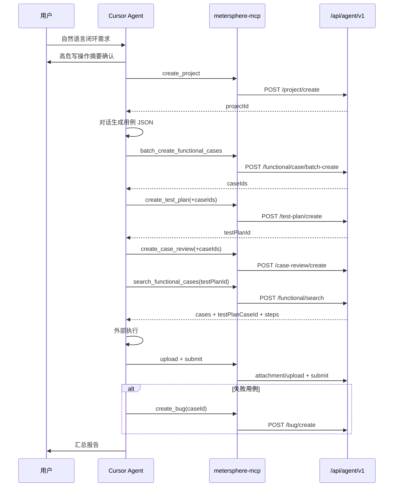

# MeterSphere-Agent 对话闭环扩展方案

> 文档类型：扩展方案（相对《Agent 集成改造方案 v2.0》的一期写闭环增量）  
> 日期：2026-07-23  
> 状态：【AI生成】已人工审核确认  
> 关联实现：`backend/services/agent-integration`、`metersphere-mcp`、`.cursor/rules/metersphere-agent.mdc`  
> 关联任务：[docs/task/agent_conversation_loop](../task/agent_conversation_loop/task000-实施总览与依赖关系.md)

---

## 1. 动机（Why）

### 1.1 问题

v2.0 已打通「提取用例 → 外部执行 → 计划内回写」。对话场景仍缺前半段与失败闭环：


| 缺口            | 影响                             |
| ------------- | ------------------------------ |
| 无法对话创建项目/加成员  | 演示与新业务接入仍依赖人工后台操作              |
| 无法批量写入功能用例    | 用例仍靠人工录入或平台 AI，与 Cursor 对话生成脱节 |
| 无法创建计划/评审并关联  | 回写链路依赖预先手工建计划                  |
| 无法创建缺陷并关联失败用例 | 执行失败后无法在对话内闭环提缺陷               |


### 1.2 目标

在 **不调用平台内 AI** 的前提下，由 Cursor Agent 对话生成结构化 JSON，经 `/api/agent/v1` + MCP 薄封装完成一期完整闭环：

**项目/成员 → 用例导入 → 测试计划 → 评审 → 执行回写 → 缺陷**

### 1.3 与 v2.0 关系


| 文档                                                    | 职责                             |
| ----------------------------------------------------- | ------------------------------ |
| [改造方案 v2.0](./MeterSphere-Agent集成-改造方案-2026-07-07.md) | 读/回写 MVP、Token、检索、MCP 读路径基线    |
| **本文**                                                | 一期写闭环增量：Scope、写 API、契约、鉴权边界、验收 |


实现细节与联调示例以外链为准，避免双源冲突：

- [Cursor 接入指南](../task/metersphere_agent/cursor-onboarding.md)
- [curl 联调示例](../task/metersphere_agent/curl-examples.md)
- [metersphere-mcp README](../../metersphere-mcp/README.md)
- OpenAPI：`GET /v3/api-docs/agent`

---


## 2. 范围


### 2.1 一期范围内（6 项）

1. 创建项目并添加成员
2. Agent 对话生成用例 JSON 并批量导入
3. 创建测试计划并关联用例（保证 search 可返回 `testPlanCaseId`）
4. 创建用例评审并关联
5. 计划内执行回写 + 截图附件（沿用既有 API）
6. 创建缺陷并关联失败用例


### 2.2 一期非目标


| 非目标                        | 说明                               |
| -------------------------- | -------------------------------- |
| 平台内 AI 生成用例                | 生成在 Cursor 对话侧完成                 |
| 接口用例 / 场景自动化 / 资源池执行       | 仅功能用例                            |
| 站内 UI 自动化执行                | 执行在外部（Playwright 等）              |
| 用例/计划/评审/缺陷的更新与删除 API      | 一期仅 create / associate / relate  |
| 缺陷模板字段发现 API               | 一期靠错误提示 + `customFields` 重试；二期可补 |
| GET 项目/计划/评审的独立 READ Scope | 一期读接口复用对应 WRITE Scope（已知取舍）      |
| Token 管理 UI 改造             | 沿用既有 Token 管理能力                  |


---


## 3. 决策摘要


| 决策项              | 结论                                               |
| ---------------- | ------------------------------------------------ |
| 用例生成方            | Cursor Agent 对话生成 JSON，**不**调平台 AI               |
| API 形态           | `/api/agent/v1/*`，复用现有业务 Service，不绕过模板校验         |
| 客户端形态            | `metersphere-mcp` 薄封装（无业务逻辑）                     |
| 回写路径             | 继续使用既有 `functional/search`、`submit`、`attachment` |
| 闭环全能力 Token      | 建议 `AGENT_ALL`；或 READ/SUBMIT + 各 WRITE 组合        |
| `FUNCTIONAL_ALL` | **仅**覆盖功能用例读/回写，**不**包含各 WRITE                   |


---


## 4. 端到端流程




**关键约定**

- 创建项目后，后续 Tool **显式传**返回的 `projectId`，勿依赖热改 MCP 环境变量 `MS_PROJECT_ID`。  
- 计划内回写必须使用 `testPlanCaseId`（`test_plan_functional_case.id`），**不是** `caseId`。  
- 写操作前按工作流规则做高危确认（建项目/加成员、>5 条导入、批量关联、提缺陷）。

---


## 5. Scope 矩阵


### 5.1 Scope 定义


| Scope               | 含义                            |
| ------------------- | ----------------------------- |
| `FUNCTIONAL_READ`   | 检索、详情、模块、执行日志读                |
| `FUNCTIONAL_SUBMIT` | 计划内/批量回写、附件上传                 |
| `FUNCTIONAL_ALL`    | 等价 READ + SUBMIT，**不含** WRITE |
| `PROJECT_WRITE`     | 项目创建、加成员、项目 GET               |
| `CASE_WRITE`        | 模块/用例创建与批量导入                  |
| `PLAN_WRITE`        | 测试计划创建、关联、GET                 |
| `REVIEW_WRITE`      | 评审创建、关联、GET                   |
| `BUG_WRITE`         | 缺陷创建、关联用例                     |
| `AGENT_ALL`         | 上述全部                          |


判定规则（实现：`AgentScopeAssert`）：

1. scopes 含 `AGENT_ALL` → 全部通过
2. 所需为 `FUNCTIONAL_READ|SUBMIT` 且含 `FUNCTIONAL_ALL` → 通过
3. 否则 scopes 字符串需包含所需 Scope


### 5.2 接口 × Scope


#### 读 / 回写（既有）


| Path                                              | Scope             |
| ------------------------------------------------- | ----------------- |
| `GET /api/agent/v1/functional/health`             | （健康检查，按现网实现）      |
| `GET /api/agent/v1/functional/modules`            | FUNCTIONAL_READ   |
| `POST /api/agent/v1/functional/search`            | FUNCTIONAL_READ   |
| `GET /api/agent/v1/functional/{caseId}`           | FUNCTIONAL_READ   |
| `POST /api/agent/v1/functional/submit`            | FUNCTIONAL_SUBMIT |
| `POST /api/agent/v1/functional/submit/batch`      | FUNCTIONAL_SUBMIT |
| `POST /api/agent/v1/functional/attachment/upload` | FUNCTIONAL_SUBMIT |
| `GET /api/agent/v1/functional/exec-log/{id}`      | FUNCTIONAL_READ   |


#### 写闭环（本期新增）


| Path                                              | Scope         | 备注                       |
| ------------------------------------------------- | ------------- | ------------------------ |
| `POST /api/agent/v1/project/create`               | PROJECT_WRITE |                          |
| `POST /api/agent/v1/project/members/add`          | PROJECT_WRITE |                          |
| `GET /api/agent/v1/project/{id}`                  | PROJECT_WRITE | 一期复用 WRITE，无独立 READ      |
| `POST /api/agent/v1/functional/module/create`     | CASE_WRITE    |                          |
| `POST /api/agent/v1/functional/case/create`       | CASE_WRITE    |                          |
| `POST /api/agent/v1/functional/case/batch-create` | CASE_WRITE    | 主路径                      |
| `POST /api/agent/v1/test-plan/create`             | PLAN_WRITE    | 可带 `caseIds`             |
| `POST /api/agent/v1/test-plan/associate-cases`    | PLAN_WRITE    |                          |
| `GET /api/agent/v1/test-plan/{id}`                | PLAN_WRITE    | 一期复用 WRITE               |
| `POST /api/agent/v1/case-review/create`           | REVIEW_WRITE  | 可带 `caseIds`/`reviewers` |
| `POST /api/agent/v1/case-review/associate-cases`  | REVIEW_WRITE  |                          |
| `GET /api/agent/v1/case-review/{id}`              | REVIEW_WRITE  | 一期复用 WRITE               |
| `POST /api/agent/v1/bug/create`                   | BUG_WRITE     | 可带 `caseId`              |
| `POST /api/agent/v1/bug/relate-case`              | BUG_WRITE     |                          |


---


## 6. 鉴权与数据边界


### 6.1 身份模型

- 请求携带 Agent Token（`Authorization: Bearer msat_xxx`）。  
- 业务写操作以 Token 绑定的平台用户（`SessionUtils.getUserId()`）身份执行。  
- Token 可绑定默认 `projectId`；创建新项目后必须以请求体/参数中的新 `projectId` 为准。


### 6.2 组织归属（已实现 / 待补强）


| 能力           | 现状                                  | 方案结论                                                                        |
| ------------ | ----------------------------------- | --------------------------------------------------------------------------- |
| 创建项目 / 加成员   | 校验 Token 用户属于目标 `organizationId`    | **必须保留**                                                                    |
| 用例/计划/评审/缺陷写 | 校验项目存在；组织成员校验未统一前置                  | **一期接受风险**；上线审核须确认 Token 仅发可信用户，二期建议统一 `assertOrgAccessible(project.orgId)` |
| 跨项目写         | `AGENT_ALL` + 任意 `projectId` 可写存在项目 | 生产 Token 建议绑定项目或缩小 Scope                                                    |


### 6.3 成员角色

- `project/members/add` 支持可选 `userRoleIds`。  
- **未传角色时**依赖平台默认行为；业务侧须确认默认用户组是否具备功能用例/计划权限，避免「加人无权限」。

---


## 7. API 契约摘要

完整字段以 OpenAPI / DTO 为准；此处仅列对话闭环关键字段。

### 7.1 创建项目

**请求** `POST /project/create`


| 字段                                                          | 必填  | 说明             |
| ----------------------------------------------------------- | --- | -------------- |
| organizationId                                              | 是   | 组织 ID          |
| name                                                        | 是   | 项目名            |
| userIds                                                     | 是   | 成员用户 ID，建议含创建者 |
| description / moduleIds / resourcePoolIds / allResourcePool | 否   |                |


**响应关键**：`id`（即后续 `projectId`）、`organizationId`、`name`

### 7.2 批量导入用例（主路径）

**请求** `POST /functional/case/batch-create`


| 字段         | 必填  | 说明                               |
| ---------- | --- | -------------------------------- |
| projectId  | 是   |                                  |
| moduleId   | 否   | 与 modulePath 二选一；**优先 moduleId** |
| modulePath | 否   | 如 `登录/短信登录`，无 moduleId 时按路径创建    |
| templateId | 否   | 空则项目默认功能用例模板                     |
| failFast   | 否   | 默认 `false`；`true` 遇错立即失败         |
| cases[]    | 是   | 见下表                              |


**cases[] 项（Agent 生成 JSON 最小契约）**


| 字段               | 必填  | 说明                |
| ---------------- | --- | ----------------- |
| name             | 是   | 用例名称              |
| priority         | 否   | 如 P0/P1，映射模板优先级字段 |
| tags             | 否   | 字符串数组             |
| prerequisite     | 否   | 前置条件              |
| description      | 否   | 备注                |
| steps[].num      | 建议  | 步骤序号              |
| steps[].desc     | 建议  | 步骤描述              |
| steps[].expected | 建议  | 预期结果              |


**响应**

```json
{
  "created": [{ "caseId": "...", "num": 1001, "name": "...", "moduleId": "..." }],
  "errors": [{ "name": "...", "error": "..." }]
}
```

**约定**

- 对话侧生成后先摘要确认，再调用批量导入。  
- 一期未强制批量上限与幂等；重复导入可能产生重名用例。建议单次 ≤50，演示数据用标签 `agent` 便于清理。  
- 验收期望：`errors` 为空或已人工确认可接受失败项。


### 7.3 测试计划

**创建** `POST /test-plan/create`：`projectId`、`name` 必填；`caseIds` 可选（创建后关联）。  
**关联** `POST /test-plan/associate-cases`：`projectId`、`testPlanId`、`caseIds`。  

创建后 search 必须带同一 `testPlanId`，且用例已关联，才能拿到 `testPlanCaseId`。

### 7.4 用例评审

**创建** `POST /case-review/create`：`projectId`、`name` 必填；`reviewers` 为空则用当前 Token 用户；可带 `caseIds`、`reviewPassRule`（SINGLE/MULTIPLE）。

### 7.5 缺陷

**创建** `POST /bug/create`


| 字段                          | 必填  | 说明                              |
| --------------------------- | --- | ------------------------------- |
| projectId                   | 是   |                                 |
| title                       | 是   |                                 |
| description                 | 否   | 建议含实际/期望                        |
| templateId                  | 否   | 空则默认缺陷模板                        |
| caseId                      | 否   | 关联功能用例                          |
| caseType                    | 否   | 默认 FUNCTIONAL                   |
| testPlanId / testPlanCaseId | 否   | 建议失败回写场景一并传入                    |
| customFields                | 否   | `fieldId -> value`；模板必填字段缺失时需补传 |


**一期缺口**：无「查询缺陷模板必填字段」API；Agent 按接口错误提示补 `customFields` 后重试。

### 7.6 执行回写（既有，闭环必需）


| 步骤   | API / Tool                                                           |
| ---- | -------------------------------------------------------------------- |
| 检索   | `POST /functional/search` → `search_functional_cases`                |
| 上传证据 | `POST /functional/attachment/upload` → `upload_execution_attachment` |
| 回写   | `POST /functional/submit` → `submit_functional_result`               |


`lastExecResult`：`SUCCESS` / `ERROR` / `BLOCKED` / `FAKE_ERROR`。  
`steps` 须保留 search 返回的 `step.id`。

---


## 8. 复用 Service

Agent 层仅做 Scope 校验、入参适配与审计，业务落库复用：


| 领域      | Service                                                    |
| ------- | ---------------------------------------------------------- |
| 项目/成员   | `OrganizationProjectService`                               |
| 功能用例/模块 | `FunctionalCaseService`、`FunctionalCaseModuleService`、模板服务 |
| 测试计划    | `TestPlanService`、`TestPlanFunctionalCaseService`          |
| 评审      | `CaseReviewService`                                        |
| 缺陷      | `BugService`、`BugRelateCaseCommonService`                  |


原则：**不绕过**项目模板必填校验与既有业务校验。

---


## 9. 审计矩阵

写入 `agent_exec_log` 的动作：


| action                | 触发接口                        | resourceId |
| --------------------- | --------------------------- | ---------- |
| PROJECT_CREATE        | project/create              | 新项目 id     |
| PROJECT_ADD_MEMBERS   | project/members/add         | projectId  |
| CASE_BATCH_CREATE     | case/batch-create（含单条走批量）   | projectId  |
| TEST_PLAN_CREATE      | test-plan/create            | testPlanId |
| TEST_PLAN_ASSOCIATE   | test-plan/associate-cases   | testPlanId |
| CASE_REVIEW_CREATE    | case-review/create          | reviewId   |
| CASE_REVIEW_ASSOCIATE | case-review/associate-cases | reviewId   |
| BUG_CREATE            | bug/create                  | bugId      |
| BUG_RELATE_CASE       | bug/relate-case             | bugId      |


人工审核须确认：项目创建与成员变更审计字段含 `organizationId`/`userIds`/`tokenId`（或等价信息）。

---


## 10. MCP 工具清单（18）

`metersphere-mcp` **不含业务逻辑**，仅转发 REST。

### 10.1 读 / 回写（7）


| Tool                              | 说明     |
| --------------------------------- | ------ |
| `search_functional_cases`         | 检索     |
| `get_functional_case`             | 详情     |
| `list_modules`                    | 模块列表   |
| `submit_functional_result`        | 单条回写   |
| `submit_functional_results_batch` | 批量回写   |
| `upload_execution_attachment`     | 执行附件   |
| `get_exec_log`                    | 审计日志详情 |


### 10.2 写闭环（11）


| Tool                            | Scope         | 说明                   |
| ------------------------------- | ------------- | -------------------- |
| `create_project`                | PROJECT_WRITE | 创建项目（可含初始成员）         |
| `add_project_members`           | PROJECT_WRITE | 追加成员                 |
| `create_functional_module`      | CASE_WRITE    | 创建模块                 |
| `create_functional_case`        | CASE_WRITE    | 单条创建                 |
| `batch_create_functional_cases` | CASE_WRITE    | 批量导入（主路径）            |
| `create_test_plan`              | PLAN_WRITE    | 可带 caseIds           |
| `associate_test_plan_cases`     | PLAN_WRITE    | 关联用例                 |
| `create_case_review`            | REVIEW_WRITE  | 可带 caseIds/reviewers |
| `associate_case_review_cases`   | REVIEW_WRITE  | 关联用例                 |
| `create_bug`                    | BUG_WRITE     | 可关联用例                |
| `relate_bug_case`               | BUG_WRITE     | 补关联                  |


### 10.3 与 REST 差异（已知）


| REST                    | MCP | 说明              |
| ----------------------- | --- | --------------- |
| `GET /project/{id}`     | 未暴露 | 创建响应已含 id，一期可不调 |
| `GET /test-plan/{id}`   | 未暴露 | 同上              |
| `GET /case-review/{id}` | 未暴露 | 同上              |


环境变量：`MS_BASE_URL`、`MS_AGENT_TOKEN`、`MS_PROJECT_ID`（默认项目）、`MS_TEST_PLAN_ID`（可选）。

---


## 11. 对话侧约束

与 `.cursor/rules/metersphere-agent.mdc` 对齐，方案级强制：

1. 高危写操作先摘要确认再调用 Tool。
2. 批量导入 >5 条必须确认。
3. 全程显式传 `projectId`（尤其新建项目后）。
4. 回写前检查每条有 `testPlanCaseId`。
5. 失败用例提缺陷时带 `caseId`，建议带 `testPlanId`/`testPlanCaseId`。
6. 向用户汇总：创建/导入/关联结果；通过/失败数；缺陷 ID。

---


## 12. 验收标准（可判定）


| #   | 场景           | 通过标准                                                                    |
| --- | ------------ | ----------------------------------------------------------------------- |
| 1   | 对话创建项目并加成员   | 返回有效 `projectId`；成员在项目中可见；`PROJECT_CREATE` / `PROJECT_ADD_MEMBERS` 审计可查 |
| 2   | 生成 ≥5 条用例并导入 | `batch-create` 的 `created.length ≥ 5` 且 `errors` 为空（或失败项已说明）；平台列表可见     |
| 3   | 创建测试计划并关联    | 返回 `testPlanId`；对同一计划 `search` 时，关联用例均含非空 `testPlanCaseId`              |
| 4   | 创建评审并关联      | 返回 `reviewId`；平台评审中可见关联用例                                               |
| 5   | 执行回写 + 截图    | `upload` 成功；`submit` 成功；计划执行历史可见；附件可打开                                  |
| 6   | 失败用例提缺陷      | `create_bug` 返回 bugId；与 `caseId` 关联在平台可查                                |


联调命令参见 `docs/task/metersphere_agent/curl-examples.md`。

---


## 13. 风险与缓解


| 风险                        | 等级  | 缓解                                         |
| ------------------------- | --- | ------------------------------------------ |
| Agent Token 泄露导致写放大       | 高   | 生产用短效 Token、最小 Scope、审计；禁止提交真实 Token 到 Git |
| 跨项目写（组织校验未统一）             | 中   | Token 绑定可信用户；二期统一组织校验                      |
| 缺陷必填自定义字段导致创建失败           | 中   | 文档约定 `customFields` 重试；二期补模板字段查询           |
| 重复导入产生脏数据                 | 低   | 标签 `agent`、单次批量上限约定、演示后清理                  |
| MCP 默认 `MS_PROJECT_ID` 过期 | 中   | 规则强制显式传 projectId                          |
| GET 挂 WRITE Scope 过严/过宽   | 低   | 一期接受；二期可拆 READ                             |


---


## 14. 人工审核清单

- [x] Scope 矩阵与 `AgentScopeAssert` / Token 发放策略一致  
- [x] 组织归属：创建项目校验保留；跨项目写风险已业务确认  
- [x] 项目创建 / 成员变更审计字段完整  
- [x] 缺陷模板必填字段：当前「报错重试」策略可接受，或排期字段发现 API  
- [x] 成员默认 `userRoleIds` 能覆盖用例/计划/缺陷操作权限  
- [x] 生产限流 / Token 过期 / 泄露应急流程  
- [x] OpenAPI Agent 分组已包含新接口  
- [x] 上线前灰度与回滚方案（关闭 WRITE Scope 或禁用 Token）  

---


## 15. 二期建议（不在本期交付）

1. 统一写接口的组织归属校验
2. 缺陷/用例模板必填字段查询 API
3. `PROJECT_READ` / `PLAN_READ` / `REVIEW_READ`，GET 与 WRITE 解耦
4. MCP 暴露 get_project / get_test_plan / get_case_review（按需）
5. 批量导入幂等键或外部 `clientRequestId`
6. 更新/删除类 Agent API（若产品需要）

---


## 16. 相关路径速查


| 类型           | 路径                                                                                                                                     |
| ------------ | -------------------------------------------------------------------------------------------------------------------------------------- |
| 任务目录         | `docs/task/agent_conversation_loop/`（task000–014）                                                                                      |
| Scope 常量     | `backend/.../agent/constants/AgentTokenScope.java`                                                                                     |
| 写 Controller | `AgentProjectController` / `AgentCaseWriteController` / `AgentTestPlanController` / `AgentCaseReviewController` / `AgentBugController` |
| MCP 入口       | `metersphere-mcp/src/index.ts`（18 tools）                                                                                               |
| 工作流规则        | `.cursor/rules/metersphere-agent.mdc`                                                                                                  |
| 接入指南         | `docs/task/metersphere_agent/cursor-onboarding.md`                                                                                     |


---


## 修订记录


| 版本   | 日期         | 说明                               |
| ---- | ---------- | -------------------------------- |
| 决策备忘 | 2026-07-23 | 初版清单（API/Scope/验收要点）             |
| 扩展方案 | 2026-07-23 | 按评审补齐目标/非目标、流程、契约、鉴权、审计、可判定验收与风险 |
| 任务拆解 | 2026-07-23 | 已审后生成 `docs/task/agent_conversation_loop`（task000–014） |


