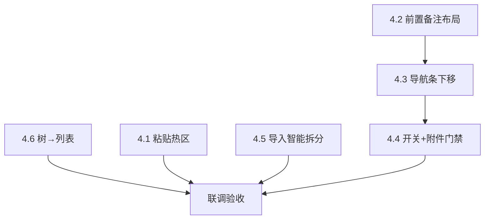

# MeterSphere 功能用例详情体验优化方案

> 【AI生成】产品决策已全部确认（含歧义收口 v1.3 + 偏好 B1）；技术负责人审核后可拆任务实施  
> 文档版本：v1.3.1  
> 日期：2026-07-22  
> 适用范围：功能用例详情 Tab（前置/备注/步骤/附件/执行结果/上下条）、导入解析、左侧模块树 → 列表联动；测试计划内嵌用例详情同期改自动下一条相关  
> 对照原型截图：用例详情「详情」Tab（红框区域）  
> 关联历史：`docs/task/case_feature_optimize/*`、`Plan-e5fc6a90`（部分能力已落地，本期为增量收口）  
> 状态：产品决策已全部锁定（见 §7）；任务已拆分 task010–016，见 [task000](../task/case_feature_optimize/task000-实施总览与依赖关系.md)

---

## 1. 背景与目标

### 1.1 Why（动机）

| # | 痛点 | 影响 |
|---|------|------|
| 1 | 截图复制后无法稳定粘贴到附件；粘贴热区过小 | 执行留证效率低，用户误以为「不支持粘贴」 |
| 2–3 | 前置/备注为独立表单项（标签在上、内容在下）；备注在步骤/预期之后 | 阅读密度差，与「前置：文本；备注：文本」预期不符 |
| 4 | 上一条/下一条挂在「添加附件」标签右侧 | 与执行结果操作区割裂，易误触附件区 |
| 5–6 | 点执行结果即自动下一条，无附件门禁、无用户开关 | 无证据也跳转；无法按人关闭 |
| 7 | 导入用例常落为 TEXT，步骤/预期整段堆积，换行丢失 | 与改造后 STEP 界面不一致，需人工再拆 |
| 8 | 点击左侧用例树后，右侧列表未可靠切换 | 模块筛选失效，找不到对应用例 |

### 1.2 How（业务流程概要）

1. 用户在附件附近悬停即可 Ctrl+V / 粘贴截图上传。  
2. 详情只读态：前置、备注紧挨在顶部，以「标签：内容」行式展示。  
3. 步骤/文本与执行结果状态下方，独立导航条：左侧「自动下一条」开关，右侧「上一条 / 下一条」。  
4. 开启自动下一条且附件非空时，用例级结果保存成功后跳下一条；否则停留。  
5. Excel/Xmind 导入智能识别编号步骤 → STEP；纯叙述保留 TEXT 并保留换行。  
6. 左侧树选中节点后，右侧列表按该模块（及子模块策略）刷新。

### 1.3 What（呈现结果）

- 粘贴上传可用，悬停附件附近区域即可粘贴。  
- 布局顺序：**前置 → 备注 → 步骤/文本描述 → 执行结果 → 导航条（开关+上下条）→ 附件**。  
- 自动下一条可关、按用户永久记住；无附件不自动跳。  
- 导入后步骤拆分符合新界面；TEXT 换行正确。  
- 点树即切列表。

### 1.4 非目标（本期不做）

- 不改列表「批量改执行人 / 执行人列 / 基本信息执行人」等（仍属原 `task003/004/007`，可并行另排期）。  
- 不改顶栏项目下拉滚动（`task002`）。  
- 不强制历史存量用例批量重解析（仅**新导入 / 覆盖导入**时重解析；库内未再导入的存量不变）。  
- 账号级自动下一条偏好：已确认采用 **B1 本机存储**（不做服务端账号级）。

---

### 1.5 名词：编辑模式（`caseEditType`）是什么？

现网功能用例详情有两种**展示/编辑形态**，由字段 `caseEditType` 控制（界面「步骤描述 / 文本描述」下拉切换）：

| 值 | 界面表现 | 存储 |
|----|----------|------|
| **STEP** | 步骤表格：多行「步骤 / 预期」，可逐步填执行结果 | `functional_case_blob.steps`（JSON 数组） |
| **TEXT** | 两大段富文本：「文本描述」+「预期结果」 | `text_description` + `expected_result` |

下载的 **Excel 导入模板默认 8 列**为：用例ID｜用例名称｜所属模块｜前置条件｜**步骤描述**｜**预期结果**｜用例等级｜备注。  
其中「步骤描述 / 预期结果」是导入内容列；**「编辑模式」列不出现在下载模板里**（历史注释：标签、编辑模式等仅兼容导入、不进下载模板）。若 Excel 里自加「编辑模式」列且值为 `STEP`/`TEXT`，导入仍可读。

**本期产品口径（已确认，与现网互斥展示不同）**：STEP 与 TEXT **数据并存、双向同步**——TEXT 是 STEP 的全文展示；改 STEP 要同步生成 TEXT；改 TEXT 要按拆分规则同步回 STEP。`caseEditType` 仅表示**当前用哪种 UI 查看/编辑**，不再表示「只存一种数据」。因此：**不必把「编辑模式」加回下载模板**也能正确导入——导入时按 §4.5 规则拆分后**同时写入 steps + text 字段**，并设合理默认展示类型（建议有顶层/序号/换行可拆则默认 STEP，否则 TEXT）。模板靠「步骤描述」列**批注**说明填写规范即可。

> ⚠️ 范围提示：双向同步会改详情保存与切换逻辑，工作量大于「仅改导入」；实施时需单独回归切换类型、编辑保存、导出再导入。

---

## 2. 现状基线（代码对照）

| 能力 | 关键路径 | 现状结论 |
|------|----------|----------|
| 粘贴上传 | `ms-add-attachment/index.vue` L10–18、L345–362 | **已有** `@paste`；热区仅按钮+tip 小框；需 focus 才响应 → 截图常失败 |
| 详情布局 | `tabDetail.vue` L4–117 | 顺序：前置 → STEP/TEXT → **备注** → 附件（上下条在附件 labelRight） |
| 执行结果 | `AddStep` + `handleSetCaseResult` L637–651 | STEP 模式有四按钮；**TEXT 无对等入口**；保存成功即 `emit('nextCase')`，无附件检查、无开关 |
| 导入拆分 | `FunctionalCaseImportEventListener.handleSteps` L281–291、`parseStepCell` L356–370 | 仅当 `caseEditType=STEP` 才按 `[1]`/`[2]` 拆分；空/未填默认 **TEXT** |
| 树→列表 | `caseTree` → `index` → `caseTable` `watch(activeFolder)` L2012+ | 链路存在；高级搜索模式跳过模块过滤；「含子模块」依赖 localforage |
| 偏好存储 | `utils/local-storage.ts`、`useLocalForage`、`useStorage` | 无「自动下一条」键；可对标测试计划内存 `autoNext` |

截图用例（`[100004] …关联信息卡片`）为 **TEXT**：文本描述 / 预期结果整段含 `[1][2][3]`，备注在预期下方，符合「导入未按新布局拆分」的现场表现。

---

## 3. 目标布局（详情 Tab）

```text
┌─────────────────────────────────────────────┐
│ 前置：{文本或 -}          [内容编辑]         │  ← 只读行式；编辑态仍纵向富文本
│ 备注：{文本或 -}                             │  ← 紧挨前置下方
├─────────────────────────────────────────────┤
│ StepDescription（STEP/TEXT 切换）            │  ← 在备注下方
│ STEP 步骤表  /  TEXT 文本描述+预期结果       │
│ （通过 / 失败 / 阻塞 / 跳过）                 │  ← 执行结果四按钮（STEP/TEXT 均有）
├─────────────────────────────────────────────┤
│ [自动下一条 ○] 需有附件才跳    [上一条][下一条]│  ← 独立 div：开关左、导航右
├─────────────────────────────────────────────┤
│ 添加附件（热区外扩约 200px）                 │
│ 文件列表 …                                   │
└─────────────────────────────────────────────┘
另：详情顶部原有上下条保留，与底栏双入口并存。
```

**与现布局差异**：备注上移到前置下；StepDescription 在备注下；上下条从附件区迁到四按钮下方；导航条新增开关与说明。

---

## 4. 分项方案

### 4.1 【P0】附件粘贴上传增强（对应需求 1）

#### 动机-行为-呈现

- **Why**：截图复制后应能直接贴到附件。  
- **How**：仅在功能用例详情外包一层热区（组件默认不变）；悬停/focus 后粘贴。  
- **What**：热区高亮；只接收文件类型剪贴板。

#### 实现要点（已确认）

| 项 | 方案 |
|----|------|
| 范围 | **仅** `tabDetail`（功能用例详情）外包 `attachment-paste-region`；`ms-add-attachment` 默认行为不变；缺陷/API 等复用处不扩大 |
| 热区尺寸 | 「添加附件」可视区域再**向外延伸约 200px**（上/左/右/下均外扩，具体以该模块外包 padding/margin 实现） |
| 悬停/focus | 桌面：`mouseenter/leave` 维护 `isHoverPasteZone`；平板：**依赖 focus**（区域 `tabindex=0`，点按后可粘贴） |
| 剪贴板 | **只收 file**（`files` + `items.kind===file`）；文字不当附件；悬停区内有 file 则 `preventDefault` 上传 |
| 纯文字 | 焦点在附件热区且剪贴板无 file：**不响应**（已接受） |
| 默认文件名 | 无 name 时 `screenshot-YYYYMMDD-HHmmss.png` |
| 禁用态 | `disabled` 不处理 |

#### 涉及文件

- 主改：`tabDetail.vue` 外包层 + document/容器级 paste（受悬停/focus 门控）  
- 可选小改：`ms-add-attachment` 仅保留既有 paste，不强行扩热区  
- locale：可补「悬停/点选附件区域后粘贴」

#### 验收

- [ ] 截图复制后，鼠标在附件区外扩 200px 内 Ctrl+V 可上传  
- [ ] 悬停附件区 + 焦点在富文本：有 file 时进附件  
- [ ] 非热区：富文本粘贴文字/图片进正文正常  
- [ ] 热区内纯文字粘贴无响应  
- [ ] 缺陷等其它模块粘贴行为未变  

---

### 4.2 【P0】前置 / 备注行式布局与位置（对应需求 2、3）

#### 实现要点（已确认）

1. DOM：`precondition` → `description(备注)` → `StepDescription` → STEP/TEXT 内容。  
2. **只读**：行式「前置：内容」「备注：内容」。  
3. **编辑**：仍**纵向富文本**；「内容编辑」为**统一编辑态**（保持现网，一次编辑前置/备注/步骤等）。  
4. `StepDescription`（类型切换）在**备注下方**。

#### 验收

- [ ] 只读行式且备注在前置下、StepDescription 在备注下  
- [ ] 编辑为纵向富文本、统一编辑态  
- [ ] 保存字段不错乱  

---

### 4.3 【P0】上下条独立模块 + TEXT 四按钮（对应需求 4）

#### 实现要点（已确认）

| 项 | 方案 |
|----|------|
| 四按钮 | STEP / TEXT **均展示** 通过/失败/阻塞/跳过，走同一 `handleSetCaseResult` |
| 导航条位置 | **紧挨四按钮下方**新建 `div`（即添加步骤/文本内容区的执行结果条之下） |
| 导航条布局 | 左：自动下一条开关 + 常驻说明「需有附件才跳」；右：上一条 / 下一条 |
| 双入口 | 详情**顶部**原有上下条 **保留**，与底栏**并存** |
| 显隐 | 底栏开关与上下条随 `showCaseNav` **同显隐**（`false` 时整条不展示） |
| 热区 | 按钮自身可点，`inline-flex gap-2` |

#### 验收

- [ ] TEXT/STEP 均有四按钮  
- [ ] 底栏在四按钮下；开关左、导航右；有「需有附件才跳」说明  
- [ ] 顶部与底部上下条并存且状态一致  
- [ ] `showCaseNav=false` 时底栏整条隐藏  

---

### 4.4 【P0】自动下一条：附件门禁 + 用户开关（对应需求 5、6）

#### 触发规则（已确认）

```text
IF showCaseNav
 AND 开关开启
 AND 有效附件数 ≥ 1
 AND canGoNext
 AND 触发源 == 用例级四按钮（handleSetCaseResult）
THEN emit('nextCase')
ELSE IF 开关开启 AND 有效附件数 == 0
THEN 仅保存，不跳转，不 Toast
ELSE IF 开关开启 AND 有效附件数 ≥ 1 AND !canGoNext
THEN Message「已是最后一条」
ELSE
THEN 仅保存，不跳转
```

| 条件 | 结论 |
|------|------|
| 触发源 | **仅**四按钮；单步结果变更即便汇总改写总结果也 **不跳** |
| 附件判定 | 详情 Tab「添加附件」列表；**历史附件也算有**；仅 **done / 已关联** 计入；`init` / `uploading` / `error` 不计 |
| 无附件 | 只不跳，**不 Toast**；开关旁常驻「需有附件才跳」 |
| 默认 | 开关 **默认关** |
| 范围 | **功能用例详情 + 测试计划内嵌用例详情同期改** |
| 显隐 | 与 `showCaseNav` 同显隐 |

#### 4.4.1 「永久」：已确认 B1 本机

| 方案 | 结论 |
|------|------|
| **B1. 本机** `useStorage('ms.functionalCase.autoNext.{userId}', false)` | **已采用**：同浏览器按用户长期记住；换电脑/清缓存会丢；文案可用「记住我的选择」 |
| B2. 账号级服务端 | **本期不做** |

无后端写库、无鉴权变更。

#### 验收

- [ ] 仅四按钮可触发自动下一条；改单步不跳  
- [ ] 有 done/关联附件才跳；上传中不跳；无附件不跳不 Toast  
- [ ] 开关旁有「需有附件才跳」；默认关；计划内嵌同期行为一致  
- [ ] 本机刷新后开关状态保持（按 userId）  

---

### 4.5 【P1】导入智能拆分 + STEP/TEXT 同步（对应需求 7）

#### 拆分算法（已确认）

对「步骤描述」「预期结果」单元格分别解析后按段对齐：

| 情形 | 规则 |
|------|------|
| 有序号且**无层级**（仅 `1.xx` `2.xx`，或仅 `①xx` `②xx`，或仅 `【1】`/`[1]` 同级） | **按该序号序列拆分**为多条 STEP |
| 有序号且**有层级**（如 `1.XXX：①…；2.xxx：①…②…`） | **只按最高层级**拆；次级整段留在该 STEP 的 `desc`/`result` 内 |
| **无序号** | **按换行**拆分为多条 STEP（空行可合并/忽略连续空行） |
| **行中编号** | 仍按「有序号」规则拆（不要求必须行首） |

兼容标记：`【n】`、`[n]`、`n.`、`n、`、`①②③…` 等；层级判定：同时出现「上级样式 + 下级样式」时以上级为最高层。

#### STEP ↔ TEXT 数据并存（已确认，相对现网是增强）

现网：`caseEditType` 互斥展示，常只突出一种存储。  
本期：

1. 导入 / 覆盖导入：按上表拆出 `steps` JSON，**同时**生成全文 `textDescription` / `expectedResult`（TEXT 为 STEP 全文展示形态，保留换行）。  
2. 详情编辑：改 STEP → 同步刷新 TEXT 全文；改 TEXT → **按同一拆分规则**同步回 STEP。  
3. `caseEditType`：只表示当前 UI；切换视图不丢另一侧数据。  
4. **覆盖导入已有用例：重解析 steps**（及同步 TEXT）。  
5. 下载模板：**步骤描述列写入 Excel 批注**（填写规范，供人工/AI 转模板）；**不强制加回「编辑模式」列**（见 §1.5）。

#### 模板批注要点（步骤描述列）

1. 无层级序号：`1.`/`2.` 或 `①`/`②` 或 `【1】`/`【2】` → 按序号拆步。  
2. 有层级：只把最高层写成多段；`①②` 写在同一段内。  
3. 无序号：一行一步（换行拆分）。  
4. 预期结果与步骤段序对齐。  
5. 导入后步骤表与文本描述数据同步，界面可切换查看。

#### 涉及文件

- `FunctionalCaseImportEventListener`（拆分 + 双写 + 覆盖重解析）  
- 详情 `tabDetail` / `AddStep`：保存与切换时双向同步  
- 模板生成：步骤描述列 **Cell 批注**  
- 测试计划内嵌详情：与自动下一条相关部分对齐；同步逻辑若共用组件则一并生效  

#### 验收

- [ ] 无层级 / 有层级 / 无序号换行 / 行中编号 四类样例拆分符合规则  
- [ ] 新导入与覆盖导入均重解析并双写 STEP+TEXT  
- [ ] 详情改 STEP↔TEXT 双向同步  
- [ ] 模板步骤描述列有批注说明  

---

### 4.6 【P0】左侧用例树点击切换列表（对应需求 8）

#### 排查与修复方向

| 风险点 | 处理 |
|--------|------|
| 高级搜索中点树 | **退出**高级搜索并按模块刷新 |
| 含子模块 | **保持现网默认** |
| `selectedKeys` 不同步 | 修复与 `activeFolder` 一致 |
| 叶子/目录 | 统一带 `offspringIds` 并 `initData` |

#### 验收

- [ ] 点模块列表切换正确；点全部恢复；高级搜索下点树可退出并刷新  

---

## 5. 优先级与实施顺序



| 顺序 | 项 | 优先级 | 预估 | 依赖 |
|------|----|--------|------|------|
| 1 | 4.6 树点击切列表 | P0 | 0.5–1d | 无 |
| 2 | 4.2 前置/备注布局与位置 | P0 | 0.5d | 无 |
| 3 | 4.3 四按钮下导航条 + TEXT 四按钮 + 双入口 | P0 | 0.5–1d | 4.2 |
| 4 | 4.4 开关+附件门禁（+计划内嵌，**B1 本机偏好**） | P0 | 0.5–1d | 4.3 |
| 5 | 4.1 粘贴热区（详情外包 200px） | P0 | 0.5–1d | 可并行 |
| 6 | 4.5 导入拆分 + STEP/TEXT 双向同步 + 批注 | P1 | **2–3.5d** | 可并行；前后端联调重 |

**合计**：约 **5–9 人日**（含联调）。STEP/TEXT 双向同步是主要增量。

---

## 6. 与既有任务包关系

| 本期需求 | 原 task | 关系 |
|----------|---------|------|
| 1 粘贴增强 | task001 | **增强收口**（代码已有 paste，补热区/悬停/默认名） |
| 2–3 前置备注 | — | **新增** |
| 4 上下条位置 | task005/006 | **布局变更**（状态修复可复用） |
| 5–6 自动下一条 | task008 | **增强**（原可选开关升为本期必做 + 附件门禁） |
| 7 导入拆分 | — | **新增** |
| 8 树切列表 | — | **新增** |
| 执行人/项目下拉/评论内嵌 | task002–004/007/009 | **不在本期 8 项内**，保持原排期 |

原 `Plan-e5fc6a90` 可拆为：本方案落地「详情执行体验 + 导入 + 树」；执行人闭环仍走原 Batch B。

---

## 7. 产品决策清单（v1.3 收口）

| # | 问题 | 结论 |
|---|------|------|
| 1 | 自动下一条默认 | **关** |
| 2 | TEXT 四按钮 | **补齐** |
| 3 | 粘贴 vs 富文本 | 悬停附件热区 **优先附件（仅 file）** |
| 4 | 无附件判定 | 详情「添加附件」列表；**历史附件也算**；仅 done/已关联 |
| 5 | 无附件点结果 | 不跳、**不 Toast**；开关旁常驻「需有附件才跳」 |
| 6 | 导入拆分 | 无层级按序号；有层级按最高层；无序号按换行；行中编号仍按序号规；覆盖导入重解析；模板用**批注** |
| 7 | 点树+高级搜索 | **退出**并刷新 |
| 8 | 含子模块 | 现网默认 |
| 9 | 粘贴热区 | 详情外包，外扩 **~200px**；只收 file；仅功能用例详情；平板靠 focus |
| 10 | 前置/备注 | 只读行式；编辑纵向富文本；统一编辑态；StepDescription 在备注下 |
| 11 | 导航条 | 四按钮下方新 div；开关左、上下条右；**顶部底部双入口并存**；随 `showCaseNav` 显隐 |
| 12 | 自动下一条触发 | **仅四按钮**；单步不跳；**测试计划内嵌同期改** |
| 13 | STEP/TEXT | **数据并存双向同步**；编辑模式=当前 UI（见 §1.5）；模板可不含编辑模式列 |
| 14 | 偏好永久 | **B1 本机**（已确认）；不做账号级服务端 |

文档版本 **v1.3.1**。

---

## 8. 风险与审核点

- **STEP/TEXT 双向同步**：相对现网互斥展示，改动面大（保存、切换、导入、导出）；需专项回归。  
- **导入拆分**：行中编号可能误拆（如「版本1.2升级」）；需样例黑名单/边界用例。  
- **无序号按换行**：富文本 HTML 换行与纯 `\n` 要统一处理。  
- **粘贴热区 200px**：可能与下方评论区重叠，注意 `mouseenter` 与评论输入抢事件。  
- **计划内嵌同期改**：确认与功能用例共用组件或复制逻辑，避免漏改。  
- **B1 本机偏好**：换机/清缓存会丢开关状态，属预期。

---

## 9. 里程碑验收（打包）

### M-A 详情操作闭环

- [ ] 前置/备注行式；备注下为 StepDescription  
- [ ] 四按钮下有开关+说明+上下条；顶底双入口  
- [ ] 仅四按钮+有效附件才自动下一条；单步不跳  

### M-B 附件与导入

- [ ] 详情热区外扩约 200px 可粘贴 file  
- [ ] 导入四类拆分 + 覆盖重解析 + STEP/TEXT 双写同步  
- [ ] 模板步骤描述列有批注  

### M-C 列表联动

- [ ] 左侧树点击稳定切换右侧列表  

---

## 10. 任务文档（已拆分）

已在 `docs/task/case_feature_optimize/` 落地，索引见 [task000](../task/case_feature_optimize/task000-实施总览与依赖关系.md)：

| 编号 | 标题 |
|------|------|
| task010 | 附件粘贴热区（详情外包 ~200px） |
| task011 | 前置/备注行式布局与位置 |
| task012 | 四按钮下导航条 + TEXT 四按钮 + 双入口 |
| task013 | 自动下一条开关/门禁/说明（含计划内嵌，B1 本机） |
| task014 | 导入拆分算法 + 覆盖重解析 + 模板批注 |
| task015 | STEP/TEXT 详情双向同步 |
| task016 | 用例树点击切换列表修复 |

---

## 11. 验证建议

1. 前端 eslint / typecheck。  
2. 导入样例：无层级、有层级、无序号换行、行中编号、覆盖导入。  
3. 详情：STEP↔TEXT 切换与互改同步；四按钮/单步；有无附件；计划内嵌。  
4. 粘贴：热区内/外、纯文字、其它模块未受影响。  

**交付说明**：产品决策已全部锁定（含 B1）；任务文档已生成。未经你明确要求不改业务代码、不 commit。可按 task000 §2.1 顺序开工。
