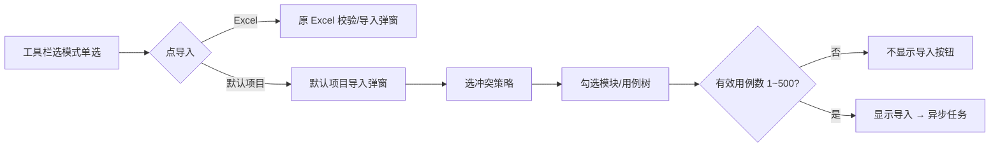

# MeterSphere 用例导入入口与默认项目勾选体验优化方案

> **文档类型**：产品 / 前端体验优化方案（增量）  
> **编写日期**：2026-07-24  
> **标注**：【AI生成】已人工审核确认（产品决策见 §9）；**状态：已实施**  
> **实施提交**：导入入口按钮+双单选、勾选树含用例叶子、隐藏无效导入、后端拒 ALL/UNPLANNED/root  
> **关联主方案**：[MeterSphere-默认项目与跨项目导入-优化方案-2026-07-23.md](./MeterSphere-默认项目与跨项目导入-优化方案-2026-07-23.md)  
> **关联截图**：导入按钮下拉；「从【米多公司默认项目】导入」弹窗（冲突策略 + 选择方式 + 模块树）

---

## 1. 背景与目标

### 1.1 Why

当前「从默认项目导入」已落地，但入口与勾选体验不符合预期：

| 痛点 | 现状 | 影响 |
|------|------|------|
| 导入入口藏在下拉里 | `a-dropdown-button`：主按钮默认 Excel，下拉切「从默认项目导入」 | 模式切换不直观，易误点 |
| 树仅到模块 | `importFromDefaultModal` 只拉 `getCaseModuleTree`，无用例叶子 | 无法勾选单条用例 |
| 选择方式冗余 | 单选：全部用例 / 未规划用例 / 所属模块 | 与「按模块+用例勾选」产品方向冲突 |
| 文案异常 | 表单项标签显示原始键 `common.select` | 未翻译，体验差 |
| 导入按钮策略 | 选「全部 / 未规划」时按钮可用（旧 #10） | 新产品要求：**不显示**导入按钮 |

### 1.2 目标（本次 3 点）

| # | 需求 | 优先级 |
|---|------|--------|
| 1 | 导入按钮右侧改为两个单选：「从 Excel 导入」「从默认项目导入」；选中哪项，点导入即进对应模式 | P0 |
| 2 | 默认项目导入：模块下展示用例 **ID + 名称**，可勾选单条；删除「全部用例 / 未规划用例」选项与「选择方式」标签行；未规划下用例不可导入 | P0 |
| 3 | 勾选「全部用例」或「未规划用例」时，**不显示**导入按钮 | P0 |

**预估**：约 1.5–2.5 人日（以前端为主；若树接口需带用例叶子，后端约 +0.5～1 人日）。

### 1.3 非目标

- 不改变「仅从公司默认项目导入」的数据源与复制边界（正文+步骤；无附件/关联）。  
- 不改变冲突策略「跳过 / 覆盖」与单次 500 条上限。  
- 不改造 Excel 导入内部校验/结果弹窗流程。

---

## 2. 现状基线

| 点 | 关键实现 |
|----|----------|
| 导入入口 | `components/import/index.vue`：`a-dropdown-button` + Excel / 默认项目两个 `a-doption` |
| 默认项目弹窗 | `importFromDefaultModal.vue`：冲突策略 + `selectMode`（`ALL`/`UNPLANNED`/`MODULE_IDS`）+ 模块树勾选 |
| 树数据 | `getCaseModuleTree({ projectId: hubProjectId })`，仅模块节点 |
| 导入按钮 | `:ok-button-props="{ disabled: !canImport }"`；`ALL`/`UNPLANNED` 时 `canImport=true` |
| `common.select` | 弹窗 `a-form-item :label="t('common.select')"`；**locale 中无此 key** → 页面原文显示 `common.select` |

---

## 3. 关于 `common.select` 的说明

### 3.1 它是什么

`common.select` 是前端 **i18n 国际化文案键（locale key）**，约定写法为 `t('命名空间.键名')`。  
组件里写了：

```vue
<a-form-item :label="t('common.select')">
```

意图是给「选择方式」那一行加表单标签，期望翻译成例如「选择」或「选择方式」。

### 3.2 为什么页面上看到的是 `common.select`

在 `frontend/src/locale/zh-CN/common.ts`（及 en-US）中 **未注册** `common.select` 这一条。  
`vue-i18n` 找不到翻译时，默认回退为 **原样输出 key 字符串**，所以弹窗上出现灰色字样 `common.select`，而不是中文。

同类已存在的键例如：`common.import`、`common.cancel`、`common.selectedCount` 等；**没有** `common.select`。

### 3.3 修复建议（已纳入本方案）

| 方案 | 做法 | 建议 |
|------|------|------|
### 3.3 处理结论（已确认）

**去掉「选择方式」整行**（含错误的 `t('common.select')` 标签及「全部 / 未规划 / 所属模块」单选）。  
弹窗在冲突策略下方直接展示模块+用例勾选树，不再出现 `common.select` 原文，也不再补公共 locale。

---

## 4. 需求分项方案

### 4.1 【#1】导入按钮 + 右侧模式单选

#### 动机-行为-呈现

- **Why**：模式可见、可预期，减少下拉误触。  
- **How**：工具栏「导入」改为普通按钮；**右侧紧邻**两个 radio：`从 Excel 导入` | `从默认项目导入`。用户先选模式，再点「导入」打开对应弹窗。  
- **What**：默认选中「从 Excel 导入」（兼容旧习惯）；无下拉箭头。

#### UI 示意

```text
[ 新建 ]  [ 导入 ]  ○ 从 Excel 导入  ○ 从默认项目导入
```

#### 技术方案

**改文件**：`import/index.vue`（入口）、必要时微调 `caseTable.vue` 工具栏间距。

| 项 | 约定 |
|----|------|
| 组件结构 | `a-button`（导入）+ `a-radio-group`（`excel` / `defaultHub`） |
| 点击导入 | `mode==='excel'` → `showExcelModal=true`；`mode==='defaultHub'` → `showHubModal=true` |
| 权限 | 整组仍 `v-permission="['FUNCTIONAL_CASE:READ+IMPORT']"` |
| 当前即默认项目时 | 「从默认项目导入」可禁用并 tooltip「当前已是默认项目，无需导入」 |
| i18n | 复用 `importExcelTab` / `importHubTab`；文案可微调为「从 Excel 导入」「从默认项目导入」 |

**不推荐**：把 radio 放进弹窗内再选源——与截图诉求相反，本次明确入口外置。

---

### 4.2 【#2】模块树展示用例叶子；精简选择方式

#### 动机-行为-呈现

- **Why**：支持按模块批量勾选，也支持单条用例精确导入。  
- **How**：树节点 = 文件夹 / 模块 / **用例叶子**；用例节点展示 **`{num} {name}`**（如 `100001 测试`）；勾选叶子 = 导入该条；勾选模块 = 导入其下全部用例（含子模块，与现有 `check-strictly=false` 联动）。  
- **What**：删除「全部用例」「未规划用例」两个 radio，并**整行删除**「选择方式」（含 `common.select`）；弹窗仅保留冲突策略 + 可导入的模块/文件夹树（含用例叶子）。

#### 树展示规则（已确认）

| 节点类型 | 展示 | 可勾选导入 | 说明 |
|----------|------|------------|------|
| 文件夹 / 业务模块 | 名称 (+ 可选计数) | ✅ | 勾选后子孙**已归类**用例进入导入集 |
| 用例叶子（归类在模块/文件夹下） | **`ID + 用例名称`** | ✅ | 单条导入 |
| 「全部用例」虚拟根 | — | ❌ | **不渲染**或不参与勾选 |
| 「未规划用例」节点 | 可保留展示（只读提示）或整支隐藏 | ❌ | **节点及其下全部用例叶子均不可勾选、不可导入** |

#### 未规划用例策略（已确认）

- **目的**：强制用户先将测试用例分类归类到模块/文件夹后，才允许从默认项目导入。  
- **规则**：「未规划用例」下的用例叶子 **不允许勾选导入**；即使用户在源项目未规划池中有用例，导入弹窗中也不可选。  
- **实现建议（二选一，推荐 A）**：  
  - **A**：导入树 **不渲染**「未规划用例」整支（含其下用例），文案提示「仅可导入已归类到模块的用例」。  
  - **B**：节点可见但 `disableCheckbox` / 用例叶子不可选，tooltip 说明须先归类。  
- 后端二次校验：若请求 `caseIds` 属于未规划模块（`root` / 未规划），直接拒绝，防止绕过前端。

#### 技术方案

**前端** `importFromDefaultModal.vue`：

1. 去掉 `ALL` / `UNPLANNED` radio 及整块「选择方式」`a-form-item`（含 `t('common.select')`）。  
2. `selectMode` 固定为树勾选：`MODULE_IDS` + `CASE_IDS`（或汇总为 caseId 列表）。  
3. 加载「模块树 + 用例」时过滤未规划支；用例节点展示 `{{ num }} {{ name }}`。  
4. 提交前过滤：排除未规划下 caseId；有效数量 ∈ [1, 500] 才显示导入按钮。  
5. 后端：忽略/拒绝 `ALL`/`UNPLANNED`；拒绝未规划 caseId。

---

### 4.3 【#3】选「全部用例 / 未规划用例」不显示导入按钮

#### 与旧方案差异

| 版本 | 策略 |
|------|------|
| 主方案旧 #10 | 选全部 / 未规划 → **显示/可用**导入按钮 |
| **本次（已确认）** | 选全部 / 未规划 → **不显示**导入按钮 |

以本次为准，主方案 #10 作废并回写。

#### 行为定义

| 选择状态 | 导入按钮 |
|----------|----------|
| 未勾选任何有效（已归类）节点 | **隐藏** |
| 仅涉及「全部用例 / 未规划用例」或其下用例 | **不显示**（未规划不可导入） |
| 勾选了 ≥1 个已归类模块/文件夹或 ≥1 条已归类用例叶子，且数量 ∈ [1, 500] | **显示**且可点 |
| 展开后用例数 = 0 或 > 500 | 不显示或禁用并提示 |

#### 技术方案

- `canImport` 重写：有效选择 = 勾选结果解析出的 `caseIds.length ∈ [1, 500]`。  
- 模板：`:hide-cancel="false"` + 用 `v-if="canImport"` 控制自定义 footer，或 `:footer="false"` 自绘按钮区，使「导入」在无效时不渲染。  
- Arco `a-modal` 的 `ok-button-props.disabled` **只能禁用不能隐藏**，若严格「不显示」，需自定义 footer。

---

## 5. 交互流程（合并后）



---

## 6. 实施切片

| 顺序 | 任务 | 改动面 | 预估 |
|------|------|--------|------|
| 1 | 入口：下拉改按钮+双单选 | `import/index.vue`、locale | 0.3d |
| 2 | 去掉 ALL/UNPLANNED 与整行 `common.select`；过滤未规划支 | `importFromDefaultModal.vue` | 0.3d |
| 3 | 树带用例叶子（ID+名称）；提交 CASE_IDS | FE + 可选 BE 树接口 | 0.8–1.5d |
| 4 | 导入按钮按有效选择隐藏；作废旧 #10 | modal footer 逻辑 | 0.3d |
| 5 | 回归：Excel 链路、500 上限、冲突策略、默认项目自导入禁用 | 测试 | 0.3d |

---

## 7. 测试要点

| 编号 | 场景 | 期望 |
|------|------|------|
| U1 | 选 Excel → 点导入 | 打开 Excel 弹窗，无下拉 |
| U2 | 选从默认项目 → 点导入 | 打开默认项目弹窗 |
| U3 | 展开模块 | 可见用例「ID + 名称」，可单条勾选导入 |
| U4 | 弹窗内 | 无「选择方式」行、无 `common.select`、无全部/未规划模式单选 |
| U5 | 未规划节点/其下用例 | 不可勾选或不可见；无法导入 |
| U5b | 未勾选或仅无效节点 | **不显示**「导入」按钮 |
| U6 | 勾选已归类模块或用例叶子后 | 出现「导入」；成功后无附件/关联 |
| U7 | 当前项目=默认项目 | 默认项目模式不可用或导入被拒绝 |

---

## 8. 对主方案的回写点

实施确认后更新主方案：

1. §3.5 How：入口改为「按钮 + 右侧双单选」，不再强调弹窗内双 Tab / 下拉。  
2. §3.5 选择模式：删除 `ALL` / `UNPLANNED` 作为产品入口；以树勾选 `MODULE` + `CASE` 为准。  
3. §3.10：**改为**「选全部用例 / 未规划用例 → **不显示**导入按钮」；与本次一致。  
4. 修订记录增加本增量方案引用。

---

## 9. 已确认决策（原开放项）

| # | 结论 |
|---|------|
| 1 | **去掉**「选择方式」整行（含 `common.select`），不补公共翻译 |
| 2 | 「未规划用例」下用例叶子 **不允许**勾选导入，强制先分类归类到模块/文件夹 |

---

## 10. 修订记录

| 版本 | 日期 | 说明 |
|------|------|------|
| v0.1 | 2026-07-24 | 【AI生成】入口单选、树展示用例、隐藏无效导入按钮；解释 `common.select` |
| v0.2 | 2026-07-24 | 确认：删除 `common.select` 整行；未规划下用例禁止导入（强制归类） |
| v1.0 | 2026-07-24 | 已实施：FE 入口/弹窗 + BE 导入树接口与 ALL/UNPLANNED/root 校验 |
