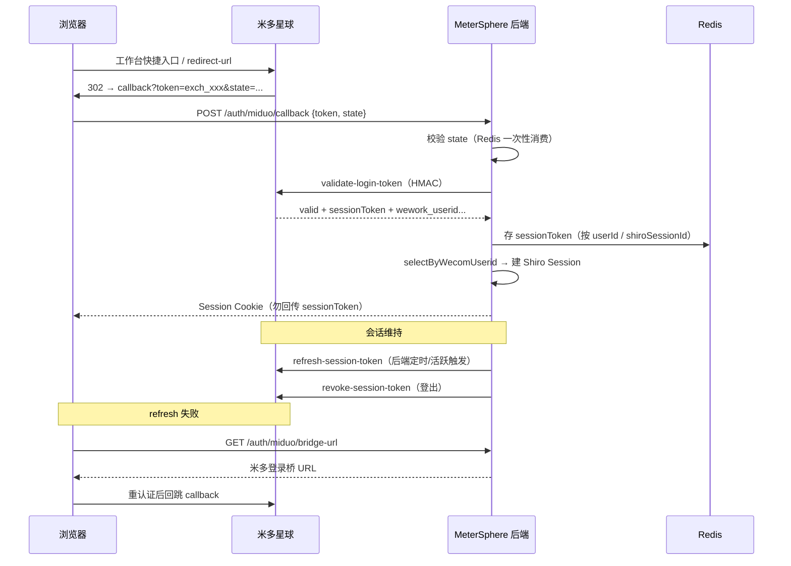

# MeterSphere 第三方 SSO（米多星球）单点登录接入方案

> **版本**：v1.1 | **日期**：2026-07-16 | **状态**：设计稿（已修订）  
> **标注**：【AI生成】已对照《米多星球-第三方SSO单点登录接入设计参考-2026-07-16》与本仓库现有认证/企微同步实现梳理；落地前须与米多侧正式交付信息核对并经技术负责人评审  
> **参考文档**：`myTapd/miduo-md/workflow/sso/米多星球-第三方SSO单点登录接入设计参考-2026-07-16.md`  
> **任务拆分**：[`docs/task/miduo_sso/task000-实施总览与依赖关系.md`](../task/miduo_sso/task000-实施总览与依赖关系.md)

---

## 1. 结论摘要

| 维度 | 结论 |
|---|---|
| 角色定位 | MeterSphere 作为**米多星球的第三方应用**接入双 Token SSO |
| 协议 | 浏览器只中转 exchange token；后端 HMAC 调 `validate / refresh / revoke`；会话失效走登录桥 |
| 身份权威字段 | `wework_userid` ↔ 本系统 `user.wecom_userid` |
| 本地会话 | 校验成功后发放 **MeterSphere Shiro Session**（勿把米多 `sessionToken` 下发前端） |
| 成员前提 | SSO 登录**不自动建号**；依赖企微通讯录同步（`/org-wecom`）先落本地用户 |
| 与现有扫码 SSO | `FilterChainUtils` 已预留 `/sso/callback/**` anon，**无对应 Controller 实现**；米多 SSO 走**独立模块** `/auth/miduo/**`，不混用 `platform_source` / `authsource` |

**硬约束（与米多参考一致，不可违背）：**

- `appSecret` 仅后端持有，禁止下发前端
- 浏览器只中转 exchange token，不持有 `sessionToken`
- 不以 URL 上的 `mobile`/`name` 等 PII 作为身份证明
- `state` 由 MeterSphere 生成并在回调校验（防 CSRF）
- `redirectUri` 必须命中米多侧白名单；生产使用 HTTPS

---

## 2. 现状与差距

### 2.1 已具备（可复用）

| 能力 | 落点 |
|---|---|
| 本地 / LDAP 登录 | `LoginController` + `UserLoginService.login()` + Apache Shiro Session |
| 非 LOCAL 免密建会话 | `LocalRealm`：`authenticate != LOCAL` 时走 `getUserWithOutAuthenticate` |
| 用户表企微字段 | `user.wecom_userid`；`ExtUserMapper.selectByWecomUserid` |
| 企微通讯录同步 | `OrgWecomSyncController` → `/org-wecom/sync/manual` 等；`UserSyncHandler` 写入 `wecom_userid` |
| 组织-成员 / 组织架构 UI | `frontend/.../organization/member`、`.../orgStructure` |
| 匿名过滤器扩展位 | `FilterChainUtils` + `ShiroFilterChainExtender`（参考 `AgentShiroFilterChainExtender`） |
| Redis | `StringRedisTemplate`（企微同步锁等，可复用存 state / sessionToken） |

### 2.2 缺口（本方案需补齐）

| 缺口 | 说明 |
|---|---|
| 米多开放 API 客户端 | 签名 + validate / refresh / revoke / bridge URL |
| 回调落地页与后端 callback | 收 `token`+`state` → 校验 → 建本地会话 |
| `sessionToken` 服务端存储 | Redis（P0）；可选 DB 审计表（P2） |
| 登录桥回退 | refresh 失败时引导浏览器回米多重认证 |
| 配置项 | `miduo.sso.*` 环境/密钥配置（与 `org_wecom_sync_config`、`authsource` 分离） |
| CDS 路由 | `cds-compose.yml` 需增加 `/auth/` 前缀，避免 callback 落到 Vite |
| 前端白名单 | SSO callback 路由须加入 `WHITE_LIST`，避免未登录重定向 |

### 2.3 文档勘误（v1.0 → v1.1）

| v1.0 描述 | 实际代码 |
|---|---|
| `SsoLoginController` 占位拒绝 | **仓库中无此类**；仅有 FilterChain 的 `/sso/callback/**` anon |
| `PlatformSourceService.rejectSsoCallback` | **未找到** |
| 「SSO 不自动建号」 | 准确；**企微同步**会在 `UserSyncHandler.createUser` 中建号，运营上仍是「先同步后登录」 |
| `UserSource` | 仅有 `LOCAL, LDAP, CAS, OIDC, OAUTH2, QR_CODE`，需扩展 `MIDUO` |

---

## 3. 核心模型：双 Token + 本地 Session



| 令牌 | 持有方 | 用途 |
|---|---|---|
| exchange token | 浏览器仅中转 | 一次性交给后端 validate |
| 米多 sessionToken | **仅 MeterSphere 后端（Redis）** | refresh / revoke |
| MeterSphere Session | Cookie / Shiro | 本系统鉴权 |

---

## 4. 接入前确认单（P0）

编码前须逐项确认（与米多交付对齐）：

```text
【MeterSphere ↔ 米多星球 SSO 确认单】
1. 环境
   - 对接环境: <dev/test/prod>
   - MIDUO_SSO_BASE_URL: <https://...>

2. 应用凭据（仅后端，环境变量注入）
   - MIDUO_SSO_APP_CODE
   - MIDUO_SSO_APP_SECRET

3. 回调与白名单（须与米多 allowlist 字符级一致）
   - 推荐（灰度/CDS）: https://{host}/#/sso/miduo/callback
   - 备选（无 hash）: https://{host}/auth/miduo/landing → 前端中转
   - tokenDeliveryMode: QUERY | FORM_POST
   - MIDUO_SSO_SHORTCUT_ID（若走工作台快捷入口）

4. state
   - 生成：服务端随机串（≥32 字节）
   - 存储：Redis key `miduo:sso:state:{state}`，TTL 5–10 分钟
   - 回调一次性消费（GETDEL）

5. 用户匹配策略
   - 权威：validate 返回的 wework_userid → user.wecom_userid
   - 禁止：URL 参数 mobile/name 作为身份依据
   - 未匹配：拒绝登录，提示先执行「同步企业微信成员」
   - 不自动建号（建号仅由企微同步完成）
```

---

## 5. 米多侧 API（第三方后端调用）

| 方法 | 路径 | signedValue |
|---|---|---|
| POST | `/api/open/sso/validate-login-token` | `token` |
| POST | `/api/open/sso/refresh-session-token` | `sessionToken` |
| POST | `/api/open/sso/revoke-session-token` | `sessionToken` |
| GET | `/api/sso/bridge/redirect-url` | 浏览器跳转（无需开放签名） |

签名 Canonical：

```text
canonical = appCode + "\n" + timestamp + "\n" + nonce + "\n" + signedValue
signature = Base64(HMAC_SHA256(appSecret, canonical))
```

请求头：`X-App-Code` / `X-App-Timestamp` / `X-App-Nonce` / `X-App-Signature`。

业务成功判定：

- validate：`return_data.valid == true`（禁止只认 `return_code`）
- refresh / revoke：`return_data.success == true`

---

## 6. MeterSphere 实现蓝图

### 6.1 建议模块落点

| 层级 | 建议路径 | 职责 |
|---|---|---|
| 配置 | `miduo.sso.enabled/base-url/app-code/app-secret/redirect-uri` | 环境变量 / Nacos，Secret 禁止入库明文 |
| 客户端 | `.../sso/miduo/MiduoSsoClient` | 签名 + 三接口 + bridge URL |
| 应用服务 | `.../sso/miduo/MiduoSsoApplicationService` | state、validate、用户匹配、存 sessionToken、建 Shiro 登录 |
| Shiro 扩展 | `.../sso/miduo/MiduoSsoShiroFilterChainExtender` | 注册 `/auth/miduo/**` anon（参考 Agent 扩展方式） |
| 控制器 | `.../sso/miduo/MiduoSsoAuthController` | status / state / callback / logout / bridge-url |
| 存储 | Redis | `miduo:sso:state:*`、`miduo:sso:session:{userId}` |
| 前端落地 | `frontend/src/views/login/sso/MiduoCallback.vue` | 读 query `token` → POST callback → 跳转首页 |
| 前端 API | `frontend/src/api/modules/sso/miduo.ts` | 封装本地 SSO 接口 |
| 路由白名单 | `frontend/src/router/constants.ts` | 增加 `ssoMiduoCallback` |
| 部署 | `cds-compose.yml` | `cds.path-prefixes` 增加 `/auth/` |

### 6.2 本地 API 建议

| 方法 | 路径 | 说明 |
|---|---|---|
| GET | `/auth/miduo/status` | 是否启用、是否需走桥、企微同步是否就绪 |
| GET | `/auth/miduo/state` | 生成 state（可写 HttpOnly Cookie 关联） |
| POST | `/auth/miduo/callback` | Body: `{ token, state }` |
| POST | `/auth/miduo/logout` | 本系统登出 + revoke 米多 sessionToken |
| GET | `/auth/miduo/bridge-url` | 返回米多登录桥完整 URL |

公网经 Vite 代理时，前端请求路径为 `/front/auth/miduo/**`（与现有 `/front/display/info` 一致）。

### 6.3 用户匹配与权限

1. `validate` 成功后取 `wework_userid`（权威）
2. `extUserMapper.selectByWecomUserid(wework_userid)` 查找本地用户
3. 用户不存在 / 禁用 / 已删除 → 拒绝登录，提示先同步企微成员
4. 成功则：`session.setAttribute("authenticate", UserSource.MIDUO.name())` → 复用 `UserLoginService` / `LocalRealm` 建 Session
5. 调用 `autoSwitch()` 设置组织/项目上下文
6. 组织/项目权限仍走本地用户组，**不**从米多同步 RBAC

### 6.4 refresh / logout

| 时机 | 行为 |
|---|---|
| 后端活跃或定时 | 用 Redis 中 sessionToken 调 refresh；失败标记 `needMiduoReauth` |
| `/is-login` 响应 | 若 `needMiduoReauth=true`，前端引导 bridge |
| 用户点击退出 | 先 revoke 米多 sessionToken，再 `SecurityUtils.getSubject().logout()` |
| refresh 失败 | 前端跳转 `GET /auth/miduo/bridge-url` |

**登出挂钩**：扩展 `LoginController.signout` 或 `userStore.logout()` 前置调用 `/auth/miduo/logout`（当 Session 为 MIDUO 来源时）。

### 6.5 与企微同步的关系

```text
企微通讯录同步（/org-wecom）  →  UserSyncHandler 写入 user.wecom_userid
        ↓
米多 SSO validate  →  wework_userid 匹配  →  允许登录
```

| 配置 | 存储 | 用途 |
|---|---|---|
| 通讯录 Secret | `org_wecom_sync_config` | 企微同步 |
| LDAP 等 | `auth_source` | 本地/LDAP 登录 |
| 扫码（预留） | `platform_source` | 原生企微/钉钉扫码（未实现） |
| 米多 SSO | `miduo.sso.*` 环境变量 | 米多双 Token |

三者/四者**禁止混用 Secret**。

---

## 7. 分阶段落地建议

| 阶段 | 任务 | 内容 | 优先级 |
|---|---|---|---|
| P0 | task001–006 | 配置、Client、callback、Redis、Shiro/CDS、前端 Callback | 必须 |
| P1 | task007–008 | refresh/bridge、安全加固与 status 门禁 | 强烈建议 |
| P2 | task009 | 登录入口、端到端验收、可选扫码入口统一 | 可选 |

详见 [`docs/task/miduo_sso/`](../task/miduo_sso/task000-实施总览与依赖关系.md)。

---

## 8. 风险与评审必查

### P0

- `appSecret` / `sessionToken` 出现在前端或日志明文
- 信任 URL 中的手机号/姓名登录
- 无后端 validate 或只认 `return_code`
- 未匹配用户却自动建号
- `redirectUri` 与白名单不一致 / 双重 encode
- CDS 未配置 `/auth/` 导致 callback 404 或落到静态资源

### P1

- 无 state 校验 / 无 nonce 去重
- logout 不 revoke
- refresh 失败无登录桥
- 企微同步未完成却开放 SSO 入口

---

## 9. 验收清单

- [ ] callback 能接收 `token` + `state`（QUERY 或 FORM_POST，与米多确认一致）
- [ ] 后端校验 state 后再调 validate
- [ ] `valid=true` 后建立本系统 Session，`sessionToken` 仅存 Redis
- [ ] 按 `wecom_userid` 匹配已同步用户；未匹配拒绝并提示同步
- [ ] logout 调 revoke
- [ ] refresh 失败可走登录桥
- [ ] 日志不打印 secret / token 全量
- [ ] 灰度 `https://v3-x-metersphere.miduo.org/front/auth/miduo/callback` 可达 Java
- [ ] 与米多交付的 appCode / 白名单 / TTL / claims 一致
- [ ] Agent API 与米多 SSO 互不影响（正交鉴权链路）

---

## 10. 相关代码索引（本仓库）

| 主题 | 路径 |
|---|---|
| 登录 | `backend/.../LoginController.java`、`UserLoginService.java` |
| Shiro Realm | `backend/.../LocalRealm.java` |
| 扫码 SSO 预留（无实现） | `FilterChainUtils` `/sso/callback/**` |
| Shiro 扩展参考 | `AgentShiroFilterChainExtender.java` |
| 企微同步 | `OrgWecomSyncController`、`UserSyncHandler` |
| 用户企微字段 | `ExtUserMapper.selectByWecomUserid` |
| 组织成员页同步按钮 | `frontend/.../organization/member/index.vue` |
| 前端白名单 | `frontend/src/router/constants.ts` |
| CDS 路由 | `cds-compose.yml` `cds.path-prefixes` |
| 匿名链 | `FilterChainUtils.java` |

---

## 11. 文档边界

| 本文覆盖 | 本文不覆盖 |
|---|---|
| MeterSphere 作为第三方如何接米多 SSO | 米多侧发牌实现源码 |
| 与现有企微同步、Shiro 会话的衔接设计 | 企微原生扫码换票完整实现 |
| 分阶段编码蓝图与 task 拆分 | 各业务模块细粒度权限改造 |

**原则**：优先落地「签名客户端 + callback + Redis sessionToken + revoke/bridge」最小闭环；本地账号匹配以 `wecom_userid` 为准，且须先完成企微成员同步。
