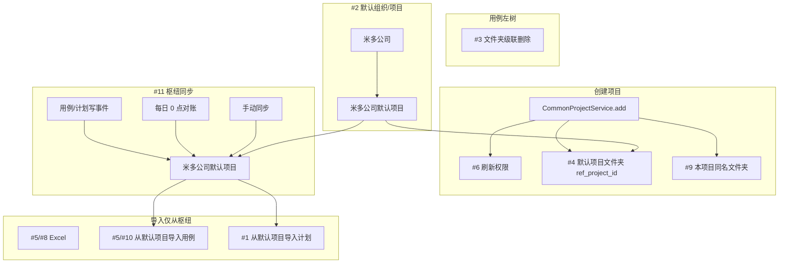

# MeterSphere 默认项目与跨项目导入优化方案

> **文档类型**：产品 / 技术优化方案  
> **编写日期**：2026-07-23  
> **标注**：【AI生成】产品决策已回写至 v0.4.1（含枢纽同步、仅从默认项目导入、权限落库模型、导入副本不回写）；待技术负责人做权限点清单终审  
> **状态**：关键产品决策已确认；任务已拆解见 [`docs/task/default_project_cross_import/`](../task/default_project_cross_import/task000-实施总览与依赖关系.md)  
> **关联截图**：测试计划详情「表格设置」默认态（每页 10；所属项目、测试点默认关闭）

---

## 1. 背景与目标

### 1.1 Why（动机）

日常多项目协作中存在以下痛点：

| 痛点 | 影响 |
|------|------|
| 测试计划 / 用例无法便捷复用（计划侧甚至无导入入口） | 重复建计划、手工搬用例，成本高 |
| 缺少稳定的「公司默认组织 / 默认项目」枢纽 | 跨项目沉淀、统一权限基线难落地 |
| 左树仅有「添加子模块」，缺少可承载多模块的「文件夹」入口 | 模块树扁平、难按业务域归类 |
| 新建项目后权限未即时刷新 | 进入新项目菜单/能力异常，需手动刷新或重登 |
| 计划详情用例表默认列与团队习惯不一致 | 测试点等列干扰，需每次改表格设置 |
| Excel 导入模板无执行人 | 与列表「执行人」能力不一致 |

### 1.2 How / What（目标摘要）

| # | 需求 | 优先级建议 |
|---|------|-----------|
| 1 | 测试计划可从【米多公司默认项目】**单条导入**（仅「测试计划」Tab / 规划文档；不含用例关联/计划组/定时任务） | P0 |
| 2 | 【米多公司】/【米多公司默认项目】系统默认、不可删；默认项目权限与组织锁定 | P0 |
| 3 | 执行用例左树：收起全部与「➕」之间增加「创建文件夹」 | P1 |
| 4 | 创建项目时，在【米多公司默认项目】左树同步创建同名文件夹（`ref_project_id`） | P1 |
| 5 | 用例导入：工具栏「导入」+ 右侧双单选（Excel / 默认项目）；树勾选模块与单条用例（ID+名称）；仅从默认项目导入 | P0 |
| 6 | 创建并进入新项目后自动刷新权限 | P0 |
| 7 | 计划详情-测试用例 Tab：表格默认设置对齐产品图 | P1 |
| 8 | Excel 导入模板增加「执行人」列 | P1 |
| 9 | 新项目自身左树创建与项目同名的文件夹（仅自身） | P1 |
| 10 | 从默认项目导入：选「全部用例 / 未规划用例」时**不显示**导入按钮 | P1 |
| **11** | **枢纽同步（新增）**：他项目新建/变更用例与计划「测试计划」Tab → 同步到默认项目；定时 24h（0 点）+ 手动同步 | **P0** |

**枢纽模型（v0.4 核心变更）**

```text
业务项目 A/B/C  ──(创建/变更同步)──▶  【米多公司默认项目】枢纽沉淀
业务项目 A/B/C  ◀──(仅从此导入)──  【米多公司默认项目】
```

- **导入方向**：业务项目 **只能从【米多公司默认项目】** 导入计划 / 用例（不再支持任选「其他业务项目」互导）。  
- **同步方向**：业务项目 → 默认项目（保证枢纽数据与各业务项目一致）；**不**做默认项目改回写业务项目（除非后续单独立项）。

**预估总工期**：约 **28–40 人日**（含同步引擎、联调与回归；不含大规模历史数据清洗）。较 v0.3 上调，因 #11 为新增主路径。

### 1.3 非目标（本期不做）

- 测试计划 **Excel** 导入 / 导出计划本身。
- 业务项目之间 **互导**（A↔B）；导入源 **仅限**【米多公司默认项目】。
- 默认项目修改后 **反向回写** 到业务项目。
- 将「文件夹」做成与模块完全独立的第二套资源权限体系（本期复用模块树扩展类型）。
- 改造接口测试 / 场景自动化的跨项目导入与同步（仅功能用例与测试计划主路径）。
- 同步实时强一致（本期为事件尽力同步 + 日批对账，非分布式事务）。

---

## 2. 现状基线（代码结论）

| 能力 | 现状 | 关键路径 |
|------|------|----------|
| 测试计划导入 | **无**跨项目计划导入；仅有本项目批量复制/移动 | `test-plan/testPlan`、`TestPlanBatchOperationService` |
| 计划「测试计划」Tab | 规划文档富文本；表 `test_plan_document`（`TestPlanDocumentService`） | `detail/plan/index.vue`、`TestPlanDocument*` |
| 默认组织 | 已有 `num=100001` 默认组织，删除受 `checkOrgDefault` 拦截 | `OrganizationService` |
| 默认项目 | **无**与「米多公司默认项目」对等的硬编码保护与权限特例 | `CommonProjectService` |
| 用例左树 | `FunctionalCaseModule`；虚拟根 `root`；无独立「文件夹」类型 | `caseManagementFeature/index.vue`、`caseTree.vue` |
| 删模块 | `deleteModule` **级联**删子模块及挂载用例 | `FunctionalCaseModuleService` |
| 建项目初始化 | 模板/环境/版本/机器人；**不**自动建功能用例模块 | `ProjectServiceInvoker` |
| 用例导入 | 执行用例 Tab 仅 Excel；Xmind 已拆至独立 Tab | `import/exportCaseModal.vue` |
| 建项目后刷新 | 仅 `appStore.initProjectList()`，**未**重拉 `userRolePermissions` | `addProjectModal.vue`（组织侧） |
| 计划详情用例表 | 测试点列默认展示；所属项目默认隐藏 | `detail/featureCase/components/caseTable.vue` |
| Excel 模板 | 无执行人列；等级等多在模板自定义字段 | `FunctionalCaseImportFiled` |
| 权限 | 组织/项目权限分挂 `user_role_relation.source_id` | `InternalUserRole`、`PermissionConstants` |

---

## 3. 需求分项方案（动机-行为-呈现）

### 3.1 【#1】从【米多公司默认项目】导入测试计划

#### 动机-行为-呈现

- **Why**：从公司枢纽复用计划骨架（「测试计划」Tab / 规划文档），避免连带搬入用例与执行态。
- **How**：测试计划列表「导入」→ **来源固定为【米多公司默认项目】**（可按文件夹/项目镜像筛选）→ **单选一条计划** → 确认导入到当前项目。
- **What**：生成**新计划 ID**；仅复制约定字段；成功提示「未导入关联用例/计划组/定时任务/执行与报告」。

#### 导入 / 复制范围（已确认）

| 内容 | 是否导入 | 说明 |
|------|----------|------|
| 计划基本信息（名称、描述、标签等） | ✅ | 见落库映射；状态取目标侧合理初始值（如未开始） |
| **「测试计划」Tab = 规划文档** | ✅ | `test_plan_document` 正文；富文本内图片见 §3.1.1 |
| 计划组关系 / 整组导入 | ❌ | |
| 定时任务 / 调度 | ❌ | |
| **测试用例 / API / 场景 Tab 及关联** | ❌ | |
| 缺陷列表 / 执行历史 / 报告 | ❌ | |

#### 名称冲突（已确认，与用例对齐）

同目标项目下计划**同名**时弹窗，仅两选项：

| 选项 | 行为 |
|------|------|
| **跳过（SKIP）** | 不导入该条 |
| **覆盖（OVERWRITE）** | 用源计划内容覆盖目标同名计划的「测试计划」Tab 及约定基本信息；**不**改目标侧已有关联用例等 |

支持「全部跳过 / 全部覆盖」应用到本次剩余冲突项。

#### 3.1.1 落库映射（规划文档）

| 源 | 目标动作 |
|----|----------|
| `test_plan` | 新建行：`id` 新生成；`project_id`=目标项目；复制 `name`/`description`/`tags` 等约定字段；`group_id` 置默认（不挂组）；`status` 初始值；不复制实际起止/归档态 |
| `test_plan_config` | 按产品最小集复制或按新建计划默认初始化（**不含**调度相关） |
| `test_plan_document` | 复制 `content`；`file_ids`：**复制文件到目标项目文件域并重写引用**（避免跨项目图片 404）；复制失败则保留可渲染 Markdown/HTML 并记录断链日志 |
| 关联表（功能/API/场景用例、报告、定时任务等） | **一律不写** |

> 前端「测试计划」Tab 对应 `detail/plan/index.vue` → `getTestPlanDocument` / `saveTestPlanDocument`。

#### 技术方案要点

- **BE**：`POST /test-plan/import/from-default-project`（或 `from-project` 且强制 `sourceProjectId=默认项目`）。  
- **FE**：导入抽屉**无任意项目选择器**；展示默认项目下计划列表（可按同步文件夹过滤）。  
- **权限**：目标 `PROJECT_TEST_PLAN:READ+ADD`；对默认项目 `PROJECT_TEST_PLAN:READ`。  
- **审计**：源计划 ID → 新计划 ID；冲突策略。

---

### 3.2 【#2】系统默认组织 / 默认项目与权限特例

#### 动机-行为-呈现

- **Why**：公司统一协作枢纽；防误删；进入默认项目即具备业务 + 组织设置能力（不含系统级）。
- **How**：迁移命名与打标；删除/改组织拦截；成员加入/离开默认项目时维护组织源权限关系。
- **What**：列表「系统默认」标识；删除禁用；所属组织只读。

#### 数据与保护规则

| 对象 | 规则 |
|------|------|
| 组织【米多公司】 | `num=100001` 或 `internal=1`；**不可删除** |
| 项目【米多公司默认项目】 | `internal` / `is_default`；**不可删除**（含软删）；`organization_id` **不可改** |
| 所属组织 UI | 编辑时组织选择器 disabled |

#### 权限边界（已确认）

| 范围 | 是否授予 |
|------|----------|
| 项目内业务模块（按已启用模块） | ✅ |
| **组织设置** | ✅ |
| 系统设置 → **系统**模块（`SYSTEM_*`） | ❌ **唯一排除** |

#### 权限落库模型（已确认）

| 规则 | 说明 |
|------|------|
| **组织权限挂组织源** | 「组织设置」类权限写入 `user_role_relation`，`source_id = organizationId`（组织角色关系），**不**塞进项目用户组冒充组织权 |
| **项目权限挂项目源** | 默认项目业务权限：专用用户组「默认项目成员」或等价，`source_id = 默认项目Id` |
| **加入默认项目** | ① 绑定项目侧「默认项目成员」组；② 若用户在该组织**尚无**组织管理员 / 已覆盖组织设置权限的角色，则**补授**约定组织角色（白名单权限） |
| **离开默认项目** | **回收**因本机制授予的组织设置角色关系；若用户仍是组织管理员或其他合法组织角色，**不误删** |
| **已是组织管理员** | **幂等**：不重复插入组织角色关系 |
| **白名单** | 技术对照 `PermissionConstants` 产出清单，安全负责人签字后落种子 |

> ⚠️ 安全敏感；**须人工审核权限点清单**后再上线。

---

### 3.3 【#3】左树增加「创建文件夹」

#### 动机-行为-呈现

- **Why**：按业务域分层。  
- **How**：收起/展开全部 与 ➕ 之间增加文件夹按钮。  
- **What**：可展开收起；下可挂子模块/文件夹；**允许直接挂用例**。

#### 数据模型

| 字段 | 说明 |
|------|------|
| `type` / `module_type` | `MODULE`（默认） / `FOLDER` |
| `ref_project_id` | 可选；#4 同步文件夹必填，指向业务项目 ID |

#### 删除语义（已确认）

与现有「删模块」对齐：**有子节点 / 有挂用例 → 级联删除**（子文件夹、子模块及挂载用例一并删除）。前端二次确认文案需明示「将级联删除子树及用例」。

---

### 3.4 【#4】创建项目 → 默认项目同步同名文件夹

#### 动机-行为-呈现

- **Why**：默认项目按项目分文件夹沉淀。  
- **How**：建项成功后在默认项目根下建 `FOLDER`，`name=项目名`，写入 `ref_project_id`。  
- **What**：仅空文件夹；重名加后缀保证建项成功。

#### 生命周期副作用（已确认）

| 事件 | 行为 |
|------|------|
| 业务项目 **删除 / 软删** | 默认项目下 `ref_project_id` 对应文件夹 **随删**（级联删其子树与用例，同 #3） |
| 业务项目 **禁用** | 对应文件夹在默认项目树中 **隐藏**；但作为导入源时 **仍可选/可导入**（接口不因隐藏拒绝读） |
| 业务项目 **改名** | **仅按 `ref_project_id`** 定位文件夹并改名；**禁止**仅靠名称匹配；目标名冲突则加后缀并打日志 |
| 人工改过文件夹显示名后再改项目名 | 仍以 `ref_project_id` 为准覆盖为新项目名（或产品可选「保留自定义名」——本期默认 **跟随项目名**） |

失败降级：不阻断建项/改名主流程；打日志 + 可补偿任务。

---

### 3.5 【#5】用例导入：Excel / 仅从默认项目导入

#### 动机-行为-呈现

- **Why**：从枢纽按树挑选用例复制到当前业务项目。  
- **How**（入口体验见增量方案 [MeterSphere-用例导入入口与勾选体验-优化方案-2026-07-24.md](./MeterSphere-用例导入入口与勾选体验-优化方案-2026-07-24.md)）：  
  1. 工具栏「导入」按钮右侧两个单选：**从 Excel 导入** / **从默认项目导入**；点导入打开对应模式。  
  2. 默认项目弹窗：冲突策略 + **模块/用例勾选树**（模块下展示用例 ID+名称，可单条勾选）；**去掉**「选择方式」行及「全部用例 / 未规划用例」模式单选；**未规划用例及其下叶子不可导入**（强制先归类）。  
- **What**：按路径重建模块；落到当前选中节点或根下；成功提示复制边界。

#### 冲突策略（已确认）

| 选项 | 行为 |
|------|------|
| **跳过** | 保留目标已有 |
| **覆盖** | 仅覆盖约定正文；目标已有附件/关联 **保留** |

#### 复制范围（已确认，细化）

| 内容 | 是否复制 | 说明 |
|------|----------|------|
| 基本信息（名称、等级、标签、执行人、自定义字段等列表/详情基本区） | ✅ | 新 `caseId`；覆盖则更新目标 |
| **详情：前置条件、备注、步骤（含预期）** | ✅ | |
| 模块 / 文件夹路径 | ✅ | |
| **评审结果** | ❌ 清除 | 目标侧置为 **未评审** |
| **执行状态 / 执行历史** | ❌ 清除 | 置为 **未执行**；不复制历史 |
| 附件 | ❌ | |
| 缺陷 / 评审关联 / 计划关联 / 其它一切关联 | ❌ | |

#### 大批量导入（已确认）

| 项 | 约定 |
|----|------|
| 单次上限 | **≤ 500 条**用例（超出拒绝或要求拆分） |
| 超时 | 同步等待上限 **5 分钟**；超时转失败并提示查看任务 |
| 执行方式 | **异步任务 + 进度**（百分比 / 成功失败数） |
| 失败策略 | **整单回滚**（本批次已写数据回滚，不保留部分成功） |

#### 技术方案要点

- `POST /functional/case/import/from-default-project`；`sourceProjectId` 固定默认项目。  
- 选择模式以树勾选为准：`CASE_IDS` / `MODULE_IDS` / `FOLDER_IDS` + `SKIP`/`OVERWRITE`；**产品入口不再使用** `ALL` / `UNPLANNED`；请求中的未规划用例 ID **后端拒绝**。  
- 权限：默认项目 `FUNCTIONAL_CASE:READ`；目标 `IMPORT` 或 `ADD`。

---

### 3.6 【#6】创建新项目并进入后自动刷新权限

- 组织侧 / 系统侧创建入口均需：`initProjectList` → `userStore.isLogin(true)` → `setCurrentProjectId` → 跳转。  
- 与路由守卫切换项目逻辑防抖，避免双刷。

---

### 3.7 【#7】计划详情-测试用例 Tab 表格默认

| 配置项 | 默认值 |
|--------|--------|
| 每页 | **10** |
| 所属项目 / 测试点 | **关** |
| 其余列 | 开（顺序见原产品图） |

**不强制**清用户本地 `tableStore` 缓存；仅新用户/无缓存生效。

---

### 3.8 【#8】Excel 模板增加「执行人」

- 写入 `functional_case.execute_user`。  
- 旧模板无列：兼容置空。  
- **解析优先级（建议默认，待签字）**：邮箱 → 用户名 → 姓名；姓名重名记失败行。

---

### 3.9 【#9】新项目自身同名文件夹

创建项目 A：A 根下 `FOLDER「A」` + 默认项目根下 `FOLDER「A」`（#4）。失败不阻断建项。

---

### 3.10 【#10】选全部 / 未规划时不显示导入按钮

与 #5 同弹窗；「全部用例 / 未规划用例」及其下用例 **不可作为导入范围**（未规划禁止导入，强制归类）；无效选择时 **不显示**「导入」按钮；仅当勾选已归类模块/用例并解析出 1～500 条时显示。详见增量方案。

---

### 3.11 【#11】枢纽同步：业务项目 →【米多公司默认项目】（新增）

#### 动机-行为-呈现

- **Why**：导入源仅默认项目，必须保证枢纽与各业务项目数据一致。  
- **How**：  
  1. **创建同步**：业务项目新建用例 / 测试计划时，在默认项目对应 `ref_project_id` 文件夹（或计划镜像位置）创建镜像。  
  2. **变更同步**：业务项目侧用例增删改、计划「测试计划」Tab 内容变更 → 同步到默认项目镜像。  
  3. **定时对账**：每 **24 小时**，以 **0:00（服务器时区，建议 Asia/Shanghai）** 为基准全量/增量对账。  
  4. **手动同步**：默认项目或业务项目提供「手动同步」按钮，触发该项目（或全局）变更同步任务。  
- **What**：默认项目可见与业务项目一致的用例树（落在项目文件夹下）及计划镜像（仅含「测试计划」Tab 约定内容）。

#### 同步范围

| 对象 | 同步内容 | 不同步 |
|------|----------|--------|
| **功能用例** | 与 §3.5 复制范围一致：基本信息 + 前置/备注/步骤；镜像侧评审=未评审、执行=未执行 | 附件、执行历史、缺陷/评审/计划等关联 |
| **测试计划** | 仅「测试计划」Tab（`test_plan` 约定字段 + `test_plan_document`）；新建时在默认项目建镜像计划 | 用例关联、其它 Tab、定时任务、计划组、报告 |
| **删除** | 业务项目删除用例/计划 → 默认项目镜像删除（或标记删除后物理删，与产品一致） | — |

#### 映射表（建议）

| 表（逻辑名） | 字段要点 |
|--------------|----------|
| `default_hub_case_map` | `biz_project_id`, `biz_case_id`, `hub_case_id`, `updated_at`, `content_hash` |
| `default_hub_plan_map` | `biz_project_id`, `biz_plan_id`, `hub_plan_id`, `updated_at`, `content_hash` |
| `default_hub_sync_job` | 任务类型（定时/手动/事件）、范围、状态、进度、错误摘要 |

以映射表为准做 upsert，**禁止**仅靠同名匹配。

#### 技术方案要点

- **事件**：用例/计划写路径发领域事件或 Outbox → 异步 Worker 更新枢纽（失败入重试队列）。  
- **定时**：Cron `0 0 0 * * ?`（按环境确认）；按项目分片，避免长事务。  
- **手动**：`POST /project/default-hub/sync`（`projectId` 可选；空=全组织业务项目）。  
- **权限**：手动同步需项目管理员或组织管理员。  
- **与导入关系（已确认：不回写）**：从默认项目导入到业务项目的副本，后续在业务项目修改时 **不再同步回默认项目**。  
  - 导入生成新业务侧 ID；可记审计字段 `imported_from_hub_case_id` / `imported_from_hub_plan_id`（仅溯源）。  
  - **不**写入 `default_hub_case_map` / `default_hub_plan_map` 作为同步源。  
  - 仅「业务项目自建/自维护且已建立 hub 映射」的对象参与业务→枢纽同步，避免同步环。

---

## 4. 总体架构关系



---

## 5. 实施顺序与任务切片建议

| 阶段 | 任务 | 依赖 | 预估 |
|------|------|------|------|
| S0 | #2 权限点白名单签字 | — | 0.5d |
| S1 | #2 标记/拦截 + 组织源权限授予/回收 | S0 | 3–4d |
| S2 | #3 文件夹类型 + 级联删除对齐 + 左树入口 | — | 2d |
| S3 | #4+#9 建项文件夹、`ref_project_id`、删/禁用/改名副作用 | S1、S2 | 2.5–3d |
| S4 | #6 权限刷新 | — | 0.5d |
| S5 | #7 表格默认 | — | 0.5–1d |
| S6 | #8 Excel 执行人 | — | 1–1.5d |
| S7 | #11 映射表 + 事件同步 + 定时 + 手动同步（用例+计划 Tab） | S3 | **6–9d** |
| S8 | #5+#10 从默认项目导入用例（异步/500/回滚） | S2、S7 | 4–5d |
| S9 | #1 从默认项目导入计划（SKIP/OVERWRITE + document 落库） | S7 | 3–4d |
| S10 | 联调 / 回归 / 权限与同步负向 | 全部 | 3–4d |

建议 **S4、S5 先行**；**S1 权限**、**S7 同步**、**S8/S9 导入** 分灰度。

---

## 6. 已确认决策与剩余开放项

### 6.1 已确认

| # | 结论 | 版本 |
|---|------|------|
| 1 | 计划导入仅「测试计划」Tab / 规划文档；不含计划组、定时、用例关联；单条 | v0.2/v0.4 |
| 2 | 默认项目权限含组织设置；仅排除系统-系统；组织权限挂组织源；离开回收；组织管理员幂等 | v0.4 |
| 3 | 文件夹可挂用例；删除级联（同删模块） | v0.4 |
| 4 | 用例/计划导入冲突：SKIP / OVERWRITE | v0.4 |
| 5 | 用例复制：基本信息+前置/备注/步骤；清评审为未评审、清执行为未执行；无附件与关联 | v0.4 |
| 6 | 改名同步文件夹以 `ref_project_id` 为准 | v0.4 |
| 7 | 表格默认不强制清缓存 | v0.2 |
| 8 | 导入源 **仅**【米多公司默认项目】；业务项目变更同步到枢纽；日批 0 点 + 手动同步 | v0.4 |
| 9 | 项目删/软删 → 枢纽文件夹随删；禁用 → 文件夹隐藏但仍可导入 | v0.4 |
| 10 | 批量导入：≤500、5 分钟、异步进度、失败整单回滚 | v0.4 |
| 11 | 覆盖时目标已有附件/关联保留 | v0.4 |
| 12 | **从默认项目导入到业务项目的副本，业务侧后续修改不再同步回默认项目** | v0.4 |

### 6.2 仍建议实施前敲定

1. **#8** 执行人解析：建议 **邮箱 → 用户名 → 姓名**（本文已作默认建议）。  
2. **#2** 权限点白名单终稿（S0）。  
3. 定时任务时区与多节点抢锁（ShedLock 等）运维约定。

---

## 7. 测试要点（提测清单）

| 编号 | 场景 | 期望 |
|------|------|------|
| T1 | 从默认项目单选导入计划到 A | A 新计划；有规划文档；无关联用例/组/定时 |
| T1b | 计划同名 SKIP/OVERWRITE | 符合选项 |
| T2 | 删除默认组织/默认项目 | 拒绝 |
| T3 | 改默认项目所属组织 | 拒绝 |
| T4 | 进默认项目 / 离开默认项目 | 组织设置权限授予与回收正确；组织管理员不重复、不误删 |
| T5 | 文件夹挂用例；级联删除 | 子树与用例删除 |
| T6 | 创建项目 X | 默认项目与 X 各有文件夹；`ref_project_id` 正确 |
| T6b | 改名 / 人工改文件夹名后再改名 | 仅按 `ref_project_id` 更新 |
| T6c | 删项目 / 禁用项目 | 文件夹随删 / 隐藏但仍可导入 |
| T7 | 仅从默认项目导入用例；冲突 SKIP/OVERWRITE | 通过；不能选其它业务项目 |
| T7b | 导入后用例 | 有前置/备注/步骤；未评审、未执行；无附件与关联 |
| T8 | 未规划用例 / 无有效勾选；501 条 | 不可导入或不显示导入；超限拒绝；失败整单回滚 |
| T9 | 建项进入 | 权限即时生效 |
| T10 | 表格默认 | 新用户=产品默认；老用户保留缓存 |
| T11 | Excel 执行人 | 解析与校验报告正确 |
| T12 | 业务项目新建用例/计划 | 默认项目出现镜像（计划仅 Tab 内容） |
| T13 | 业务项目改用例/改规划文档 | 枢纽镜像更新 |
| T14 | 0 点定时 + 手动同步 | 任务成功、进度可见、对账后一致 |
| T15 | 规划文档含图片 | 目标侧可打开图片（文件已拷贝或引用已重写） |
| T16 | 从枢纽导入到业务项目后修改副本 | 默认项目对应源数据**不变**（不回写） |

---

## 8. 风险与人工审核点

| 风险 | 说明 | 建议 |
|------|------|------|
| 默认项目全能权限 | 越权面 | 权限清单签字；离开回收单测 |
| 同步延迟/冲突 | 日批前枢纽可能旧 | UI 展示「上次同步时间」；手动同步入口明显 |
| 同步环 | 导入副本再回写 | 默认不登记导入副本为同步源（§3.11） |
| 级联删除 | 误删文件夹丢用例 | 强确认文案；默认项目文件夹随项目删需运维知晓 |
| 大批量 | 500×富文本/图片 | 异步+回滚；图片拷贝限流 |
| 表格缓存 | 老用户不见新默认 | 已确认不强制重置 |

---

## 9. 交付物

1. 本方案评审定稿（本文件 v0.4.1）。  
2. 任务拆解：[`docs/task/default_project_cross_import/`](../task/default_project_cross_import/task000-实施总览与依赖关系.md)（task000–011，含 #11 同步）。  
3. 迁移 SQL（默认组织/项目、`module.type`、`ref_project_id`、hub 映射表、权限种子）。  
4. 前后端 MR + 同步任务监控说明 + 测试报告。

---

## 10. 修订记录

| 版本 | 日期 | 说明 |
|------|------|------|
| v0.1 | 2026-07-23 | 【AI生成】首版方案，待人工审核确认 |
| v0.2 | 2026-07-23 | 回写 6 项产品确认 |
| v0.3 | 2026-07-23 | 用例跨项目导入：不复制附件/执行态/关联 |
| v0.4 | 2026-07-24 | 回写评审补充：权限落库与回收；文件夹生命周期；**导入源仅默认项目**；**#11 枢纽同步（日批+手动）**；批量 500/5min/异步/整单回滚；计划冲突 SKIP/OVERWRITE；用例/计划复制范围与 `test_plan_document` 落库映射；文件夹级联删除 |
| v0.4.1 | 2026-07-24 | 确认：导入副本业务侧修改**不回写**默认项目；补充 T16 |
| v0.4.2 | 2026-07-24 | 生成任务拆解 `docs/task/default_project_cross_import`（task000–011） |
| v0.4.3 | 2026-07-24 | 入口改为按钮+双单选；树展示用例可单选；删除全部/未规划模式；#10 改为不显示导入按钮；详见增量方案 2026-07-24 |
| v0.4.4 | 2026-07-24 | 去掉 `common.select` 整行；未规划下用例禁止导入（强制归类） |
| v0.5 | 2026-07-24 | 【已实施】入口按钮+双单选；导入树含用例叶子；无效时隐藏导入；后端拒 ALL/UNPLANNED/root |
