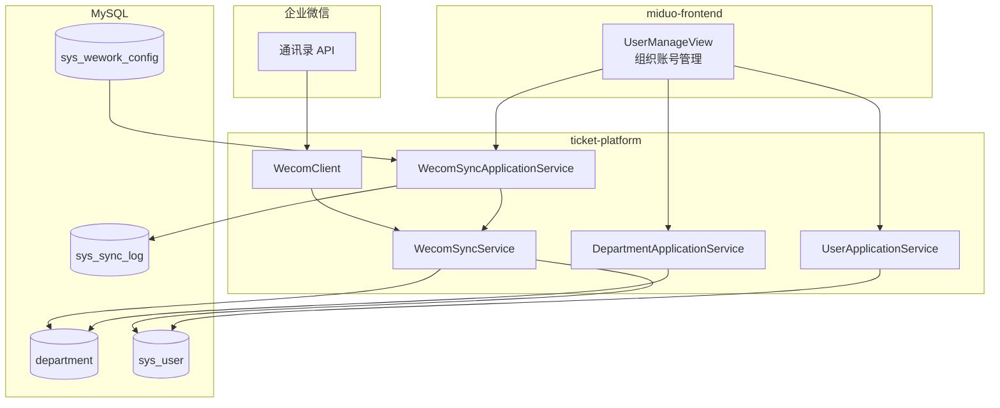

# 组织架构模块设计摘要

> **文档类型**：架构摘要 / 模块导读  
> **适用项目**：米多内部工单系统（ticket-platform + miduo-frontend）  
> **编写日期**：2026-06-25  
> **关联文档**：见文末「延伸阅读」

---

## 1. 模块定位

组织架构模块负责将**企业微信通讯录**同步为工单系统内的**本地只读副本**，为以下能力提供数据基础：

- 企微扫码登录（身份匹配）
- 组织账号管理（管理端查询与运维）
- RBAC 角色授权（本地维护，与组织解耦）
- 工单创建/分派/审批（处理人、部门维度）

**核心原则**：企微是组织与员工的主数据源；工单系统不做组织主数据维护，仅同步、查询、脱敏展示。

---

## 2. 设计原则

| 原则 | 说明 |
|------|------|
| 主数据唯一 | 部门/员工以企业微信为准，本地不开放增删改 |
| 本地可查询 | 持久化至 `department`、`sys_user`，保障树形展示与筛选性能 |
| 权责分离 | 身份认证走企微；业务权限走本地 `sys_role` / `sys_user_role` |
| 幂等同步 | 全量 upsert + 失活收敛，重复同步不产生脏数据 |
| 可运维 | 手动/定时同步、日志审计、失败重试、状态可视化 |

**一期明确不做**：前端手工维护组织、多租户隔离、跨企业通讯录聚合、部门树拖拽重排。

---

## 3. 总体架构



---

## 4. 后端分层

组织相关代码集中在 **用户域（`domain/user`）**，遵循 Controller → Application → Domain → Infrastructure 分层：

| 层级 | 路径 | 职责 |
|------|------|------|
| Controller | `ticket-controller/.../user/` | HTTP 入口，参数校验，调用 Application |
| Application | `ticket-application/.../user/`、`.../wecom/` | 部门树构建、员工查询、同步编排 |
| Domain | `ticket-domain/.../user/` | `Department`、`User` 模型；Repository 接口 |
| Infrastructure | `ticket-infrastructure/.../` | MyBatis PO/Mapper、Repository 实现、`WecomClient` |
| Entity | `ticket-entity/.../user/` | 对外 DTO（`DepartmentTreeOutput` 等） |
| Job | `ticket-job/.../WecomSyncJob` | 定时同步调度 |

**关键类一览**：

| 类 | 职责 |
|----|------|
| `WecomSyncService` | 同步核心：部门 upsert、员工 upsert、失活收敛 |
| `WecomSyncApplicationService` | 同步编排：写日志、重试、返回统计 |
| `DepartmentApplicationService` | 内存构建部门树，聚合成员数量 |
| `UserApplicationService` | 员工分页/详情，敏感字段脱敏 |
| `WecomClient` | 企微 API 封装（部门列表、成员列表、Token 缓存） |

---

## 5. 数据模型

### 5.1 核心表

**`department`（部门）**

| 字段 | 说明 |
|------|------|
| `id` / `parent_id` | 本地树形结构 |
| `wecom_dept_id` | 企微部门 ID（唯一索引 `uk_department_wecom_dept_id`） |
| `name`, `sort_order` | 名称、排序 |
| `dept_status` | 1 启用 / 0 停用 |
| `sync_status`, `sync_time` | 同步状态与时间 |
| `leader_wecom_userid` | 部门负责人企微 UserID |

**`sys_user`（员工，设计文档中亦称 sys_employee）**

| 字段 | 说明 |
|------|------|
| `wecom_userid` | 企微用户唯一标识（登录匹配键，唯一索引） |
| `department_id` | 主部门（本地 ID） |
| `account_status` | 1 在职 / 2 停用 / 4 离职 |
| `gender` | 0 未知 / 1 男 / 2 女（V12 新增） |
| `sync_status`, `sync_time` | 同步状态与时间 |

**辅助表**

| 表 | 用途 |
|----|------|
| `sys_wework_config` | 企微连接配置、定时同步 Cron、重试次数 |
| `sys_sync_log` | 同步执行日志（模式、状态、统计、耗时、错误） |
| `sys_user_role` | 本地 RBAC 角色绑定 |
| `ticket` | 扩展字段 `creator_wework_userid`、`assignee_wework_userid`、`current_dept_id` |

### 5.2 企微字段映射

| 企微（部门） | 本地 | 备注 |
|-------------|------|------|
| `id` | `wecom_dept_id` | 外部唯一标识 |
| `name` | `name` | |
| `parentid` | `parent_id` | 同步时二次换算为本地 ID |
| `order` | `sort_order` | |
| `department_leader` | `leader_wecom_userid` | |

| 企微（员工） | 本地 | 备注 |
|-------------|------|------|
| `userid` | `wecom_userid` | |
| `name` | `name` | |
| `mobile` | `phone` | 仅在 API 有值时更新，防误清空 |
| `email` | `email` | |
| `position` | `position` | 同上 |
| `department[0]` | `department_id` | 主部门 |
| `status` | `account_status` | 1 在职 / 2 停用 / 4 未激活 |

> 完整映射与回滚脚本见 [task002-数据模型与字段映射说明.md](./task002-数据模型与字段映射说明.md)

---

## 6. 同步引擎

### 6.1 执行顺序

固定为 **先部门、后员工**，由 `WecomSyncService.syncAllWithResult()` 编排。

**部门同步**

1. 拉取企微全量部门 → 按 `wecom_dept_id` upsert  
2. 第二遍修正 `parent_id`（依赖本地 ID 映射）  
3. 对企微已不存在的部门做失活（`dept_status=0`）；若 API 返回空列表则跳过失活以防误伤  

**员工同步**

1. 从根部门（`wecom_dept_id=1`）递归拉取成员  
2. 按 `wecom_userid` upsert；新建用户自动分配 SUBMITTER 角色  
3. `DEV_` 前缀系统内置账号不参与失活收敛  
4. 手机号/职位/性别：仅在 API 明确返回值时更新，避免权限不足导致清空  

### 6.2 触发方式

| 方式 | 入口 | 说明 |
|------|------|------|
| 手动 | `POST /api/v1/sync/manual` | 管理端「同步企业微信」 |
| 定时 | `WecomSyncJob` | 读取 `sys_wework_config.scheduleEnabled/Cron` |
| 登录兜底 | `AuthApplicationService` | 用户不存在时从通讯录拉详情并创建 |

### 6.3 同步状态

| 状态 | 含义 |
|------|------|
| `SUCCESS` | 失败数为 0 |
| `PARTIAL` | 存在部分失败 |
| `FAILED` | 同步过程异常中断 |

---

## 7. API 接口

存在 **双轨接口**，底层复用同一 Application 服务：

| 场景 | 路径 | 接口编号 |
|------|------|----------|
| 通用部门树（工单选人等） | `GET /api/department/tree` | API000404 |
| 组织管理-部门树（含成员统计） | `GET /api/v1/departments/tree` | API000428 |
| 组织管理-员工分页 | `GET /api/v1/employees/page` | API000429 |
| 组织管理-员工详情 | `GET /api/v1/employees/detail/{id}` | API000430 |
| 手动同步 | `POST /api/v1/sync/manual` | API000425 |
| 最近同步状态 | `GET /api/v1/sync/status` | API000426 |
| 同步日志分页 | `GET /api/v1/sync/log/page` | API000427 |

**部门树输出增强字段**（API000428）：`directUserCount`、`totalUserCount`、`deptStatus`、`syncStatus`

**员工详情脱敏规则**：手机号中间 4 位、邮箱用户名、企微 userid 中间段掩码。

---

## 8. 前端设计

| 项 | 说明 |
|----|------|
| 路由 | `/manage/user` |
| 页面 | `miduo-frontend/src/views/manage/UserManageView.vue` |
| 菜单 | 管理端 → 组织账号管理 |
| API 封装 | `src/api/organization.ts`（管理端）、`src/api/department.ts`（通用树） |
| 类型 | `src/types/organization.ts` |

**页面布局**：左组织树 + 右成员列表 + 详情抽屉 + 同步运维（状态/日志/手动触发）

**交互要点**

- 点击部门节点 → 右侧成员列表按 `departmentId` 过滤  
- 支持关键字、账号状态、性别、同步状态组合筛选  
- 同步完成后自动刷新树、列表、最近同步状态  

---

## 9. 模块联动

| 关联模块 | 使用方式 |
|----------|----------|
| 认证 | 登录以 `wecom_userid` 匹配 `sys_user`；返回部门名称 |
| RBAC | 角色在本地维护；OBSERVER 可按部门限制可见范围 |
| 工单 | 创建人/处理人关联用户；ticket 表存企微 userid 与部门 ID |
| 工作流/派单 | 可按部门、角色、规则自动分派 |
| 企微配置 | `WecomConfigPanel` 与同步配置同模块运维 |

---

## 10. 已知局限与优化方向

| 项 | 现状 | 建议方向 |
|----|------|----------|
| 员工分页 | 内存过滤 + 分页（`findAll` 后筛选） | 改为 SQL 层分页与组合索引查询 |
| 部门归属 | 仅主部门（`department_id`） | 如需一人多部门，需扩展关联表 |
| 组织维护 | 只读，不支持前端 CRUD | 符合一期设计，变更走企微 |
| API 双轨 | `/department` 与 `/v1` 并存 | 新功能统一走 `/v1`，旧接口逐步收敛 |

---

## 11. 代码索引

### 后端

```
ticket-platform/
├── ticket-controller/src/main/java/.../user/
│   ├── DepartmentController.java
│   └── OrganizationQueryController.java
├── ticket-controller/src/main/java/.../wecom/
│   └── WecomSyncController.java
├── ticket-application/src/main/java/.../user/
│   ├── DepartmentApplicationService.java
│   ├── UserApplicationService.java
│   └── WecomSyncService.java
├── ticket-application/src/main/java/.../wecom/
│   └── WecomSyncApplicationService.java
├── ticket-domain/src/main/java/.../user/
│   ├── model/Department.java, User.java
│   └── repository/DepartmentRepository.java, UserRepository.java
├── ticket-infrastructure/src/main/java/.../
│   ├── persistence/mybatis/user/po/DepartmentPO.java
│   ├── persistence/repositoryimpl/DepartmentRepositoryImpl.java
│   └── external/wework/WecomClient.java
└── ticket-bootstrap/src/main/resources/db/migration/
    ├── V1__init_base.sql
    └── V12__enhance_org_account_management.sql
```

### 前端

```
miduo-frontend/src/
├── views/manage/UserManageView.vue
├── api/organization.ts
├── api/department.ts
└── types/organization.ts
```

---

## 12. 延伸阅读

| 文档 | 内容 |
|------|------|
| [工单系统-企业微信账号体系复用实施清单.md](./工单系统-企业微信账号体系复用实施清单.md) | 一期范围、角色权限、总体架构 |
| [task002-数据模型与字段映射说明.md](./task002-数据模型与字段映射说明.md) | 表结构、字段映射、回滚脚本 |
| [task004-同步引擎阶段性说明.md](./task004-同步引擎阶段性说明.md) | 同步流程、状态定义、重试机制 |
| [task005-组织查询接口交付说明.md](./task005-组织查询接口交付说明.md) | API000428~430 行为与脱敏 |
| [task006-组织账号管理产品规划方案.md](./task006-组织账号管理产品规划方案.md) | 产品范围、交互流程、验收标准 |
| [task007-组织账号管理技术实现方案.md](./task007-组织账号管理技术实现方案.md) | V12 变更、前后端实现细节 |
| [认证与用户模块API接口设计.md](../工单系统/认证与用户模块API接口设计.md) | 认证、用户、部门 API 完整契约 |

---

## 13. 快速上手检查清单

- [ ] 企微连接配置已填写（`sys_wework_config` 或管理端企微配置页）  
- [ ] 手动触发同步成功（`POST /api/v1/sync/manual`）  
- [ ] 部门树有数据且成员数量正确（`GET /api/v1/departments/tree`）  
- [ ] 员工分页与详情脱敏正常（`GET /api/v1/employees/page|detail`）  
- [ ] 同步日志可查询（`GET /api/v1/sync/log/page`）  
- [ ] 管理端「组织账号管理」页面可正常联调  
