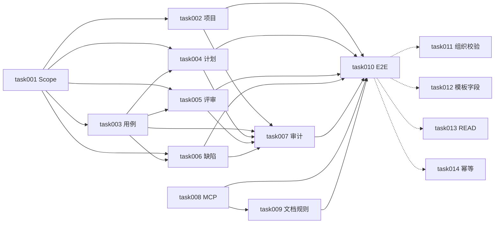

# task000 - 实施总览与依赖关系

> **文档类型**：任务索引 / 里程碑规划  
> **适用项目**：MeterSphere Agent 对话闭环（写路径扩展）  
> **编写日期**：2026-07-23  
> **关联方案**：[MeterSphere-Agent对话闭环-扩展方案-2026-07-23.md](../../summary/MeterSphere-Agent对话闭环-扩展方案-2026-07-23.md)（已人工审核）  
> **前置基线**：`docs/task/metersphere_agent`（读/回写 MVP + MCP 读路径）  
> **标注**：【AI生成】已按已审方案拆解；一期代码多数已合入，任务以核对、联调验收与二期排期为主

---

## 1. 总体目标

在不调用平台 AI 的前提下，完成对话闭环一期：

**项目/成员 → 用例批量导入 → 测试计划 → 评审 → 执行回写（既有）→ 缺陷**

形态：`/api/agent/v1` + `metersphere-mcp` 薄封装。

### 1.1 一期（task001–010）

1. Scope：`PROJECT_WRITE` / `CASE_WRITE` / `PLAN_WRITE` / `REVIEW_WRITE` / `BUG_WRITE` / `AGENT_ALL`  
2. 项目创建与加成员 + 组织归属校验  
3. 模块/单条/批量用例写入  
4. 测试计划创建与关联（保证 `testPlanCaseId`）  
5. 用例评审创建与关联  
6. 缺陷创建与关联失败用例  
7. 写操作审计覆盖  
8. MCP 11 个写 Tool + 文档/工作流规则  
9. 端到端 6 项可判定验收 + OpenAPI  

### 1.2 二期（task011–014，方案 §15）

1. 写接口组织归属统一校验  
2. 缺陷/用例模板必填字段查询 API  
3. GET 独立 READ Scope +（可选）MCP GET Tools  
4. 批量导入幂等（`clientRequestId`）  

---

## 2. 阶段划分

| 阶段 | 任务文档 | 主题 | 预估 | 代码现状 |
|------|----------|------|------|----------|
| **P0** | [task001](task001-P0-Scope与鉴权扩展.md) | Scope 与鉴权扩展 | 0.5d | 已实现，待核对 |
| **P0** | [task002](task002-P0-项目创建与成员API.md) | 项目创建与成员 | 1d | 已实现，待核对 |
| **P0** | [task003](task003-P0-功能用例批量导入API.md) | 模块/用例批量导入 | 1.5d | 已实现，待核对 |
| **P0** | [task004](task004-P0-测试计划创建与关联API.md) | 测试计划写闭环 | 1d | 已实现，待核对 |
| **P0** | [task005](task005-P0-用例评审创建与关联API.md) | 评审写闭环 | 1d | 已实现，待核对 |
| **P0** | [task006](task006-P0-缺陷创建与关联API.md) | 缺陷写闭环 | 1d | 已实现，待核对 |
| **P0** | [task007](task007-P0-写闭环审计覆盖.md) | 审计矩阵 | 0.5d | 已实现，待核对 |
| **P1** | [task008](task008-P1-MCP写闭环Tools.md) | MCP 写 Tools（11） | 1d | 已实现，待核对 |
| **P1** | [task009](task009-P1-Cursor工作流与接入文档.md) | 规则与接入文档 | 0.5d | 已实现，待核对 |
| **P0** | [task010](task010-P0-端到端验收与OpenAPI.md) | E2E 验收 + OpenAPI | 1–1.5d | **当前优先** |
| **P2** | [task011](task011-P2-写接口组织归属统一校验.md) | 组织归属统一 | 1d | 未排期 |
| **P2** | [task012](task012-P2-模板必填字段查询API.md) | 模板字段发现 | 1–1.5d | 未排期 |
| **P2** | [task013](task013-P2-READ-Scope与MCP-GET.md) | READ Scope / GET | 1d | 未排期 |
| **P2** | [task014](task014-P2-批量导入幂等.md) | 导入幂等 | 1d | 未排期 |

**一期合计**：约 5–8 人日（以验收与补缺为主）；**二期**：约 4–5 人日。

**建议顺序**：`001 → 002∥003 → 004∥005 → 006 → 007 → 008 → 009 → 010`；二期按风险优先 `011 → 012 → 013∥014`。

---

## 3. 依赖关系

**关键路径（验收）**：task001–007 核对通过 → task008/009 → **task010 E2E**。

---

## 4. 默认产品决策（摘自方案）

| 决策项 | 值 |
|--------|-----|
| 用例生成 | Cursor 对话生成 JSON，不调平台 AI |
| API 前缀 | `/api/agent/v1` |
| MCP | 薄封装，无业务逻辑；一期 18 Tools（7 读回写 + 11 写） |
| `FUNCTIONAL_ALL` | 仅读/回写，不含 WRITE |
| GET 项目/计划/评审 | 一期复用对应 WRITE Scope |
| 缺陷必填字段 | 一期报错 + `customFields` 重试 |
| 新建项目后 | 显式传 `projectId`，不依赖热改 MCP env |

---

## 5. 里程碑验收

### M1 - 一期写闭环可交付（task001–010）

- [ ] Scope 矩阵与单元测试覆盖 WRITE / AGENT_ALL / FUNCTIONAL_ALL 边界  
- [ ] 6 类写 API curl 联调通过（见方案 §12）  
- [ ] MCP 写 Tools 可在 Cursor 调用  
- [ ] 工作流规则含高危确认与 `testPlanCaseId` 约定  
- [ ] OpenAPI `agent` 分组含新增 Path  
- [ ] 端到端 6 项可判定场景全部通过  

### M2 - 二期加固（task011–014）

- [ ] 写接口统一组织归属校验  
- [ ] 模板必填字段可查询  
- [ ] GET 与 WRITE Scope 解耦（按需 MCP GET）  
- [ ] 批量导入支持幂等键  

---

## 6. 相关文档

| 文档 | 说明 |
|------|------|
| [扩展方案](../../summary/MeterSphere-Agent对话闭环-扩展方案-2026-07-23.md) | 已审权威方案 |
| [改造方案 v2.0](../../summary/MeterSphere-Agent集成-改造方案-2026-07-07.md) | 读/回写基线 |
| [cursor-onboarding](../metersphere_agent/cursor-onboarding.md) | 接入指南 |
| [curl-examples](../metersphere_agent/curl-examples.md) | 联调示例 |
| [metersphere-mcp README](../../../metersphere-mcp/README.md) | MCP 说明 |

---

## 7. 任务状态总览

| 任务 | 状态 |
|------|------|
| task000 | 进行中（索引） |
| task001 | 已核对通过（单测） |
| task002–007 | 代码已核对；运行时随 task010 |
| task008–009 | 已核对通过 |
| task010 | **进行中**：脚本/单测就绪，待后端联调 |
| task011–014 | 未开始（二期） |

### 本轮执行记录（2026-07-23）

- 单测 14 passed（含新增 CASE_WRITE 隔离）  
- MCP build 通过；Tool 数 18  
- 新增 `scripts/verify-agent-conversation-loop.ps1`  
- fixture 增加 `msat_demo_agent_all_token_01`（AGENT_ALL）  
- **阻塞**：本地/生产 Agent health 均不可达，E2E 六项未勾选  

