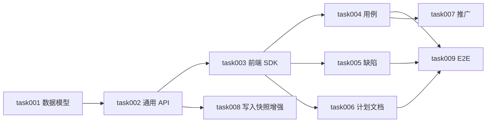

# task000 - 实施总览与依赖关系

> **文档类型**：任务索引 / 里程碑规划  
> **适用项目**：MeterSphere 编辑自动保存与撤销  
> **编写日期**：2026-07-24  
> **关联方案**：[MeterSphere-编辑自动保存与撤销-优化方案-2026-07-24.md](../../summary/MeterSphere-编辑自动保存与撤销-优化方案-2026-07-24.md)（**v0.1 产品决策已确认**）  
> **标注**：【AI生成】已按已审方案拆解；S1 表结构与工期需技术负责人确认  

---

## 1. 总体目标

落地全产品统一的**自动保存 + 整单 Undo（最多 2 步）+ 编辑锁**能力：

**基建（锁/快照/SDK）→ 首期三试点（用例 / 缺陷 / 计划文档）→ 其余模块复用接入 → 可选写入路径快照增强 → E2E 收口**

### 1.1 核心模型（勿偏离）

```text
正式数据 = 最新成功保存态
每次成功保存 → 滚动快照（支撑跨天 Undo ≤2 步）
编辑会话 → 加锁（15min 无操作释放）；他人只读「xxx 正在编辑」
自动保存 = 失焦 + 防抖 1.5～2s；失败 Toast + 阻断离开
显式保存 / Ctrl+S 保留；Ctrl+Z / Ctrl+Shift+Z
附件不进 Undo；Agent/Excel/批量无自动保存（增强期可选单次快照）
```

### 1.2 一期范围（task001–008）

对应方案 S1–S4 + 验收；全产品推广在 task006 按模块清单滚动，不阻塞首期上线。

### 1.3 非目标

无限版本库、字段级 Undo、附件进栈、强制抢锁、Agent/Excel 自动保存（见方案 §1.3）。

---

## 2. 阶段划分

| 阶段 | 任务文档 | 主题 | 预估 | 建议灰度 |
|------|----------|------|------|----------|
| **S1** | [task001](task001-P0-锁与快照数据模型.md) | Flyway：`resource_edit_lock` / `resource_edit_snapshot` | 1–1.5d | 先合迁移 |
| **S1** | [task002](task002-P0-编辑锁与快照通用API.md) | 加锁/心跳/释锁；保存后写快照；Undo/Redo API | 2.5–3.5d | 可联调 Mock |
| **S1** | [task003](task003-P0-前端自动保存SDK与状态条.md) | `useAutoSaveEditor`、状态条、拦截离开、快捷键、本地弱兜底 | 2.5–3.5d | 依赖 task002 契约 |
| **S2** | [task004](task004-P0-功能用例详情接入.md) | 用例详情试点 | 2–3d | **首期主路径** |
| **S2** | [task005](task005-P0-缺陷详情接入.md) | 缺陷详情试点 | 2–2.5d | 可与 task004 并行 |
| **S2** | [task006](task006-P0-测试计划文档Tab接入.md) | 计划「测试计划」Tab 试点 | 1.5–2.5d | 可与 004/005 并行 |
| **S3** | [task007](task007-P1-全产品推广接入清单.md) | 其余模块接入清单与模板 | 滚动 | 试点稳定后 |
| **S4** | [task008](task008-P2-写入路径单次快照增强.md) | Agent/导入/批量成功后可选 1 次快照 | 1–2d | **后置** |
| **收口** | [task009](task009-P0-端到端验收与回归.md) | T1–T11 + 负向 | 2–3d | 收口 |

**合计（S1+S2+收口）**：约 **15–22** 人日；S3/S4 另计。

**建议顺序**：`001 → 002 → 003` → `004∥005∥006` → `009`；其后 `007` / `008`。

---

## 3. 依赖关系



---

## 4. 默认产品决策（摘录）

| 决策项 | 值 |
|--------|-----|
| 自动保存 | 失焦 + 防抖 1.5～2s |
| 失败 | Toast + 阻断离开（可强制离开并提示风险） |
| 显式保存 | 保留；Ctrl+S |
| Undo | 整单；最多 2 步；跨天；自动保存后可撤 |
| 整单边界 | 正文/字段一体；**附件不进** |
| 锁 | 15min 无操作释放；他人只读提示 |
| 无权限 | 只读 + 无自动保存 |
| 存储 | 后端滚动快照为主；前端本地仅失败弱兜底 |
| Agent/Excel/批量 | 无自动保存；单次快照见 task008 |

---

## 5. 里程碑验收

### M0 - 基建（task001–003）

- [ ] 迁移可回滚/可重复执行说明清晰  
- [ ] 锁 acquire/heartbeat/release 可用  
- [ ] Undo/Redo API + 快照滚动上限正确  
- [ ] SDK 在隔离 Demo 页可演示自动保存与拦截离开  

### M1 - 首期试点（task004–006）

- [ ] 方案 §4 T1–T10 在三模块主路径通过  
- [ ] 与枢纽同步叠加时无异常风暴（有防抖/hash 短路）  

### M2 - 收口（task009）

- [ ] T1–T11 勾选；缺陷有主责与优先级  
- [ ] 灰度开关：可关自动保存而不影响手动保存  

### M3 - 推广 / 增强（task007–008）

- [ ] 推广清单按模块关闭  
- [ ] 可选写入路径快照不破坏人工 Undo 语义  

---

## 6. 任务索引

| ID | 文件 | 状态 |
|----|------|------|
| 000 | 本文件 | 已拆解 |
| 001 | [task001](task001-P0-锁与快照数据模型.md) | 代码已完成 |
| 002 | [task002](task002-P0-编辑锁与快照通用API.md) | 代码已完成 |
| 003 | [task003](task003-P0-前端自动保存SDK与状态条.md) | 代码已完成 |
| 004 | [task004](task004-P0-功能用例详情接入.md) | 代码已完成，待联调验收 |
| 005 | [task005](task005-P0-缺陷详情接入.md) | 代码已完成，待联调验收 |
| 006 | [task006](task006-P0-测试计划文档Tab接入.md) | 代码已完成，待联调验收 |
| 007 | [task007](task007-P1-全产品推广接入清单.md) | 清单与模板已落地；P1+ 滚动中 |
| 008 | [task008](task008-P2-写入路径单次快照增强.md) | 代码已完成（默认关）；导入钩子待补 |
| 009 | [task009](task009-P0-端到端验收与回归.md) | 验收清单就绪；环境联调待执行 |

---

## 7. 变更记录

| 日期 | 说明 |
|------|------|
| 2026-07-24 | 初版拆解，对齐方案 v0.1 已确认决策 |
