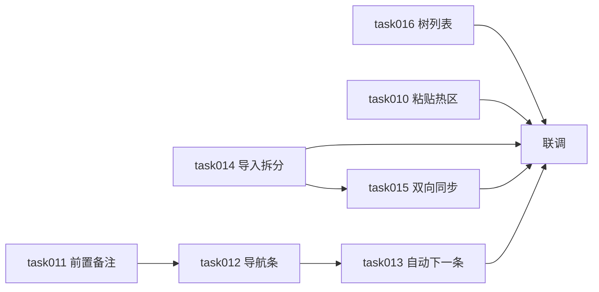
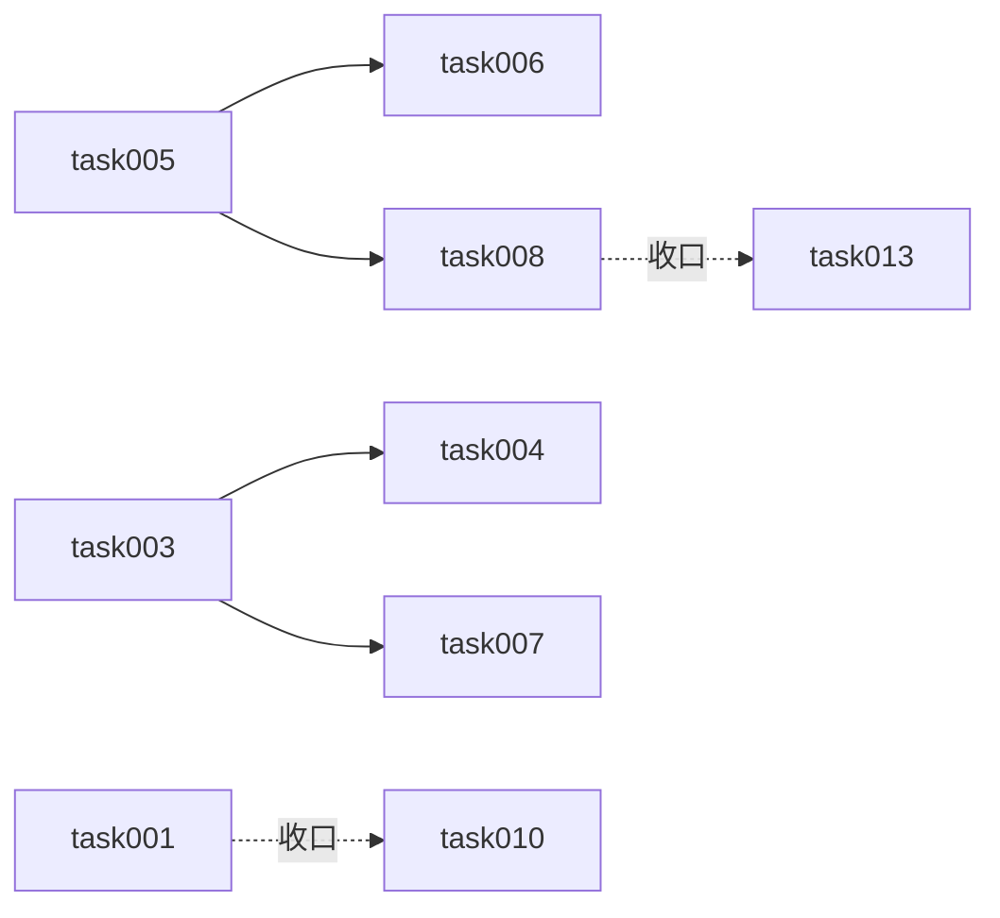

# task000 - 实施总览与依赖关系

> **文档类型**：任务索引 / 里程碑规划  
> **适用项目**：MeterSphere 功能用例（列表、详情、附件、全局顶栏）  
> **编写日期**：2026-07-21；**二期增补**：2026-07-22  
> **关联需求**：一期 9 项能力改造 + 二期详情体验 8 项（方案 v1.3.1）  
> **关联方案**：[MeterSphere-功能用例详情-体验优化方案-2026-07-22](../../summary/MeterSphere-功能用例详情-体验优化方案-2026-07-22.md)  
> **标注**：【AI生成】已按代码现状与产品决策拆解，实施前请技术负责人审核

---

## 1. 总体目标

### 1.1 一期（task001–009）

1. 用例详情附件支持粘贴上传（基础能力，收口见二期 task010）  
2. 顶栏项目切换下拉支持滚动  
3. 列表批量修改执行人、执行人列；基本信息展示执行人  
4. 详情上一条/下一条状态与热区修复  
5. 用例级结果后自动下一条（基础能力，收口见二期 task013）  
6. 详情评论内嵌至附件下方  

### 1.2 二期（task010–016，当前优先）

依据方案 v1.3.1，完成详情执行体验、导入拆分、树联动：

1. 附件粘贴热区外扩 ~200px（仅功能用例详情）  
2. 前置/备注行式布局与位置调整  
3. 四按钮下导航条 + TEXT 四按钮 + 顶底双入口  
4. 自动下一条开关（默认关）+ 附件门禁 + B1 本机偏好；计划内嵌同期  
5. 导入智能拆分 + 模板批注 + 覆盖重解析  
6. STEP/TEXT 数据双向同步  
7. 左侧用例树点击切换列表修复  

---

## 2. 阶段划分

### 2.1 二期 — 详情体验（建议优先）

| 阶段 | 任务文档 | 主题 | 预估 |
|------|----------|------|------|
| **P0** | [task016](task016-P0-用例树点击切换列表修复.md) | 树点击切列表 | 0.5–1d |
| **P0** | [task011](task011-P0-前置备注行式布局与位置.md) | 前置/备注布局 | 0.5d |
| **P0** | [task012](task012-P0-四按钮下导航条与TEXT结果按钮.md) | 导航条 + TEXT 四按钮 | 0.5–1d |
| **P0** | [task013](task013-P0-自动下一条开关与附件门禁.md) | 开关 + 附件门禁（B1） | 0.5–1d |
| **P0** | [task010](task010-P0-附件粘贴热区增强.md) | 粘贴热区 | 0.5–1d |
| **P1** | [task014](task014-P1-导入智能拆分与模板批注.md) | 导入拆分 + 批注 | 1–2d |
| **P1** | [task015](task015-P1-STEP与TEXT双向同步.md) | STEP↔TEXT 同步 | 1–1.5d |

**二期合计**：约 5–9 人日。  

**建议顺序**：`016 → 011 → 012 → 013`；`010` 可并行；`014 ∥ 015`（共用拆分规则）。

### 2.2 一期 — 原能力包（可并行另排期）

| 阶段 | 任务文档 | 主题 | 预估 | 备注 |
|------|----------|------|------|------|
| P0 | [task005](task005-P0-详情上下条导航状态修复.md) | 上下条状态 | 1d | 二期依赖其能力 |
| P0 | [task006](task006-P0-详情导航按钮热区修复.md) | 导航热区 | 0.5d | |
| P0 | [task003](task003-P0-执行人数据模型与API.md) | execute_user | 1.5–2d | 不在二期 8 项内 |
| P1 | [task004](task004-P1-列表执行人列与批量修改.md) | 列表执行人 | 1.5–2d | |
| P1 | [task007](task007-P1-基本信息执行人字段.md) | 基本信息执行人 | 0.5d | |
| P1 | [task008](task008-P1-执行结果后自动下一条.md) | 自动下一条基础 | 0.5–1d | **收口 → task013** |
| P2 | [task001](task001-P2-附件粘贴上传.md) | 粘贴基础 | 0.5–1d | **收口 → task010** |
| P2 | [task002](task002-P2-项目下拉滚动.md) | 项目下拉 | 0.5d | 不在二期 8 项内 |
| P2 | [task009](task009-P2-详情评论内嵌布局.md) | 评论内嵌 | 1–1.5d | 不在二期 8 项内 |

---

## 3. 依赖关系

### 3.1 二期

### 3.2 一期（保留）

---

## 4. 产品规则确认（二期已锁定）

详见方案 §7。摘要：

| 决策项 | 结论 |
|--------|------|
| 自动下一条默认 | **关**；B1 本机 `useStorage` |
| 触发 | 仅四按钮；单步不跳；计划内嵌同期 |
| 附件门禁 | 历史也算；仅 done/已关联；无附件不跳不 Toast；旁注「需有附件才跳」 |
| 粘贴 | 详情外包外扩 ~200px；只收 file；其它模块不动 |
| 布局 | 前置→备注→StepDescription→内容→四按钮→导航条→附件；顶底双入口 |
| 导入 | 无层级按序号；有层级按最高层；无序号按换行；覆盖重解析；批注；STEP/TEXT 双写 |
| 树 | 点树退出高级搜索；含子模块现网默认 |

一期执行人等规则见原 §4 表（未改）。

---

## 5. 里程碑验收

### M-二期-A 详情操作闭环

- [ ] 前置/备注行式；导航条在四按钮下；顶底双入口  
- [ ] 开关+附件门禁+B1；仅四按钮触发  

### M-二期-B 附件与导入

- [ ] 粘贴热区；导入四类拆分；STEP↔TEXT 同步；模板批注  

### M-二期-C 列表联动

- [ ] 树点击稳定切列表  

### M1–M3（一期）

见原执行人 / 导航 / 评论等验收（另排期）。

---

## 6. 主要改动范围（二期）

| 层级 | 路径 |
|------|------|
| 前端-详情 | `caseManagementFeature/components/tabContent/tabDetail.vue` 等 |
| 前端-列表树 | `caseTree.vue`、`caseTable.vue`、`index.vue` |
| 前端-计划内嵌 | 测试计划 featureCase detail（与自动下一条同期） |
| 后端-导入 | `FunctionalCaseImportEventListener`、模板批注、覆盖导入 |
| 存储 | 本机 localStorage only（B1）；二期无 DDL |

---

## 7. 任务索引

### 二期

| 编号 | 文档 | 优先级 |
|------|------|--------|
| task010 | [附件粘贴热区增强](task010-P0-附件粘贴热区增强.md) | P0 |
| task011 | [前置备注行式布局与位置](task011-P0-前置备注行式布局与位置.md) | P0 |
| task012 | [四按钮下导航条与 TEXT 结果按钮](task012-P0-四按钮下导航条与TEXT结果按钮.md) | P0 |
| task013 | [自动下一条开关与附件门禁](task013-P0-自动下一条开关与附件门禁.md) | P0 |
| task014 | [导入智能拆分与模板批注](task014-P1-导入智能拆分与模板批注.md) | P1 |
| task015 | [STEP 与 TEXT 双向同步](task015-P1-STEP与TEXT双向同步.md) | P1 |
| task016 | [用例树点击切换列表修复](task016-P0-用例树点击切换列表修复.md) | P0 |

### 一期

| 编号 | 文档 | 优先级 |
|------|------|--------|
| task001 | [附件粘贴上传](task001-P2-附件粘贴上传.md) | P2 → 收口 task010 |
| task002 | [项目下拉滚动](task002-P2-项目下拉滚动.md) | P2 |
| task003 | [执行人数据模型与 API](task003-P0-执行人数据模型与API.md) | P0 |
| task004 | [列表执行人列与批量修改](task004-P1-列表执行人列与批量修改.md) | P1 |
| task005 | [详情上下条导航状态修复](task005-P0-详情上下条导航状态修复.md) | P0 |
| task006 | [详情导航按钮热区修复](task006-P0-详情导航按钮热区修复.md) | P0 |
| task007 | [基本信息执行人字段](task007-P1-基本信息执行人字段.md) | P1 |
| task008 | [执行结果后自动下一条](task008-P1-执行结果后自动下一条.md) | P1 → 收口 task013 |
| task009 | [详情评论内嵌布局](task009-P2-详情评论内嵌布局.md) | P2 |
