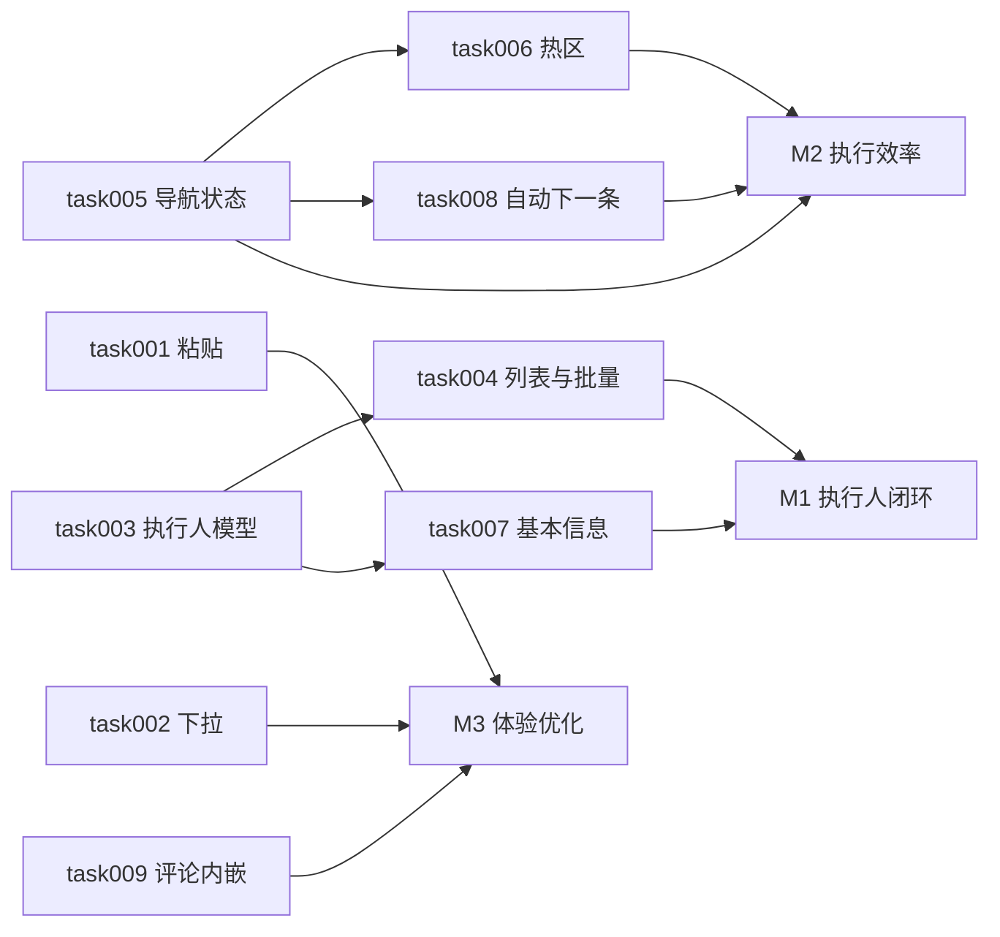

# task000 - 实施总览与依赖关系

> **文档类型**：任务索引 / 里程碑规划  
> **适用项目**：MeterSphere 功能用例（列表、详情、附件、全局顶栏）  
> **编写日期**：2026-07-21  
> **关联需求**：测试用例模块 9 项体验与能力改造  
> **标注**：【AI生成】已按代码现状拆解，实施前请技术负责人审核

---

## 1. 总体目标

在现有 Vue3 + Arco 前端与 Java 后端上完成：

1. 用例详情附件支持 **粘贴上传**（与点击、拖拽一致）  
2. 顶栏 **项目切换下拉** 支持滚动，适配多项目场景  
3. 用例列表支持 **批量修改执行人**、展示 **执行人列**  
4. 用例详情 **上一条/下一条** 导航状态与点击热区修复  
5. 基本信息展示 **执行人**（与列表同步，随执行结果更新）  
6. 更新用例 **总执行结果** 后自动进入下一条  
7. 用例详情 **评论内嵌** 至附件模块下方（取消底部悬浮）

---

## 2. 阶段划分

| 阶段 | 任务文档 | 主题 | 预估工期 |
|------|----------|------|----------|
| **P0** | [task005](task005-P0-详情上下条导航状态修复.md) | 上一条/下一条可用状态修复 | 1 人日 |
| **P0** | [task006](task006-P0-详情导航按钮热区修复.md) | 导航按钮点击热区收敛 | 0.5 人日 |
| **P0** | [task003](task003-P0-执行人数据模型与API.md) | `execute_user` 字段 + 读写 API | 1.5–2 人日 |
| **P1** | [task004](task004-P1-列表执行人列与批量修改.md) | 列表列 + 批量改执行人 | 1.5–2 人日 |
| **P1** | [task007](task007-P1-基本信息执行人字段.md) | 基本信息 Tab 展示执行人 | 0.5 人日 |
| **P1** | [task008](task008-P1-执行结果后自动下一条.md) | 用例级结果提交后自动下一条 | 0.5–1 人日 |
| **P2** | [task001](task001-P2-附件粘贴上传.md) | 附件粘贴上传 | 0.5–1 人日 |
| **P2** | [task002](task002-P2-项目下拉滚动.md) | 顶栏项目下拉滚动 | 0.5 人日 |
| **P2** | [task009](task009-P2-详情评论内嵌布局.md) | 评论内嵌至附件下方 | 1–1.5 人日 |

**合计**：约 7–10 人日。

**建议实施顺序**：`task005` → `task006` → `task003` → `task004` → `task007` → `task008` → `task001` → `task002` → `task009`。

---

## 3. 依赖关系

**关键路径**：task003 → task004 → task007（执行人数据闭环）。  
**可并行**：task005 ∥ task003；task001 ∥ task002。

---

## 4. 产品规则确认（实施前）

| 决策项 | 建议结论 | 说明 |
|--------|----------|------|
| 执行人字段语义 | **可批量指定 + 结果变更时自动覆盖** | 批量改执行人写库；用例级 `lastExecuteResult` 变更时 `execute_user = 当前用户` |
| 执行人展示 | 列表列与基本信息 **只读** | 不提供单条行内编辑（与批量改执行人区分） |
| 自动下一条触发范围 | **仅用例级结果按钮** | 通过/失败/阻塞/跳过；步骤级结果、内容自动保存不触发 |
| 最后一条行为 | **提示「已是最后一条」** | 不静默失败 |
| 评论内嵌范围 | **仅详情 Tab** | 「评论」Tab 保留完整评论管理 |
| 历史数据 | `execute_user` 为空展示 `-` | 可选：用 `update_user` 一次性回填（非本期必做） |

---

## 5. 里程碑验收

### M1 - 执行人闭环

- [ ] 列表有执行人列；可批量修改执行人  
- [ ] 基本信息展示执行人，与列表一致  
- [ ] 修改用例总执行结果后，执行人更新为当前操作用户  

### M2 - 详情执行效率

- [ ] 从首条/末条进入详情后，上下条按钮状态正确  
- [ ] 导航按钮仅按钮区域可点击  
- [ ] 用例级结果提交成功后自动进入下一条（非最后一条时）  

### M3 - 体验优化

- [ ] 附件支持粘贴上传  
- [ ] 项目下拉多项目时可滚动  
- [ ] 详情 Tab 评论在附件下方内嵌展示，无底部悬浮遮挡  

---

## 6. 主要改动范围

| 层级 | 路径 |
|------|------|
| 前端-组件 | `frontend/src/components/business/ms-add-attachment/`、`ms-prev-next-button/`、`ms-comment/`、`frontend/src/components/pure/navbar/` |
| 前端-用例 | `frontend/src/views/case-management/caseManagementFeature/components/` |
| 前端-API | `frontend/src/api/modules/case-management/featureCase.ts` |
| 后端 | `backend/services/case-management/.../functional/` |
| 数据库 | `functional_case` 表新增 `execute_user` |

---

## 7. 任务索引

| 编号 | 文档 | 优先级 |
|------|------|--------|
| task001 | [附件粘贴上传](task001-P2-附件粘贴上传.md) | P2 |
| task002 | [项目下拉滚动](task002-P2-项目下拉滚动.md) | P2 |
| task003 | [执行人数据模型与 API](task003-P0-执行人数据模型与API.md) | P0 |
| task004 | [列表执行人列与批量修改](task004-P1-列表执行人列与批量修改.md) | P1 |
| task005 | [详情上下条导航状态修复](task005-P0-详情上下条导航状态修复.md) | P0 |
| task006 | [详情导航按钮热区修复](task006-P0-详情导航按钮热区修复.md) | P0 |
| task007 | [基本信息执行人字段](task007-P1-基本信息执行人字段.md) | P1 |
| task008 | [执行结果后自动下一条](task008-P1-执行结果后自动下一条.md) | P1 |
| task009 | [详情评论内嵌布局](task009-P2-详情评论内嵌布局.md) | P2 |
