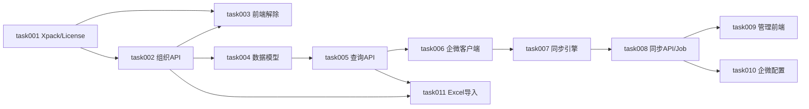

# task000 - 实施总览与依赖关系

> **文档类型**：任务索引 / 里程碑规划  
> **适用项目**：MeterSphere 自研（社区版解除限制 + 组织架构）  
> **编写日期**：2026-06-23  
> **关联摘要**：[community-unlock-and-org-structure.md](../../summary/community-unlock-and-org-structure.md)、[组织架构模块设计摘要.md](../../summary/组织架构模块设计摘要.md)

---

## 1. 总体目标

在 MeterSphere V3 社区版基础上，实现：

1. 解除组织数、用户数、资源池等 License 限制  
2. 将企业微信通讯录同步为 MeterSphere 组织内**只读**部门/成员镜像  
3. 提供组织架构管理页、同步运维、Excel 导入（MS 扩展）  

---

## 2. 阶段划分

| 阶段 | 任务文档 | 主题 | 预估工期 |
|------|----------|------|----------|
| **P0** | [task001](task001-P0-社区版Xpack与License实现.md) | 社区版 Xpack / License 实现 | 2 天 |
| **P0** | [task002](task002-P0-组织创建与切换API.md) | 组织创建 / 切换 API | 3 天 |
| **P0** | [task003](task003-P0-前端License解除与组织入口.md) | 前端 License 解除 | 2 天 |
| **P1** | [task004](task004-P1-数据模型与Flyway迁移.md) | 数据模型 Flyway 迁移 | 1 天 |
| **P1** | [task005](task005-P1-组织架构查询API.md) | 组织架构查询 API | 2 天 |
| **P2** | [task006](task006-P2-企微通讯录客户端.md) | 企微通讯录客户端 | 2 天 |
| **P2** | [task007](task007-P2-组织架构同步引擎.md) | 组织架构同步引擎 | 3 天 |
| **P2** | [task008](task008-P2-同步API与定时任务.md) | 同步 API 与定时任务 | 2 天 |
| **P3** | [task009](task009-P3-组织架构管理前端.md) | 组织架构管理前端 | 3 天 |
| **P3** | [task010](task010-P3-企微配置扩展.md) | 企微配置扩展 | 2 天 |
| **P3** | [task011](task011-P3-Excel组织架构导入.md) | Excel 组织架构导入 | 3 天 |

**合计**：约 5–6 周（1 人全职，含联调）

---

## 3. 依赖关系

**关键路径**：task001 → task002 → task004 → task006 → task007 → task008 → task009

---

## 4. 默认产品决策

| 决策项 | 推荐默认值 |
|--------|------------|
| 企微配置粒度 | **每组织一条**（`org_wecom_sync_config.organization_id`） |
| 企微与 MS 组织映射 | **一个企微主体 = 一个 MS 组织** |
| 同步新用户默认角色 | **`org_member`**（组织成员） |
| 部门数据来源 | 企微同步只读；Excel 导入为 MS 扩展能力 |
| 管理页可见范围 | 系统管理员看全部；组织管理员只看本组织 |

---

## 5. 里程碑验收

### M0 - P0 完成（约第 1 周）

- [x] 可创建第 2 个组织并完成初始化  
- [x] 可切换组织上下文  
- [x] 用户不受 5 人上限限制  
- [x] 资源池不受单池限制  
- [x] 前端「创建组织」「进入组织」可用（需 `VITE_MS_UNLIMITED=true`）  

### M1 - P1 完成（约第 2 周）

- [x] Flyway 迁移成功（`department` 表 + `user` 扩展字段）
- [x] 部门树 / 成员分页 / 成员详情 API 可用
- [ ] 可用测试数据验证树形结构与脱敏

### M2 - P2 完成（约第 3–4 周）

- [ ] 手动同步企微通讯录成功  
- [ ] 部门树与企微一致，用户自动创建并绑定 `org_member`  
- [x] 同步 API（manual/status/log/config）与定时任务已实现  
- [ ] 同步日志、最近状态、定时任务可用（待联调验证）  

### M3 - P3 完成（约第 5–6 周）

- [ ] 组织架构管理页联调通过  
- [ ] 企微配置页支持通讯录 Secret + Cron  
- [ ] Excel 导入部门与用户成功  

---

## 6. 参考代码仓库

| 项目 | 路径 | 用途 |
|------|------|------|
| MeterSphere | 本仓库 | 主开发目标 |
| myTapd | `C:\SoftWare\JetBrains\myTapd` | 同步引擎、企微客户端、管理页参考 |

---

## 7. 任务状态跟踪

| 任务 | 状态 | 负责人 | 完成日期 |
|------|------|--------|----------|
| task001 | 已完成 | | 2026-06-25 |
| task002 | 已完成 | 2026-07-03 | 2026-07-03 |
| task003 | 已完成 | | 2026-07-04 |
| task004 | 已完成 | | 2026-07-06 |
| task005 | 已完成 | | 2026-07-06 |
| task006 | 已完成 | | 2026-07-06 |
| task007 | 已完成 | | 2026-07-06 |
| task008 | 已完成 | | 2026-07-06 |
| task009 | 已完成 | | 2026-07-06 |
| task010 | 已完成 | | 2026-07-06 |
| task011 | 待开始 | | |

---

*随实现进度更新各 task 文档内的「任务状态」与各节验收勾选。*
