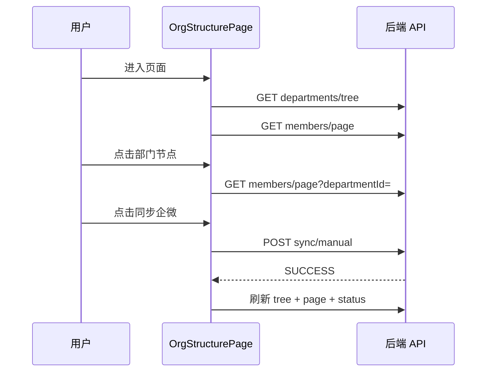

# task009 - P3 组织架构管理前端

> **阶段**：P3  
> **预估工期**：3 天  
> **前置依赖**：[task003](task003-P0-前端License解除与组织入口.md)、[task005](task005-P1-组织架构查询API.md)、[task008](task008-P2-同步API与定时任务.md)  
> **参考页面**：myTapd `miduo-frontend/src/views/manage/UserManageView.vue`

---

## 1. 任务目标

在 MeterSphere 前端新增**组织架构管理页**：左部门树 + 右成员列表 + 详情抽屉 + 同步运维面板，使用 Arco Design 与现有设置页风格一致。

---

## 2. 路由与菜单

### 2.1 路由配置

**文件**：`frontend/src/router/routes/modules/setting.ts`

| 路由 | 组件 | 说明 |
|------|------|------|
| `/setting/system/org-structure` | `views/setting/system/orgStructure/index.vue` | 系统管理员入口 |
| `/setting/organization/org-structure` | 同上或 wrapper | 组织管理员入口 |

### 2.2 菜单权限

| 入口 | 权限 ID |
|------|---------|
| 系统设置 → 组织架构 | `SYSTEM_ORGANIZATION_PROJECT:READ` |
| 组织设置 → 组织架构 | `ORGANIZATION_MEMBER:READ` |

### 2.3 国际化

**文件**：

- `frontend/src/views/setting/system/orgStructure/locale/zh-CN.ts`  
- `frontend/src/views/setting/system/orgStructure/locale/en-US.ts`  

---

## 3. 目录结构

```text
frontend/src/views/setting/system/orgStructure/
├── index.vue
├── components/
│   ├── DepartmentTree.vue       # 左侧部门树（基于 ms-tree）
│   ├── MemberTable.vue          # 右侧成员表格
│   ├── MemberDetailDrawer.vue   # 成员详情抽屉
│   └── SyncPanel.vue            # 同步状态/日志/手动触发
├── locale/
│   ├── zh-CN.ts
│   └── en-US.ts
└── config.ts                    # 表格列、筛选枚举

frontend/src/api/modules/setting/orgStructure.ts
frontend/src/models/setting/orgStructure.ts   # TS 类型
```

---

## 4. 页面布局

```
┌─────────────────────────────────────────────────────────┐
│ 组织架构管理          [组织选择▼]  [同步企微] [同步日志]   │
├──────────────┬──────────────────────────────────────────┤
│              │  关键字 [____]  状态 [▼]  同步状态 [▼]    │
│  部门树       │  ┌────────────────────────────────────┐ │
│  ├ 全公司     │  │ 姓名 │ 邮箱 │ 部门 │ 状态 │ 同步状态 │ │
│  ├ 研发部     │  │ ...  │ ...  │ ...  │ ...  │ ...     │ │
│  └ 市场部     │  └────────────────────────────────────┘ │
│              │  分页                                      │
└──────────────┴──────────────────────────────────────────┘
```

---

## 5. 组件职责

### 5.1 DepartmentTree.vue

| 功能 | 说明 |
|------|------|
| 数据源 | `GET /org-structure/departments/tree` |
| 展示 | 名称 + `(totalUserCount)` |
| 交互 | 点击节点 → emit `selectDepartment` |
| 状态 | deptStatus=0 节点灰显 |

### 5.2 MemberTable.vue

| 功能 | 说明 |
|------|------|
| 数据源 | `GET /org-structure/members/page` |
| 筛选 | keyword, enable, syncStatus, departmentId |
| 交互 | 行点击 → 打开详情抽屉 |
| 分页 | Arco Table pagination |

### 5.3 MemberDetailDrawer.vue

| 功能 | 说明 |
|------|------|
| 数据源 | `GET /org-structure/members/{id}` |
| 展示 | 脱敏后的 phone/email/wecomUserid |
| 只读 | 无编辑表单（一期设计） |

### 5.4 SyncPanel.vue

| 功能 | 说明 |
|------|------|
| 最近状态 | `GET /org-wecom/sync/status` |
| 手动同步 | `POST /org-wecom/sync/manual` + loading |
| 日志抽屉 | `GET /org-wecom/sync/log/page` |
| 完成后 | emit `syncComplete` → 刷新树和表 |

---

## 6. API 封装

**文件**：`frontend/src/api/modules/setting/orgStructure.ts`

```typescript
export function getDepartmentTree(organizationId: string) { ... }
export function getMemberPage(params: MemberPageParams) { ... }
export function getMemberDetail(id: string) { ... }
export function manualSync(organizationId: string) { ... }
export function getSyncStatus(organizationId: string) { ... }
export function getSyncLogPage(params: SyncLogPageParams) { ... }
```

**URL 常量**：`frontend/src/api/requrls/setting/orgStructure.ts`

---

## 7. 交互流程



---

## 8. 测试要求

| 场景 | 预期 |
|------|------|
| 系统管理员 | 可选组织，查看任意组织数据 |
| 组织管理员 | 仅当前组织 |
| 空数据 | 友好空状态 |
| 同步中 | 按钮 disabled + loading |
| 同步完成 | 树人数更新 |
| 详情抽屉 | 脱敏字段显示正确 |

---

## 9. 验收标准

- [x] 两个菜单入口均可访问  
- [x] 左树右表布局与 myTapd 功能对齐  
- [x] 筛选、分页、详情抽屉正常  
- [x] 手动同步后自动刷新  
- [x] 同步日志抽屉可查看历史  
- [x] 样式与 MeterSphere 设置页一致  

---

## 10. 任务状态

| 字段 | 值 |
|------|-----|
| 状态 | 已完成 |
| 开始日期 | 2026-07-06 |
| 完成日期 | 2026-07-06 |
