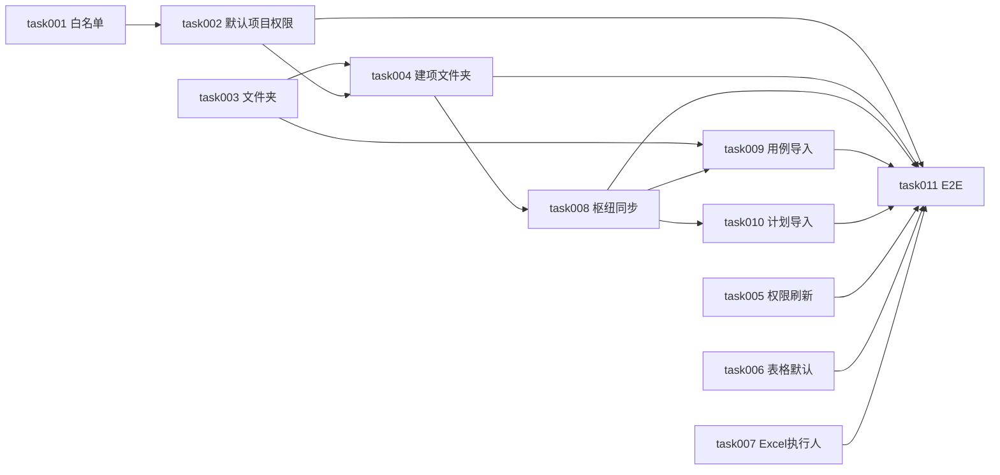

# task000 - 实施总览与依赖关系

> **文档类型**：任务索引 / 里程碑规划  
> **适用项目**：MeterSphere 默认项目与跨项目导入（枢纽模型）  
> **编写日期**：2026-07-24  
> **关联方案**：[MeterSphere-默认项目与跨项目导入-优化方案-2026-07-23.md](../../summary/MeterSphere-默认项目与跨项目导入-优化方案-2026-07-23.md)（**v0.4.1 已人工确认决策**）  
> **标注**：【AI生成】已按已审方案拆解；实施前须完成 task001 权限白名单签字

---

## 1. 总体目标

落地公司枢纽【米多公司默认项目】，完成：

**默认组织/项目保护与权限 → 文件夹 → 建项镜像文件夹 → 业务→枢纽同步 → 仅从枢纽导入用例/计划 → 体验项（权限刷新/表格/Excel 执行人）**

### 1.1 枢纽模型（勿偏离）

```text
业务项目 ──(创建/变更同步)──▶ 米多公司默认项目
业务项目 ◀──(仅从此导入)── 米多公司默认项目
导入副本业务侧修改 ──✕──▶ 不回写枢纽
```

### 1.2 一期范围（task001–011）

对应方案需求 #1–#11 及 S0–S10。

### 1.3 非目标（见方案 §1.3）

业务项目互导、枢纽回写业务、接口/场景跨项目、实时强一致等。

---

## 2. 阶段划分

| 阶段 | 任务文档 | 主题 | 预估 | 建议灰度 |
|------|----------|------|------|----------|
| **S0** | [task001](task001-P0-权限点白名单与种子设计.md) | 权限白名单签字 | 0.5d | 先于一切权限代码 |
| **S1** | [task002](task002-P0-默认组织项目与权限落库.md) | 默认组织/项目 + 组织源权限授予/回收 | 3–4d | 单独灰度 |
| **S2** | [task003](task003-P1-用例文件夹类型与左树.md) | 文件夹类型 + 级联删除 + 左树入口 | 2d | 可与 S4/S5 并行 |
| **S3** | [task004](task004-P1-建项同步文件夹与生命周期.md) | #4+#9、`ref_project_id`、删/禁用/改名 | 2.5–3d | 依赖 S1+S2 |
| **S4** | [task005](task005-P0-建项后权限刷新.md) | #6 建项进入刷权限 | 0.5d | **可先行** |
| **S5** | [task006](task006-P1-计划详情用例表默认列.md) | #7 表格默认 | 0.5–1d | **可先行** |
| **S6** | [task007](task007-P1-Excel导入执行人列.md) | #8 Excel 执行人 | 1–1.5d | 可先行 |
| **S7** | [task008](task008-P0-枢纽同步引擎.md) | #11 映射/事件/日批/手动同步 | 6–9d | **单独灰度** |
| **S8** | [task009](task009-P0-从默认项目导入用例.md) | #5+#10 异步导入 | 4–5d | 依赖 S2+S7 |
| **S9** | [task010](task010-P0-从默认项目导入测试计划.md) | #1 计划导入 | 3–4d | 依赖 S7 |
| **S10** | [task011](task011-P0-端到端验收与回归.md) | E2E / 负向 / 回归 | 3–4d | 收口 |

**合计**：约 **28–40 人日**。

**建议顺序**：`005∥006∥007` 可先上 → `001 → 002` → `003 → 004` → `008` → `009∥010` → `011`。

---

## 3. 依赖关系



---

## 4. 默认产品决策（摘录）

| 决策项 | 值 |
|--------|-----|
| 导入源 | **仅**【米多公司默认项目】 |
| 同步方向 | 业务 → 枢纽；导入副本 **不**回写 |
| 计划导入内容 | 仅「测试计划」Tab / `test_plan_document` |
| 用例导入内容 | 基本信息 + 前置/备注/步骤；未评审、未执行；无附件/关联 |
| 冲突 | SKIP / OVERWRITE |
| 批量 | ≤500；5min；异步进度；失败整单回滚 |
| 文件夹删除 | 级联（同删模块） |
| 组织权限 | 挂组织源；离开默认项目回收；组织管理员幂等 |
| 表格默认 | 不强制清本地缓存 |
| 执行人解析（建议） | 邮箱 → 用户名 → 姓名 |

---

## 5. 里程碑验收

### M0 - 体验快修（task005–007）

- [ ] 建项进入无需 F5  
- [ ] 新用户计划详情用例表默认对齐产品图  
- [ ] Excel 模板含执行人且可导入  

### M1 - 枢纽底座（task001–004）

- [ ] 默认组织/项目不可删、组织不可改  
- [ ] 进/出默认项目权限授予与回收正确（T2–T4、T6*）  
- [ ] 文件夹创建/级联删；建项双侧文件夹 + 生命周期  

### M2 - 同步 + 导入（task008–010）

- [ ] 业务新建/变更用例与计划 Tab 同步到枢纽（T12–T14）  
- [ ] 仅从枢纽导入用例/计划；T7/T7b/T1/T1b/T8/T15/T16  

### M3 - 收口（task011）

- [ ] 方案 §7 提测清单全勾  
- [ ] 灰度与回滚说明就绪  

---

## 6. 关键路径速查

| 类型 | 路径 |
|------|------|
| 方案 | `docs/summary/MeterSphere-默认项目与跨项目导入-优化方案-2026-07-23.md` |
| 默认组织校验 | `OrganizationService#checkOrgDefault` |
| 建项目 | `CommonProjectService#add` / `addProjectModal.vue` |
| 用例模块 | `FunctionalCaseModule` / `FunctionalCaseModuleService#deleteModule` |
| 用例树 FE | `caseManagementFeature/index.vue`、`caseTree.vue` |
| 计划文档 | `TestPlanDocumentService`、`detail/plan/index.vue` |
| 计划用例表 | `detail/featureCase/components/caseTable.vue` |
| Excel | `FunctionalCaseImportFiled`、`FunctionalCaseExcelData*` |

---

## 7. 任务状态总表

| 任务 | 状态 |
|------|------|
| task001 | **已完成（已审签）**：SYSTEM_* 为初始不授予，管理员可后续调整 |
| task002–004、008–011 | 待开始（task002 已解锁） |
| task005–007 | **代码已完成**，待联调勾选 |

---

## 修订记录

| 版本 | 日期 | 说明 |
|------|------|------|
| v1 | 2026-07-24 | 【AI生成】按方案 v0.4.1 拆解 task001–011 |
