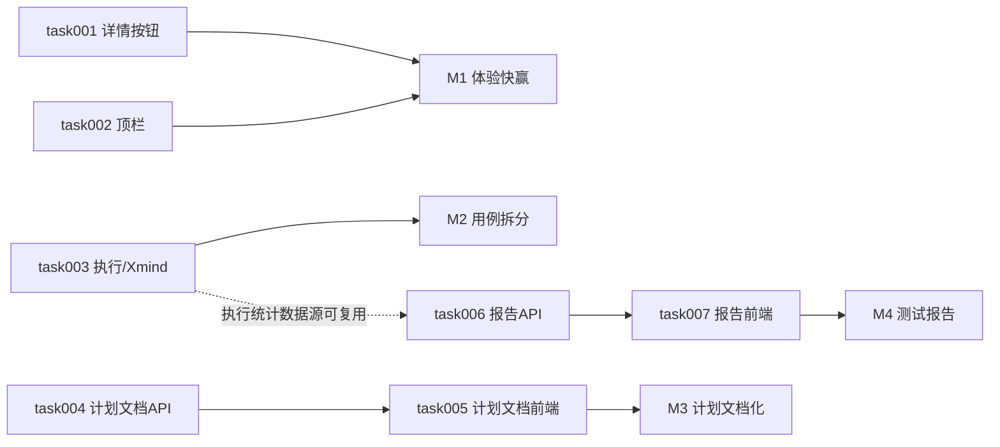

# task000 - 实施总览与依赖关系

> **文档类型**：任务索引 / 里程碑规划  
> **适用项目**：MeterSphere 体验优化（操作列详情、测试计划文档化、顶栏、用例报告 / Xmind 拆分）  
> **编写日期**：2026-07-17  
> **关联方案**：[MeterSphere-体验优化-产品方案-2026-07-17.md](../../summary/MeterSphere-体验优化-产品方案-2026-07-17.md)  
> **标注**：【AI生成】已按产品方案拆解；第 4 节默认决策待产品确认后可改

---

## 1. 总体目标

在现有 Vue3 + Arco 前端与 Java 后端上完成：

1. 业务列表操作列统一增加「详情」（编辑左侧）  
2. 测试计划详情「测试规划」改为可编辑 Markdown/富文本文档（移除脑图入口）  
3. 顶栏项目下拉可读 + 右侧展示当前组织  
4. 用例模块新增「测试报告」Tab（一键生成 + 双图 + 可编辑）  
5. 「用例」下拆「执行用例 / Xmind用例」；执行用例导入去掉 Xmind  

---

## 2. 阶段划分

| 阶段 | 任务文档 | 主题 | 预估工期 |
|------|----------|------|----------|
| **P0** | [task001](task001-P0-操作列详情按钮.md) | 操作列「详情」全业务模块 | 2–3 人日 |
| **P1** | [task002](task002-P1-顶栏项目组织展示.md) | 项目下拉加宽 + 组织名 | 0.5–1 人日 |
| **P0** | [task003](task003-P0-执行用例与Xmind拆分.md) | 二级 Tab + 导入去 Xmind + 文件库 | 3–5 人日 |
| **P0** | [task004](task004-P0-测试计划文档数据模型与API.md) | 计划文档表 + GET/POST API | 1–2 人日 |
| **P0** | [task005](task005-P0-测试计划文档前端替换脑图.md) | Tab 改名 + MsRichText + 模板 | 2–3 人日 |
| **P0** | [task006](task006-P0-测试报告数据模型与聚合API.md) | 报告存储 + 统计/缺陷聚合 | 3–5 人日 |
| **P0** | [task007](task007-P0-测试报告Tab与一键生成前端.md) | 顶栏 Tab + 列表/编辑 + 双图 | 4–6 人日 |

**合计**：约 16–25 人日（与方案 §7 里程碑一致；含联调）。

**建议实施顺序**：`task001` → `task002`（快赢）→ `task003` → `task004` → `task005` → `task006` → `task007`。

---

## 3. 依赖关系

**关键路径（重功能）**：task004 → task005；task006 → task007。  
**可并行**：task001 ∥ task002；task003 ∥ task004（无强依赖）。

---

## 4. 默认产品决策（方案 §5 待决项落默认）

| 决策项 | 本期默认 | 说明 |
|--------|----------|------|
| 「所有模块」边界 | **仅业务资源列表** | 不含系统设置/组织/项目管理纯配置表 |
| 计划文档编辑器 | **MsRichText（所见即所得）** | 不做纯 Markdown 双态；导出 md/Word 二期 |
| 旧 minder 数据 | **不迁移，首次进入空白模板** | UI 不可达 minder；API 暂保留 |
| 报告数据范围 | **当前项目 + 可选测试计划** | 一键生成弹窗必选项目内计划（可「全部计划」） |
| 报告内统计数字 | **只读快照 +「刷新统计」** | 文字章节可编辑 |
| 缺陷「类型」 | **缺陷模板自定义字段优先；无则 `platform`/`type` 回退** | 实施前对照现网字段；处理人取 `handleUser` |
| Xmind 预览 | **MVP：列表内打开下载 / 新窗口提示** | 在线脑图预览二期 |
| 顶栏布局 | **右区加宽（方案 A）** | 不改 TopMenu 居中栅格 |
| 报告权限 | **先复用功能用例模块 READ/UPDATE 权限** | 独立权限点二期 |

> 产品推翻默认值时，先改本表再改对应 task，避免实现分叉。

---

## 5. 里程碑验收

### M1 - 体验快赢

- [ ] 清单内业务列表操作列「详情」在「编辑」左侧，行为对齐点 ID  
- [ ] 顶栏约 30 字项目名可见；右侧可见当前组织名  

### M2 - 用例拆分

- [ ] 「用例」下「执行用例 / Xmind用例」二级 Tab  
- [ ] 执行用例导入无 Xmind；Xmind 可上传/列表/下载/删除  

### M3 - 计划文档化

- [ ] Tab 文案「测试计划」；无脑图编辑入口  
- [ ] 模板章节可见；保存后刷新保留；重置需确认  

### M4 - 测试报告

- [ ] 「评审」右侧「测试报告」Tab  
- [ ] 一键生成无「测试依据」「六、附件」；图1/图2 与遗留风险正确  
- [ ] 报告可编辑保存并再次打开  

---

## 6. 风险与注意

- 新报告 / 计划文档 / Xmind 文件读写涉及**项目隔离与鉴权**，合并前人工审权限矩阵。  
- 报告通过率公式与计划报告可能不一致，UI 需旁注。  
- 移除测试规划脑图需发版说明：关联用例改走计划内「功能用例」等 Tab。  
- 操作列加「详情」后多按钮模块需微调 `width`。  

---

## 7. 任务状态跟踪

| 任务 | 状态 | 负责人 | 完成日期 |
|------|------|--------|----------|
| task001 | 已完成（核心业务列表） | | 2026-07-17 |
| task002 | 已完成 | | 2026-07-17 |
| task003 | 已完成（前端 MVP；Xmind 上传待接 API） | | 2026-07-17 |
| task004 | 已完成 | | 2026-07-17 |
| task005 | 已完成 | | 2026-07-17 |
| task006 | 已完成（MVP；缺陷双图占位） | | 2026-07-17 |
| task007 | 已完成（MVP；图表用表格） | | 2026-07-17 |

---

*随实现进度更新各 task「任务状态」与验收勾选。*
