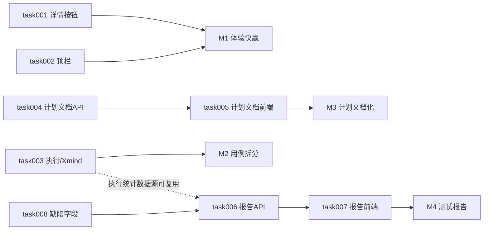

# task000 - 实施总览与依赖关系

> **文档类型**：任务索引 / 里程碑规划  
> **适用项目**：MeterSphere 体验优化（操作列详情、测试计划文档化、顶栏、用例报告 / Xmind 拆分）  
> **编写日期**：2026-07-17  
> **关联方案**：[MeterSphere-体验优化-产品方案-2026-07-17.md](../../summary/MeterSphere-体验优化-产品方案-2026-07-17.md)  
> **标注**：【AI生成】已按产品方案拆解；第 4 节决策已于 2026-07-17 产品确认

---

## 1. 总体目标

在现有 Vue3 + Arco 前端与 Java 后端上完成：

1. 业务及设置类列表操作列统一增加「详情」（编辑左侧）  
2. 测试计划详情「测试规划」改为可编辑**富文本**文档（移除脑图并清理旧数据；可导出）  
3. 顶栏项目下拉可读 + 右侧展示当前组织  
4. 用例模块新增「测试报告」Tab（绑定计划、一键生成、双图、数字可改）  
5. 「用例」下拆「执行用例 / Xmind用例」；执行用例导入去掉 Xmind；Xmind 在线浏览+下载  
6. 缺陷新增「缺陷类型」；状态/严重程度管理员可配置；报告处理人取 `handleUser` 

---

## 2. 阶段划分

| 阶段 | 任务文档 | 主题 | 预估工期 |
|------|----------|------|----------|
| **P0** | [task001](task001-P0-操作列详情按钮.md) | 操作列「详情」全业务模块 | 2–3 人日 |
| **P1** | [task002](task002-P1-顶栏项目组织展示.md) | 项目下拉加宽 + 组织名 | 0.5–1 人日 |
| **P0** | [task003](task003-P0-执行用例与Xmind拆分.md) | 二级 Tab + 导入去 Xmind + 文件库 | 3–5 人日 |
| **P0** | [task004](task004-P0-测试计划文档数据模型与API.md) | 计划文档表 + GET/POST API | 1–2 人日 |
| **P0** | [task005](task005-P0-测试计划文档前端替换脑图.md) | Tab 改名 + MsRichText + 模板 | 2–3 人日 |
| **P0** | [task006](task006-P0-测试报告数据模型与聚合API.md) | 报告存储 + 统计/缺陷聚合（绑定计划） | 3–5 人日 |
| **P0** | [task007](task007-P0-测试报告Tab与一键生成前端.md) | 顶栏 Tab + 列表/编辑 + 双图 | 4–6 人日 |
| **P0** | [task008](task008-P0-缺陷类型与枚举可配置.md) | 缺陷类型字段 + 状态/严重程度管理员配置 | 3–5 人日 |

**合计**：约 20–30 人日（含缺陷字段增强与 Xmind 在线浏览）。

**建议实施顺序**：`task001` → `task002`（快赢）→ `task003` → `task004` → `task005` → `task008`（可与 task006 并行）→ `task006` → `task007`。  
> task008 宜在 task007 图2 联调前完成「缺陷类型」字段落地。

---

## 3. 依赖关系

**关键路径（重功能）**：task004 → task005；task008 → task006 → task007。  
**可并行**：task001 ∥ task002；task003 ∥ task004；task008 ∥ task004/005。

---

## 4. 产品确认决策（2026-07-17）

| 决策项 | 结论 | 说明 |
|--------|------|------|
| 「所有模块」边界 | **含系统设置/组织/项目管理** | 凡有「编辑+详情入口」的操作列均加「详情」 |
| 计划文档编辑器 | **MsRichText 富文本 + 可导出** | 不做纯 Markdown 双态 |
| 旧 minder 数据 | **直接删除处理** | 无有效业务数据；不做迁移提示；清理表/废弃接口 |
| 报告数据范围 | **绑定测试计划（必选）** | 生成前必选一个计划 |
| 报告内统计数字 | **可改** | 文字与数字均可编辑；另提供「刷新统计」 |
| 缺陷「类型」/处理人 | **新增缺陷类型字段**；处理人取 **`handleUser`** | 状态、严重程度亦由管理员自由增删改 |
| Xmind 预览 | **在线浏览 + 下载** | 本期必做只读渲染 |
| 顶栏布局 | **右区加宽** | 不移到 Logo 旁 |
| 报告权限 | **先复用功能用例模块 READ/UPDATE 权限** | 独立权限点二期 |

---

## 5. 里程碑验收

### M1 - 体验快赢

- [ ] 清单内（含设置类）列表操作列「详情」在「编辑」左侧，行为对齐点 ID  
- [ ] 顶栏约 30 字项目名可见；右侧可见当前组织名  

### M2 - 用例拆分

- [ ] 「用例」下「执行用例 / Xmind用例」二级 Tab  
- [ ] 执行用例导入无 Xmind；Xmind 可上传/列表/在线浏览/下载/删除  

### M3 - 计划文档化

- [ ] Tab 文案「测试计划」；无脑图入口；旧 minder 数据已清理  
- [ ] 富文本模板可编辑保存；可导出；重置需确认  

### M4 - 测试报告 + 缺陷字段

- [ ] 「评审」右侧「测试报告」Tab；生成绑定计划  
- [ ] 无「测试依据」「六、附件」；图1=`handleUser`×状态；图2=缺陷类型；遗留风险正确  
- [ ] 报告文字与数字可编辑；刷新统计可用  
- [ ] 缺陷类型字段可用；状态/严重程度管理员可配置 

---

## 6. 风险与注意

- 新报告 / 计划文档 / Xmind 文件读写涉及**项目隔离与鉴权**，合并前人工审权限矩阵。  
- 报告通过率公式与计划报告可能不一致，UI 需旁注。  
- 移除测试规划脑图并**删除旧数据**需发版说明：关联用例改走计划内「功能用例」等 Tab。  
- 操作列加「详情」后多按钮模块（含设置类）需微调 `width`。  
- **缺陷状态/严重程度自由配置**影响工作流与历史数据，删除须禁用保护；task008 合并前人工审。  

---

## 7. 任务状态跟踪

| 任务 | 状态 | 负责人 | 完成日期 |
|------|------|--------|----------|
| task001 | 已补齐设置/项目关键表（资源池/鉴权/公共脚本/模板/字段）；其余无详情入口表按规则排除 | | 2026-07-17 |
| task002 | 已完成 | | 2026-07-17 |
| task003 | 已完成文件库 API/上传下载删除重命名/在线浏览 | | 2026-07-17 |
| task004 | 已补导出 HTML API；规划脑图接口已 @Deprecated（未删集合业务数据） | | 2026-07-17 |
| task005 | 已补导出入口 | | 2026-07-17 |
| task006 | 已收紧 planId 必选；execStats 可改；缺陷双图已按 handleUser×状态 / bug_type 聚合 | | 2026-07-17 |
| task007 | 已对齐 planId 必选 + 数字可编辑；图表仍为表格展示 | | 2026-07-17 |
| task008 | 已落地 bug_type 字段/迁移；严重程度+类型可维护选项；状态删除引用保护；报告联动 | | 2026-07-17 |

---

*随实现进度更新各 task「任务状态」与验收勾选。*
