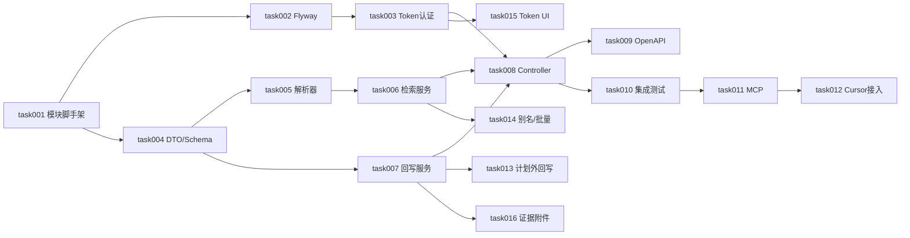

# task000 - 实施总览与依赖关系

> **文档类型**：任务索引 / 里程碑规划  
> **适用项目**：MeterSphere 外部 AI Agent 集成功能测试  
> **编写日期**：2026-07-07  
> **关联方案**：[MeterSphere-Agent集成-改造方案-2026-07-07.md](../../summary/MeterSphere-Agent集成-改造方案-2026-07-07.md) v2.0  
> **开发分支**：`v3.x-task-metersphere-agent`

---

## 1. 总体目标

在 MeterSphere V3 基础上，新增 Agent 专用 API 层，实现：

1. 外部 AI Agent（Cursor、Codex、GPT 等）通过 REST 检索功能用例（含完整 steps）  
2. Agent 在外部执行后，回写测试计划内执行结果与历史  
3. Bearer Token 简化认证 + OpenAPI 分组，供模型平台自动发现 Tool  
4. （P1）MCP Server 薄封装，供 Cursor native 调用  

---

## 2. 阶段划分

| 阶段 | 任务文档 | 主题 | 预估工期 |
|------|----------|------|----------|
| **P0** | [task001](task001-P0-agent-integration模块脚手架.md) | agent-integration 模块脚手架 | 0.5 天 |
| **P0** | [task002](task002-P0-数据模型与Flyway迁移.md) | 数据模型 Flyway 迁移 | 0.5 天 |
| **P0** | [task003](task003-P0-AgentToken认证与Shiro集成.md) | Agent Token 认证与 Shiro | 1 天 |
| **P0** | [task004](task004-P0-DTO与Schema适配层.md) | DTO 与 Schema 适配层 | 1 天 |
| **P0** | [task005](task005-P0-检索条件解析器.md) | 检索条件解析器 | 1 天 |
| **P0** | [task006](task006-P0-用例检索与导出服务.md) | 用例检索与导出服务 | 1.5 天 |
| **P0** | [task007](task007-P0-计划内结果回写服务.md) | 计划内结果回写服务 | 1 天 |
| **P0** | [task008](task008-P0-REST-Controller四层接口.md) | REST Controller 四层接口 | 0.5 天 |
| **P0** | [task009](task009-P0-OpenAPI-Agent分组.md) | OpenAPI Agent 分组 | 0.5 天 |
| **P0** | [task010](task010-P0-集成测试与MVP验收.md) | 集成测试与 MVP 验收 | 1 天 |
| **P1** | [task011](task011-P1-metersphere-mcp服务.md) | metersphere-mcp 服务 | 2 天 |
| **P1** | [task012](task012-P1-Cursor接入与工作流规则.md) | Cursor 接入与工作流规则 | 1 天 |
| **P2** | [task013](task013-P2-计划外回写与审计日志API.md) | 计划外回写与审计日志 API | 1.5 天 |
| **P2** | [task014](task014-P2-模块别名与批量回写.md) | 模块别名与批量回写 | 1.5 天 |
| **P2** | [task015](task015-P2-Token管理UI.md) | Token 管理 UI | 2 天 |
| **P2** | [task016](task016-P2-执行证据附件.md) | 执行证据附件 | 2 天 |

**合计**：MVP（P0）约 1–2 周；含 MCP（P1）约 2–3 周；全量（P2）约 4–5 周（1 人全职）

---

## 3. 依赖关系

**关键路径**：task001 → task002 → task003 → task004 → task005 → task006 → task007 → task008 → task010

---

## 4. 默认产品决策

| 决策项 | 推荐默认值 |
|--------|------------|
| API 前缀 | `/api/agent/v1` |
| 认证方式 | `Authorization: Bearer msat_<token>` |
| 项目上下文 | Header `X-MS-PROJECT`（Token 可绑定默认项目） |
| NL 解析模式 | **Agent 拆意图 + 服务端解析检索条件**（混合模式） |
| MVP 回写范围 | **仅计划内完整闭环**（预置 Agent 专用测试计划） |
| 计划外回写 | P2 有限支持（`agent_exec_log` 审计） |
| MCP 定位 | 薄 HTTP 封装，不含业务逻辑 |
| OpenAPI | 开发环境开启；生产可关 Swagger UI，保留 spec |

---

## 5. 里程碑验收

### M0 - P0 MVP 完成（约第 1–2 周）

> **代码进度**：task001–009 已完成；task010 进行中（运行时验收待完成）。

- [x] `agent-integration` 模块编译通过（`mvn compile -pl backend/app -am`）  
- [ ] 应用启动 + Flyway 迁移成功（`agent_token`、`agent_exec_log`）— 迁移脚本 `V3.7.1_1` 已就绪  
- [x] Bearer Token 鉴权代码已交付（Filter/Shiro，CSRF 跳过）  
- [x] search/get/modules/submit/health API 与 Service 已交付  
- [ ] `POST .../submit` 后测试计划执行历史可见（运行时验收，task010）  
- [x] Text 模式用例返回虚拟步骤 + warning（`AgentCaseSchemaMapper`）  
- [x] OpenAPI `agent` 分组配置已交付（`/v3/api-docs/agent` 运行时待验）  
- [x] 现有 `/functional/case/*` UI API 行为不变  

### M1 - P1 Cursor 接入（约第 2–3 周）

- [x] `metersphere-mcp` 本地包可用，4 个 Tool 已实现  
- [x] Cursor MCP 配置文档完成（`cursor-onboarding.md`、`.cursor/mcp.json.example`）  
- [x] `.cursor/rules/metersphere-agent.mdc` 默认工作流已添加  
- [ ] 端到端场景实测（需本地 MeterSphere + Token，归属 task010）

### M2 - P2 增强（约第 4–5 周）

- [x] 计划外回写 + `agent_exec_log` 查询 API（task013）  
- [x] 模块别名配置提升 NL 命中率（task014，`agent_module_alias`）  
- [x] 批量 submit 减少往返（task014）  
- [x] Token 管理 UI（系统设置 → Agent 集成，task015）  
- [x] 失败截图/附件 evidence 关联执行记录（task016）  

---

## 6. 数据规范（并行推进，不阻塞开发）

| 规范 | 做法 |
|------|------|
| Agent 专用测试计划 | 固定 `planId`，用例预先关联 |
| 模块树按业务域划分 | 财务/、订单/、用户中心/ |
| 标签统一 | `["P0","smoke"]` |
| 优先级 | 使用自定义字段 `functional_priority` |

---

## 7. 参考代码速查

| 用途 | 路径 |
|------|------|
| 用例 Service | `backend/services/case-management/.../FunctionalCaseService.java` |
| 模块树 Service | `backend/services/case-management/.../FunctionalCaseModuleService.java` |
| 计划回写 Service | `backend/services/test-plan/.../TestPlanFunctionalCaseService.java` |
| 回写请求 DTO | `backend/services/test-plan/.../TestPlanCaseRunRequest.java` |
| Shiro 配置 | `backend/services/system-setting/.../ShiroConfig.java` |
| Filter 链 | `backend/framework/sdk/.../FilterChainUtils.java` |

---

## 8. 任务状态跟踪

| 任务 | 状态 | 负责人 | 完成日期 |
|------|------|--------|----------|
| task001 | 已完成 | | 2026-07-07 |
| task002 | 已完成 | | 2026-07-07 |
| task003 | 已完成 | | 2026-07-07 |
| task004 | 已完成 | | 2026-07-07 |
| task005 | 已完成 | | 2026-07-07 |
| task006 | 已完成 | | 2026-07-07 |
| task007 | 已完成 | | 2026-07-07 |
| task008 | 已完成 | | 2026-07-07 |
| task009 | 已完成 | | 2026-07-07 |
| task010 | 进行中 | | |
| task011 | 已完成 | | 2026-07-07 |
| task012 | 已完成 | | 2026-07-07 |
| task013 | 已完成 | | 2026-07-08 |
| task014 | 已完成 | | 2026-07-08 |
| task015 | 已完成 | | 2026-07-08 |
| task016 | 已完成 | | 2026-07-08 |

---

*随实现进度更新各 task 文档内的「任务状态」与各节验收勾选。*
