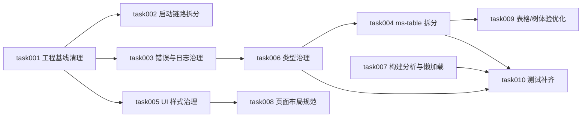

# task000 - 实施总览与依赖关系

> **文档类型**：任务索引 / 里程碑规划  
> **适用项目**：MeterSphere 前端、UI 与工程治理优化  
> **编写日期**：2026-07-09  
> **开发分支建议**：`codex/metersphere-optimize`

---

## 1. 总体目标

围绕 MeterSphere 前端工程治理、UI 一致性、可维护性和用户体验做一轮系统优化，不改变现有业务主流程，不引入大规模架构重写，优先解决高频维护痛点。

本轮优化重点：

1. 清理前端工程基线问题，修复注释乱码、代理配置、日志输出等低风险问题。
2. 拆分首屏初始化链路，减少启动阶段阻塞。
3. 沉淀统一错误处理、日志治理、UI token、页面布局规范。
4. 拆分 `ms-table` 等高复杂度基础组件，降低维护风险。
5. 对重库和重功能模块做构建分析与懒加载治理。
6. 补齐关键基础组件测试，支撑后续持续重构。

---

## 2. 阶段划分

| 阶段 | 任务文档 | 主题 | 优先级 | 预计工期 |
|------|----------|------|--------|----------|
| M0 | [task001](task001-P0-前端工程基线清理.md) | 前端工程基线清理 | P0 | 1 天 |
| M0 | [task002](task002-P0-启动初始化链路拆分.md) | 启动初始化链路拆分 | P0 | 1.5 天 |
| M0 | [task003](task003-P0-通用错误处理与日志治理.md) | 通用错误处理与日志治理 | P0 | 1 天 |
| M1 | [task004](task004-P1-ms-table拆分与可维护性优化.md) | `ms-table` 拆分与可维护性优化 | P1 | 3 天 |
| M1 | [task005](task005-P1-UI样式覆盖治理与设计token收敛.md) | UI 样式覆盖治理与设计 token 收敛 | P1 | 2 天 |
| M1 | [task006](task006-P1-接口与表格类型治理.md) | 接口与表格类型治理 | P1 | 2 天 |
| M1 | [task007](task007-P1-构建产物分析与重库懒加载.md) | 构建产物分析与重库懒加载 | P1 | 2 天 |
| M2 | [task008](task008-P2-管理台页面布局规范化.md) | 管理台页面布局规范化 | P2 | 2 天 |
| M2 | [task009](task009-P2-大数据表格与树组件体验优化.md) | 大数据表格与树组件体验优化 | P2 | 3 天 |
| M2 | [task010](task010-P2-前端关键组件测试补齐.md) | 前端关键组件测试补齐 | P2 | 2 天 |

**合计**：约 19.5 人天。

---

## 3. 依赖关系

---

## 4. 默认实施原则

| 决策项 | 默认策略 |
|--------|----------|
| 业务行为 | 不改变现有业务流程和权限行为 |
| UI 框架 | 继续基于 Vue 3、Vite、Arco Design 与现有 `ms-*` 组件体系 |
| 重构方式 | 优先局部拆分、兼容原 props/emit/slot API |
| 性能优化范围 | 保留构建分析、manualChunks 优化、重库懒加载 |
| 排除项 | 不调整生产 legacy 插件配置 |
| 测试策略 | 先补高风险基础组件与请求/权限链路测试 |
| 文档策略 | 每个 task 独立验收，task000 维护总进度 |

---

## 5. 里程碑验收

### M0 - 工程基线稳定

- [ ] 注释乱码修复完成。
- [ ] dev proxy rewrite 规则完成校验。
- [ ] 首屏初始化链路完成分层。
- [ ] 错误处理与日志输出策略落地。
- [ ] 输出前端治理基线数据。

### M1 - 核心治理完成

- [ ] `ms-table` 完成职责拆分，原有页面兼容。
- [ ] UI 样式覆盖治理形成设计 token 与组件规范。
- [ ] 接口、表格、动态字段核心类型补齐。
- [ ] 构建产物分析完成，重库按需加载策略落地。

### M2 - 体验与测试增强

- [ ] 试点页面完成管理台布局规范化。
- [ ] 大数据表格/树组件体验完成优化。
- [ ] 前端关键组件测试补齐。
- [ ] 后续新增页面具备可复用模板和测试参考。

---

## 6. 任务状态跟踪

| 任务 | 状态 | 负责人 | 完成日期 |
|------|------|--------|----------|
| task001 | 未开始 | | |
| task002 | 未开始 | | |
| task003 | 未开始 | | |
| task004 | 未开始 | | |
| task005 | 未开始 | | |
| task006 | 未开始 | | |
| task007 | 未开始 | | |
| task008 | 未开始 | | |
| task009 | 未开始 | | |
| task010 | 未开始 | | |

---

*随实施进度更新各 task 文档中的任务状态与验收勾选。*
