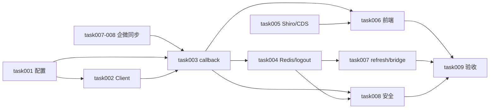

# task000 - 实施总览与依赖关系

> **文档类型**：任务索引 / 里程碑规划  
> **适用项目**：MeterSphere V3 自研 — 米多星球第三方 SSO  
> **编写日期**：2026-07-16  
> **关联方案**：[MeterSphere-第三方SSO单点登录接入方案-2026-07-16.md](../../summary/MeterSphere-第三方SSO单点登录接入方案-2026-07-16.md) v1.1  
> **前置能力**：[community_rebuild task007–008](../community_rebuild/task007-P2-组织架构同步引擎.md)（企微同步，用户 `wecom_userid` 就绪）

---

## 1. 总体目标

在 MeterSphere V3 社区版基础上，作为**米多星球第三方应用**接入双 Token SSO：

1. 浏览器只中转 exchange token，后端 HMAC 调用米多 validate / refresh / revoke  
2. 校验成功后发放 MeterSphere Shiro Session（`sessionToken` 仅存后端 Redis）  
3. 按 `wework_userid` ↔ `user.wecom_userid` 匹配已同步用户，**SSO 不自动建号**  
4. 登出 revoke、refresh 失败走登录桥回退  

---

## 2. 阶段划分

| 阶段 | 任务文档 | 主题 | 预估工期 |
|------|----------|------|----------|
| **P0** | [task001](task001-P0-接入确认单与配置项.md) | 接入确认单与配置项 | 0.5 天 |
| **P0** | [task002](task002-P0-米多开放API签名客户端.md) | 米多开放 API 签名客户端 | 1 天 |
| **P0** | [task003](task003-P0-state-callback与用户匹配.md) | state / callback / 用户匹配 / Shiro 会话 | 2 天 |
| **P0** | [task004](task004-P0-sessionToken存储与logout.md) | sessionToken Redis 与 logout revoke | 1 天 |
| **P0** | [task005](task005-P0-Shiro扩展与CDS路由.md) | Shiro 匿名链与 CDS `/auth/` 路由 | 0.5 天 |
| **P0** | [task006](task006-P0-前端Callback页与白名单.md) | 前端 Callback 页与路由白名单 | 1 天 |
| **P1** | [task007](task007-P1-refresh策略与登录桥.md) | refresh 策略与登录桥回退 | 1.5 天 |
| **P1** | [task008](task008-P1-安全加固与status门禁.md) | 安全加固与 status 门禁 | 1 天 |
| **P2** | [task009](task009-P2-端到端验收与登录入口.md) | 端到端验收与登录入口 | 1 天 |

**合计**：MVP（P0）约 1–1.5 周；含 P1 约 2 周；全量约 2.5 周（1 人全职，含米多联调）

---

## 3. 依赖关系

**关键路径**：task001 → task002 → task003 → task004 → task006 → task009

**外部依赖**：米多侧交付 appCode / appSecret / redirectUri 白名单 / tokenDeliveryMode

---

## 4. 默认产品决策

| 决策项 | 推荐默认值 |
|--------|------------|
| 身份匹配字段 | `wework_userid` → `user.wecom_userid`（全局查询，单 Corp 场景） |
| SSO 建号策略 | **不自动建号**；建号仅由 `UserSyncHandler` 企微同步完成 |
| sessionToken 存储 | Redis（P0）；DB 审计表（P2 可选） |
| state 存储 | Redis TTL 10 分钟，一次性消费 |
| 登录来源标记 | `UserSource.MIDUO` + Session `authenticate` 属性 |
| 凭证隔离 | `miduo.sso.*` 与 `org_wecom_sync_config` / `auth_source` 分离 |
| 主入口 | 米多工作台快捷入口（被动 callback）；站内按钮 P2 |
| CDS 回调路径 | 公网 `/front/auth/miduo/**` 代理到 Java `/auth/miduo/**` |

---

## 5. 里程碑验收

### M0 - P0 完成（约第 1 周）

- [ ] 米多确认单四项（环境、凭据、白名单、tokenDeliveryMode）已填写  
- [ ] `POST /auth/miduo/callback` 可完成登录（已同步用户）  
- [ ] `sessionToken` 仅存 Redis，前端无 sessionToken  
- [ ] 未同步用户拒绝登录并提示同步  
- [ ] 灰度环境 callback 路由可达后端  

### M1 - P1 完成（约第 2 周）

- [ ] logout 触发 revoke  
- [ ] refresh 失败可走 bridge  
- [ ] `/auth/miduo/status` 含企微同步就绪门禁  
- [ ] 日志无明文 secret / token  

### M2 - P2 完成

- [ ] 米多工作台 → MeterSphere 全链路验收通过  
- [ ] 登录页可选「通过米多登录」入口（若产品需要）  
- [ ] 与 Agent API 鉴权互不影响  

---

## 6. 参考代码仓库

| 项目 | 路径 | 用途 |
|------|------|------|
| MeterSphere | 本仓库 | 主开发目标 |
| myTapd | 米多 SSO 设计参考 | 协议与签名规范 |
| community_rebuild | `docs/task/community_rebuild` | 企微同步前置能力 |

---

## 7. 任务状态跟踪

| 任务 | 状态 | 负责人 | 完成日期 |
|------|------|--------|----------|
| task001 | 代码完成（待凭据联调） | Cursor | 2026-07-16 |
| task002 | 代码完成（待凭据联调） | Cursor | 2026-07-16 |
| task003 | 代码完成（待凭据联调） | Cursor | 2026-07-16 |
| task004 | 代码完成（待凭据联调） | Cursor | 2026-07-16 |
| task005 | 代码完成（待凭据联调） | Cursor | 2026-07-16 |
| task006 | 代码完成（待凭据联调） | Cursor | 2026-07-16 |
| task007 | 代码完成（待凭据联调） | Cursor | 2026-07-16 |
| task008 | 代码完成（待凭据联调） | Cursor | 2026-07-16 |
| task009 | 代码完成（待凭据联调） | Cursor | 2026-07-16 |

> 实现摘要：[`docs/develop_logs/miduo_sso/2026-07-16-SSO实施与联调验收.md`](../../develop_logs/miduo_sso/2026-07-16-SSO实施与联调验收.md)  
> 配置示例：[`miduo-sso.properties.example`](miduo-sso.properties.example)

---

*随实现进度更新各 task 文档内的「任务状态」与各节验收勾选。*
